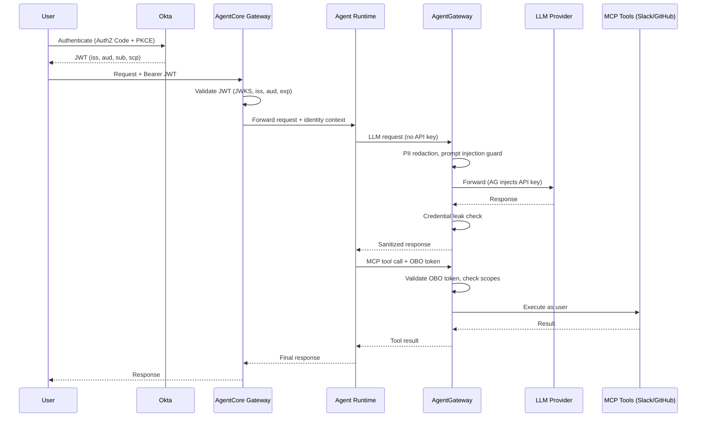

You wouldn't deploy microservices without an API gateway. So why are teams deploying AI agents with direct, ungoverned access to LLMs and external tools?

If you're running agents on AWS Bedrock AgentCore — or anywhere else — and those agents are calling Claude, GPT-4, or hitting MCP tool servers directly, you have a governance gap. No rate limiting. No audit trail. No PII filtering. No failover. Every team wiring up their own retry logic, their own auth handling, their own cost tracking. It's 2016 microservices all over again, except the blast radius includes sending your customer database to a third-party LLM.

[AgentGateway](https://github.com/agentgateway/agentgateway) fixes this. It's an open-source (CNCF) gateway purpose-built for AI agent traffic — both LLM calls and MCP tool calls — giving you a single control plane for everything your agents talk to.

This post walks through why you need it, how the auth chain works end-to-end, and how the [aws-agentcore-demo](https://github.com/ProfessorSeb/aws-agentcore-demo) wires it all together.

---

## The Problem: Agents Without Guardrails

An AI agent is, at its core, a loop: receive input → call an LLM → maybe call some tools → return output. The interesting part is what happens in those calls.

When an agent on AgentCore calls Anthropic's API directly:

- **API keys live in the agent container.** Every developer who can deploy an agent has access to production LLM credentials.
- **No visibility.** What prompts are being sent? What data is in them? You don't know until something leaks.
- **No cost controls.** One runaway agent loop burns through your API budget in minutes. There's no per-user or per-agent rate limiting.
- **No failover.** Anthropic has an outage? Your agent is dead. Hope someone set up a retry with exponential backoff — oh wait, each team did it differently.
- **No security policies.** PII goes straight to the LLM. Prompt injection attempts pass through unfiltered. Credentials in responses get forwarded to users.

And then there's MCP. Your agent discovers tools — Slack, GitHub, internal APIs — via Model Context Protocol servers. Each MCP server needs auth. Each one is another surface to secure, another thing to monitor, another connection to manage.

Every team solving these problems independently is wasted engineering. Worse, most teams don't solve them at all.

---

## The Solution: AgentGateway

AgentGateway sits between your agents and everything they talk to. LLMs and MCP tool servers both route through it.

This isn't Envoy with some AI plugins bolted on. AgentGateway is a purpose-built proxy with its own xDS-inspired control plane, designed from the ground up for agent traffic patterns. It understands:

- **LLM protocols** — OpenAI-compatible chat completions, streaming, token counting
- **MCP protocol** — tool discovery, tool invocation, server lifecycle
- **Agent-specific policies** — PII redaction, prompt injection detection, per-user token budgets

Two logical functions, one binary:

1. **LLM Proxy** — OpenAI-compatible endpoint that routes to any provider (Anthropic, OpenAI, xAI, local models)
2. **MCP Gateway** — aggregates multiple MCP servers, presents a unified tool catalog to agents

Your agent code doesn't change. Point it at AgentGateway instead of the LLM provider directly. That's it.

---

## Traffic Flow: How This Demo Works

The [aws-agentcore-demo](https://github.com/ProfessorSeb/aws-agentcore-demo) is a working reference architecture. Here's what's actually running:

```
┌─────────────────────────┐
│   AWS Bedrock AgentCore  │
│  ┌─────────────────────┐ │
│  │ Agent Container      │ │
│  │ (arm64, Python/      │ │
│  │  FastAPI)            │ │
│  └────────┬─────────────┘ │
└───────────┼───────────────┘
            │ ngrok tunnels
            ▼
┌─────────────────────────────┐
│  k8s-rooster (on-prem k8s)  │
│                              │
│  ┌────────────────────────┐  │
│  │    AgentGateway         │  │
│  │  ┌──────┐ ┌──────────┐ │  │
│  │  │ LLM  │ │   MCP    │ │  │
│  │  │Proxy │ │ Gateway  │ │  │
│  │  └──┬───┘ └────┬─────┘ │  │
│  └─────┼──────────┼───────┘  │
└────────┼──────────┼──────────┘
         │          │
    ┌────▼───┐  ┌───▼────────┐
    │Anthropic│  │MCP Servers │
    │OpenAI   │  │- Slack     │
    │xAI      │  │- GitHub    │
    └─────────┘  │- Tools     │
                 └────────────┘
```

**The agent container** runs on AgentCore as an arm64 Python/FastAPI application. It doesn't hold any LLM API keys. It knows two endpoints: AgentGateway's LLM proxy and MCP gateway.

**LLM calls** go through AgentGateway's OpenAI-compatible proxy. The agent calls `/anthropic/v1/chat/completions` — AgentGateway routes it to Anthropic, applies policies, logs the interaction, and returns the response.

**MCP tool calls** go through AgentGateway's MCP gateway. The agent discovers available tools (Slack messaging, GitHub operations, general utilities) through a single endpoint. AgentGateway aggregates multiple upstream MCP servers into one catalog.

**Connectivity** between AWS and the on-prem k8s-rooster cluster uses ngrok tunnels — pragmatic for a demo. In production, you'd use VPC peering, PrivateLink, or similar.

**Infrastructure** is fully codified: Terraform manages AWS + Okta, ArgoCD handles everything on Kubernetes.

---

## Authentication: End-to-End Token Lifecycle

This is where it matters for regulated environments. Every request traverses an authenticated chain — from human identity through agent execution to downstream tool invocation. **No ambient credentials, no hardcoded API keys in agent code, no unauthenticated hops.**

### The Identity Stack



### Okta Authorization Server

The architecture uses Okta's **default** authorization server with custom scopes for fine-grained MCP tool access:

| Property | Value |
|----------|-------|
| Auth Server | `default` (`aus104zseyg64swj3698`) |
| Issuer | `https://integrator-7147223.okta.com/oauth2/aus104zseyg64swj3698` |
| Discovery URL | `.../.well-known/openid-configuration` |
| JWKS URI | `.../v1/keys` |

### Custom MCP Scopes

Three custom scopes control fine-grained tool access, all managed via Terraform:

```hcl
resource "okta_auth_server_scope" "mcp_read" {
  auth_server_id   = data.okta_auth_server.default.id
  name             = "mcp:read"
  description      = "Read access to MCP tools via AgentGateway"
  consent          = "IMPLICIT"
  metadata_publish = "ALL_CLIENTS"
}

resource "okta_auth_server_scope" "mcp_write" {
  auth_server_id   = data.okta_auth_server.default.id
  name             = "mcp:write"
  description      = "Write access to MCP tools via AgentGateway"
  consent          = "IMPLICIT"
  metadata_publish = "ALL_CLIENTS"
}

resource "okta_auth_server_scope" "mcp_admin" {
  auth_server_id   = data.okta_auth_server.default.id
  name             = "mcp:admin"
  description      = "Admin access to MCP tools (e.g. Slack post, GitHub write)"
  consent          = "REQUIRED"           # Explicit user consent required
  metadata_publish = "ALL_CLIENTS"
}
```

The `REQUIRED` consent on `mcp:admin` ensures users explicitly approve admin-level operations — they cannot be silently granted.

### OAuth2 Applications

Two separate apps enforce **separation of human identity from machine identity**:

**App 1 — User-Facing Client** (Authorization Code + PKCE):

```hcl
resource "okta_app_oauth" "agentcore_client" {
  label                      = "devops-copilot-client"
  type                       = "web"
  grant_types                = ["authorization_code", "refresh_token"]
  redirect_uris              = [var.agent_redirect_uri]
  post_logout_redirect_uris  = [var.agent_post_logout_uri]
  token_endpoint_auth_method = "client_secret_basic"
  response_types             = ["code"]
}
```

Used by: the human user authenticating via browser. PKCE mitigates authorization code interception attacks. No implicit flow — only authorization code.

**App 2 — Agent Service** (Machine-to-Machine):

```hcl
resource "okta_app_oauth" "agentcore_service" {
  label                      = "devops-copilot-service"
  type                       = "service"
  grant_types                = ["client_credentials"]
  token_endpoint_auth_method = "client_secret_basic"
  response_types             = ["token"]
}
```

Used by: AgentCore for On-Behalf-Of token exchange. The agent service authenticates itself, then exchanges the user's token for a delegated token with MCP scopes.

### Auth Server Policy

A whitelist policy ensures **only these two apps** can request MCP-scoped tokens:

```hcl
resource "okta_auth_server_policy" "agentcore" {
  auth_server_id   = data.okta_auth_server.default.id
  name             = "AgentCore Policy"
  description      = "Token policy for AgentCore demo apps"
  priority         = 1
  client_whitelist = [
    okta_app_oauth.agentcore_client.client_id,
    okta_app_oauth.agentcore_service.client_id,
  ]
}

resource "okta_auth_server_policy_rule" "agentcore_rule" {
  auth_server_id                  = data.okta_auth_server.default.id
  policy_id                       = okta_auth_server_policy.agentcore.id
  name                            = "Allow MCP scopes"
  priority                        = 1
  grant_type_whitelist            = ["authorization_code", "client_credentials"]
  scope_whitelist                 = ["openid", "profile", "email",
                                     "mcp:read", "mcp:write", "mcp:admin"]
  group_whitelist                 = [data.okta_group.everyone.id]
  access_token_lifetime_minutes   = 60
  refresh_token_lifetime_minutes  = 1440
  refresh_token_window_minutes    = 1440
}
```

**Key controls:**
- `access_token_lifetime_minutes = 60` — tokens expire in 1 hour; compromised tokens have limited blast radius
- `group_whitelist = Everyone` — all org users can authenticate (restrict to specific groups in production)
- `scope_whitelist` — explicitly enumerates allowed scopes; no wildcard

---

## Step-by-Step Token Flow (The Full Details)

### Step 1 — User Authenticates, Okta Issues JWT

The user authenticates via the **Authorization Code + PKCE** flow. The browser redirects to Okta:

```
https://integrator-7147223.okta.com/oauth2/aus104zseyg64swj3698/v1/authorize?
  client_id=0oa104zvj88F21SEe698
  &response_type=code
  &scope=openid profile email mcp:read mcp:write
  &redirect_uri=https://agent.example.com/callback
  &state=<random>
  &code_challenge=<S256 hash of code_verifier>
  &code_challenge_method=S256
```

After the user authenticates, Okta redirects back with an authorization code. The app exchanges it for tokens. The decoded JWT payload looks like:

```json
{
  "ver": 1,
  "jti": "AT.3xK8mR2pVq1nL9fYwZbCdE7hJ0kMnOpQrStUvWxYz",
  "iss": "https://integrator-7147223.okta.com/oauth2/aus104zseyg64swj3698",
  "aud": "api://default",
  "iat": 1739541000,
  "exp": 1739544600,
  "cid": "0oa104zvbj26VVleo698",
  "uid": "00u1a2b3c4d5e6f7g8h9",
  "sub": "jane.doe@example.com",
  "scp": ["mcp:read", "mcp:write"]
}
```

**What matters:**
- `iss` — identifies which Okta auth server issued this token (validated downstream)
- `aud` — `api://default` — the AgentCore Gateway rejects tokens with any other audience
- `sub` — the human user's identity, carried through the entire chain
- `scp` — scopes determine exactly what MCP tools this user can invoke
- `exp` — 1 hour from `iat`; expired tokens are rejected at every validation point

### Step 2 — AgentCore Gateway Validates JWT

The AgentCore Gateway was created with a **CUSTOM_JWT authorizer** pointing to Okta's OIDC discovery endpoint:

```hcl
resource "null_resource" "gateway" {
  provisioner "local-exec" {
    command = <<-EOT
      aws bedrock-agentcore-control create-gateway \
        --name "${self.triggers.name}" \
        --role-arn "${self.triggers.role_arn}" \
        --protocol-type "MCP" \
        --authorizer-type "CUSTOM_JWT" \
        --authorizer-configuration '{
          "customJWTAuthorizer": {
            "discoveryUrl": "${self.triggers.okta_issuer}/.well-known/openid-configuration",
            "allowedAudience": ["api://default"]
          }
        }' \
        --no-cli-pager --output json
    EOT
  }
}
```

**The gateway performs these validations on every request:**

| Check | How | Failure |
|-------|-----|---------|
| Signature (RS256) | Fetches JWKS from Okta discovery endpoint, verifies JWT signature | `401 Unauthorized` |
| Issuer (`iss`) | Must match the configured Okta auth server | `401 Unauthorized` |
| Audience (`aud`) | Must include `api://default` | `401 Unauthorized` |
| Expiration (`exp`) | Must be in the future (with clock skew tolerance) | `401 Unauthorized` |

**If any check fails, the request is rejected immediately.** The agent runtime never sees invalid requests.

### Step 3 — Agent Receives Authenticated Request, Zero Secrets

Once the gateway validates the JWT, it forwards the request to the agent container with the **identity context attached**. The agent knows:

- **Who** is calling (`sub` claim → `jane.doe@example.com`)
- **What** they're authorized to do (`scp` claim → `["mcp:read", "mcp:write"]`)

The agent container itself has **no secrets** — no LLM API keys, no Okta client secrets, no MCP tool credentials. Only the AgentGateway URL for outbound requests. A compromised agent cannot escalate privileges because it holds no credentials to escalate with.

### Step 4 — Agent Calls LLM Through AgentGateway

AgentGateway is the **single point of control** for LLM access:

1. **API Key Injection** — AgentGateway holds the LLM API keys (stored as Kubernetes Secrets, managed by ArgoCD). The agent never sees them.
2. **Pre-request Policy Enforcement:**
   - **PII Detection/Redaction** — SSNs, credit card numbers, email addresses are redacted before reaching the LLM provider
   - **Prompt Injection Guard** — known injection patterns are blocked
3. **Post-response Policy Enforcement:**
   - **Credential Leak Protection** — prevents secrets from appearing in LLM responses
4. **Observability** — every request is traced to **Langfuse** with the user's identity (`sub` claim), model used, token count, latency, and cost

### Step 5 — On-Behalf-Of Token Exchange for MCP Tools

When the agent needs to call MCP tools (Slack, GitHub), it needs a **delegated identity token** — the agent acts *as the user*, not as itself.

The **OAuth2 Credential Provider** configured in AgentCore handles this exchange:

```hcl
resource "null_resource" "okta_credential_provider" {
  provisioner "local-exec" {
    command = <<-EOT
      aws bedrock-agentcore-control create-oauth2-credential-provider \
        --name "${self.triggers.name}" \
        --credential-provider-vendor "CustomOIDC" \
        --oauth2-provider-config-properties '{
          "issuer": "${self.triggers.issuer}",
          "clientId": "${self.triggers.client_id}",
          "clientSecret": "${self.triggers.client_secret}",
          "authorizationEndpoint": "${self.triggers.issuer}/v1/authorize",
          "tokenEndpoint": "${self.triggers.issuer}/v1/token",
          "scopes": ["openid", "mcp:read", "mcp:write"]
        }'
    EOT
  }
}
```

**The exchange flow:**

1. Agent presents the user's validated identity context to the credential provider
2. The **service app** (`devops-copilot-service`) authenticates to Okta using client credentials
3. Okta issues a **new token** that carries the original user's identity (`sub`) + the requested MCP scopes
4. This OBO token is used for MCP tool calls

**Result:** When the agent posts a Slack message, it appears **as the user**. When it creates a GitHub issue, it's **attributed to the user**. The agent never has standing access to these tools.

### Step 6 — AgentGateway Enforces Three Layers of MCP Access Control

All deployed as declarative YAML on Kubernetes, managed via ArgoCD GitOps:

#### Layer 1: JWT Authentication (Enterprise Policy)

Every MCP request must carry a valid Okta JWT. Unauthenticated requests are rejected immediately.

```yaml
apiVersion: enterpriseagentgateway.solo.io/v1alpha1
kind: EnterpriseAgentgatewayPolicy
metadata:
  name: mcp-jwt-auth-ent
spec:
  targetRefs:
  - group: gateway.networking.k8s.io
    kind: HTTPRoute
    name: mcp-slack
  - group: gateway.networking.k8s.io
    kind: HTTPRoute
    name: mcp-github
  traffic:
    jwtAuthentication:
      mode: Strict
      providers:
      - issuer: "https://integrator-7147223.okta.com/oauth2/aus104zseyg64swj3698"
        audiences: ["api://default"]
        jwks:
          inline: '<Okta JWKS JSON>'
```

#### Layer 2: Scope-Based Tool Authorization (CEL Expressions)

Once authenticated, tool access is controlled by JWT scopes using CEL expressions:

```yaml
apiVersion: agentgateway.dev/v1alpha1
kind: AgentgatewayPolicy
metadata:
  name: mcp-tool-rbac-read
spec:
  targetRefs:
  - group: gateway.networking.k8s.io
    kind: HTTPRoute
    name: mcp-slack
  - group: gateway.networking.k8s.io
    kind: HTTPRoute
    name: mcp-github
  backend:
    mcp:
      authorization:
        action: Allow
        policy:
          matchExpressions:
          - >-
            claims.scp.exists(s, s == 'mcp:read') && (
              tool.name.startsWith('list_') ||
              tool.name.startsWith('get_') ||
              tool.name.startsWith('search_') ||
              tool.name == 'slack_list_channels' ||
              tool.name == 'slack_get_channel_history'
            )
```

| Scope | Allowed Operations | Denied Operations |
|-------|--------------------|-------------------|
| `mcp:read` | List Slack channels, get GitHub issues, search code | Post messages, create issues |
| `mcp:write` | All of `mcp:read` + post messages, create issues, reply | Delete channels, admin operations |
| `mcp:admin` | All of `mcp:write` + admin operations | Destructive ops (always blocked) |

**How it works at the MCP level:**
- `tools/list` responses are **filtered** — unauthorized tools are hidden from the agent entirely
- `tools/call` requests are **rejected** if the user's scopes don't match

#### Layer 3: Destructive Operation Blocking

Certain operations are **always denied**, regardless of scope:

```yaml
apiVersion: agentgateway.dev/v1alpha1
kind: AgentgatewayPolicy
metadata:
  name: mcp-tool-block-destructive
spec:
  backend:
    mcp:
      authorization:
        action: Deny
        policy:
          matchExpressions:
          - >-
            tool.name.contains('delete') ||
            tool.name.contains('destroy') ||
            tool.name.contains('merge_pull_request')
```

Even `mcp:admin` users cannot delete repositories or force-merge PRs through the agent. These operations require human approval outside the agent workflow.

Rate limiting applies per-user (the identified human, not the agent). Every tool call is traced with user identity.

---

## Verifying the Auth Chain

You can validate the full token lifecycle end-to-end with these commands:

### Obtain and Inspect a Token

```bash
# Client credentials grant (for testing)
TOKEN_RESPONSE=$(curl -s -X POST \
  "https://integrator-7147223.okta.com/oauth2/aus104zseyg64swj3698/v1/token" \
  -H "Content-Type: application/x-www-form-urlencoded" \
  -d "grant_type=client_credentials" \
  -d "client_id=${OKTA_SERVICE_CLIENT_ID}" \
  -d "client_secret=${OKTA_SERVICE_CLIENT_SECRET}" \
  -d "scope=mcp:read mcp:write")

ACCESS_TOKEN=$(echo "$TOKEN_RESPONSE" | jq -r '.access_token')

# Decode the JWT payload
echo "$ACCESS_TOKEN" | cut -d'.' -f2 | base64 -d 2>/dev/null | jq .
```

Verify: `iss` matches your Okta issuer, `aud` is `api://default`, `scp` contains the requested scopes.

### Invoke the Agent via AgentCore

```bash
RUNTIME_ARN="arn:aws:bedrock-agentcore:us-east-1:<account>:runtime/<id>"
PAYLOAD=$(echo -n '{"input":"List available Slack channels"}' | base64 -w0)

aws bedrock-agentcore invoke-agent-runtime \
  --agent-runtime-arn "$RUNTIME_ARN" \
  --content-type "application/json" \
  --payload "$PAYLOAD" \
  response.json
```

### Verify Token Rejection

```bash
# Garbage token — should get 401
curl -s -X POST "${GATEWAY_ENDPOINT}/invoke" \
  -H "Authorization: Bearer invalid.token.here" \
  -H "Content-Type: application/json" \
  -d '{"prompt": "test"}'

# Expected: {"message": "Unauthorized"}
```

### Check Traces in Langfuse

Open Langfuse → Traces → Filter by user identity. Each trace shows: user identity (from JWT `sub`), model used, token counts, PII redactions applied, tool calls with arguments and results, total latency and cost.

### Check AgentGateway Policy Enforcement

```bash
kubectl logs -n agentgateway deployment/agentgateway --tail=50 | \
  grep -E "(policy|redact|blocked|scope)"
```

Look for:
- `pii_redacted: 2 entities` — PII was caught and redacted
- `scope_check: mcp:write ALLOWED` — scope validation passed
- `prompt_injection: BLOCKED` — injection attempt was stopped
- `rate_limit: user=jane.doe@example.com remaining=47/50` — per-user rate limiting

---

## Guardrails: The Full Picture

### Security Policies

**PII Protection.** Before a prompt reaches the LLM, AgentGateway scans for personally identifiable information and redacts it. Social security numbers, email addresses, phone numbers — stripped before they leave your network.

**Prompt Injection Detection.** Agents process user input. Users (or attackers) submit malicious prompts designed to hijack the agent's behavior. AgentGateway detects common jailbreak patterns and blocks them before the LLM ever sees them.

**Credential Leak Prevention.** LLMs sometimes echo back credentials that appeared in training data or context. AgentGateway scans responses for patterns matching API keys, tokens, and passwords, blocking them before they reach users.

### Traffic Management

**Rate limiting** operates at two levels — requests and tokens. Per-user limits (identified from JWT `sub` claim) prevent any single user from monopolizing capacity.

**Model failover** keeps agents running when providers have issues. If Anthropic returns a 529 (overloaded), the request automatically retries against OpenAI. Your agent doesn't know or care.

**Path-based routing** exposes multiple providers on a single gateway:

```
/anthropic/v1/* → Anthropic Claude
/openai/v1/*    → OpenAI GPT-4
/xai/v1/*       → xAI Grok
```

### Observability: Dual Export

Telemetry exports to two systems simultaneously via an OpenTelemetry Collector with fan-out:

**Langfuse** (OTLP) — the LLM-focused view:
- Token usage and costs per request, per user, per agent
- Full prompt and completion logging
- Trace waterfalls: user request → LLM call → tool call → tool response → final response

**ClickHouse + Solo UI** — the infrastructure view:
- Gateway throughput and latency metrics
- Policy enforcement statistics (PII redactions, blocked injections)
- Route analytics across providers

Every LLM call and MCP tool invocation is traced end-to-end with correlated trace IDs.

---

## Security Properties: What Compliance Teams Care About

### Zero Trust

| Principle | Enforcement |
|-----------|-------------|
| Every hop authenticated | User→Okta→JWT→Gateway validates→Agent receives identity→AgentGateway validates OBO→Tools |
| No ambient authority | Agent container has zero secrets; cannot call anything without going through AgentGateway |
| Least privilege | MCP scopes control exactly what tools each user can invoke |
| Token expiration | 60-minute access tokens validated at every hop |

### Audit Trail

Every operation produces a traceable record:

```
User Request (trace-id: abc-123)
  ├── Gateway: JWT validated for jane.doe@example.com [2024-02-14T15:30:00Z]
  ├── Agent: Received request, scopes=[mcp:read, mcp:write]
  ├── LLM Call: claude-sonnet-4-20250514, 1,247 input tokens, 384 output tokens, $0.0034
  │   ├── PII redacted: 2 email addresses, 1 phone number
  │   └── Prompt injection: none detected
  ├── MCP Tool: slack.list_channels (mcp:read) → 200 OK, 23 channels
  ├── MCP Tool: slack.post_message (mcp:write) → 200 OK, channel=#ops-alerts
  └── Response returned to user [latency: 3.2s]
```

**Export destinations:**
- **Langfuse** — LLM-specific analytics: model usage, token costs, prompt/completion pairs, user attribution
- **ClickHouse** — gateway metrics: request rates, latencies, policy violations, error rates

### Secrets Management

| Secret | Location | Accessible By |
|--------|----------|---------------|
| LLM API keys (Anthropic, OpenAI) | Kubernetes Secrets (ArgoCD-managed) | AgentGateway only |
| Okta client secrets | Terraform state (encrypted) + AWS Secrets Manager | AgentCore credential provider only |
| Agent container credentials | **None** | N/A — agent has zero secrets |

Credential rotation does not require agent redeployment. Update the AgentGateway config or Okta credential provider; agents are unaffected because they never hold credentials directly.

### Policy Enforcement Summary

| Policy | Enforcement Point | Mechanism |
|--------|-------------------|-----------|
| PII redaction | AgentGateway (pre-LLM) | Regex + NER detection; redacted before request leaves the gateway |
| Prompt injection | AgentGateway (pre-LLM) | Pattern matching + classifier; request blocked with 403 |
| Credential leak | AgentGateway (post-LLM) | Response scanning; secrets masked before reaching agent |
| Rate limiting | AgentGateway | Per-user (from JWT `sub`), not per-agent |
| Scope enforcement | AgentGateway (MCP routes) | OBO token `scp` claim checked against tool requirements |

All policies are defined in **declarative YAML** and managed via **GitOps** (ArgoCD). Changes are version-controlled, reviewed, and auditable.

### With vs Without Gateway

| Concern | Without Gateway | With AgentGateway |
|---------|----------------|-------------------|
| **API Keys** | Embedded in agent code | Centralized in gateway; agent has zero secrets |
| **Auth** | Each agent implements own | Okta JWT + OBO enforced at gateway |
| **PII** | Sent directly to LLM providers | Redacted at gateway before reaching any provider |
| **Audit** | Manual logging per agent | Automatic tracing on every call with user identity |
| **Rate Limits** | Per-agent, easily bypassed | Per-user, centrally enforced |
| **Key Rotation** | Redeploy every agent | Update gateway config; zero agent changes |
| **Blast Radius** | Compromised agent has full API key access | Compromised agent has no credentials |

---

## FAQ: Why Two Gateways?

If you're looking at this architecture and thinking "wait, there are TWO gateways?" — you're right, and they do very different things.

**AgentCore Gateway** is an AWS-managed service. It's the MCP protocol bridge that connects the AgentCore runtime to your MCP tool servers. It handles identity verification at the AWS edge (validating Okta JWTs via OIDC discovery) and manages the MCP connection lifecycle. It exists because AWS requires a managed control point for agents to discover and connect to external tools. Think of it as the **front door** — it answers "is this agent allowed to connect?"

**Agentgateway** is the self-hosted governance layer running on your Kubernetes cluster. It's where the actual security policies live: PII protection, prompt injection guards, credential leak detection, rate limiting, multi-provider LLM routing, scope-based MCP authorization, and full observability via Langfuse and ClickHouse. Think of it as the **policy engine** — it answers "what can this agent do, and how do we track it?"

The request flow with both:

```
Agent → AgentCore Gateway (AWS, identity) → ngrok → Agentgateway (k8s, policy) → LLMs/Tools
```

**Do you always need both?** No. The AgentCore Gateway is only required when hosting agents on AWS Bedrock AgentCore — it's the AWS-managed entry point for MCP protocol routing. If you're self-hosting agents (on Kubernetes, bare metal, or any other platform), your agents connect directly to Agentgateway and it handles everything — identity, authorization, routing, policies, and observability — in one place:

```
Agent → Agentgateway (identity + policy) → LLMs/Tools
```

The key insight: Agentgateway is the governance layer you need regardless of where your agents run. AgentCore Gateway is the additional AWS component you need when running on their managed platform. They complement each other, but Agentgateway is the one doing the heavy lifting on security and observability.

---

## Why This Matters for Production

The parallel to API gateways in the microservices era is exact. In 2015, teams deployed services that called each other directly — no rate limiting, no circuit breaking, no centralized auth. Then API gateways and service meshes became standard infrastructure because you can't run production systems without governance.

AI agents are at that same inflection point. The moment you have multiple teams deploying agents, multiple LLM providers, user-facing interactions, or any compliance requirements, you need a control plane.

AgentGateway gives you:

- **One policy layer** for all agent traffic, LLM and tool calls alike
- **Identity-aware governance** — Okta JWT + OBO, per-user rate limits, scope-based tool access
- **Full audit trail** — every prompt, response, and tool call traced to a specific human user
- **Declarative configuration** in YAML, managed via GitOps
- **Provider independence** — swap LLMs without touching agent code
- **Cost governance** — per-user, per-provider rate limits on both requests and tokens

---

## Try It

The full working demo and related repositories:

| Repository | Description |
|------------|-------------|
| [aws-agentcore-demo](https://github.com/ProfessorSeb/aws-agentcore-demo) | The main demo — Terraform for AWS + Okta, agent container code, auth flow deep-dive |
| [k8s-rooster](https://github.com/ProfessorSeb/k8s-rooster) | Backing Kubernetes cluster configuration (Talos + ArgoCD) |
| [agentgateway-langfuse](https://github.com/ProfessorSeb/agentgateway-langfuse) | AgentGateway + Langfuse observability integration |
| [agentgateway-ent-architecture](https://github.com/ProfessorSeb/agentgateway-ent-architecture) | Enterprise AgentGateway architecture patterns |
| [agentgateway-onhalfof-identity-entraid](https://github.com/ProfessorSeb/agentgateway-onhalfof-identity-entraid) | On-Behalf-Of identity flow with Entra ID |
| [agentregistry-oss-demo](https://github.com/ProfessorSeb/agentregistry-oss-demo) | Agent registry open-source demo |
| [migrating-from-litellm-agentgateway](https://github.com/ProfessorSeb/migrating-from-litellm-agentgateway) | Migration guide from LiteLLM to AgentGateway |
| [agentgateway-demo-script](https://github.com/ProfessorSeb/agentgateway-demo-script) | Demo scripts for AgentGateway walkthroughs |

AgentGateway itself is at [agentgateway/agentgateway](https://github.com/agentgateway/agentgateway) — CNCF open-source, Apache 2.0 licensed.

The agent infrastructure space is moving fast. AgentCore, MCP, and agent gateways are all weeks-to-months old. The teams that build governance into their agent platform now — rather than bolting it on after an incident — are the ones that'll actually get agents into production. Start with the gateway.
