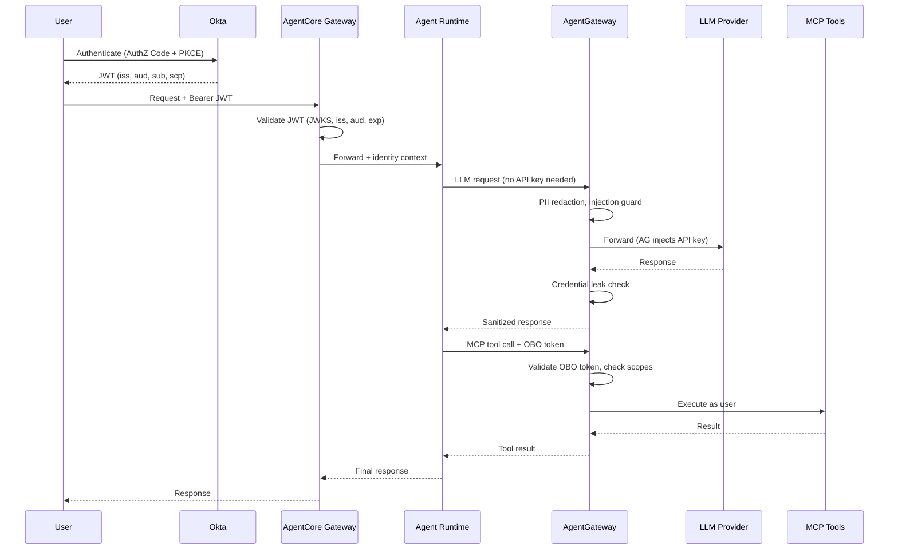

# Why Your AI Agents Need a Gateway: Securing AWS AgentCore with AgentGateway

You wouldn't deploy microservices without an API gateway. So why are teams deploying AI agents with direct, ungoverned access to LLMs and external tools?

If you're running agents on AWS Bedrock AgentCore — or anywhere else — and those agents are calling Claude, GPT-4, or hitting MCP tool servers directly, you have a governance gap. No rate limiting. No audit trail. No PII filtering. No failover. Every team wiring up their own retry logic, their own auth handling, their own cost tracking. It's 2016 microservices all over again, except the blast radius includes sending your customer database to a third-party LLM.

[AgentGateway](https://github.com/agentgateway/agentgateway) fixes this. It's an open-source (CNCF) gateway purpose-built for AI agent traffic — both LLM calls and MCP tool calls — giving you a single control plane for everything your agents talk to.

This post walks through why you need it, how the auth chain works end-to-end, and how the [aws-agentcore-demo](https://github.com/ProfessorSeb/aws-agentcore-demo) wires it all together.

---

## The Problem: Agents Without Guardrails

An AI agent is, at its core, a loop: receive input → call an LLM → maybe call some tools → return output. The interesting part is what happens in those calls.

When an agent on AgentCore calls Anthropic's API directly:

- **API keys live in the agent container.** Every developer who can deploy an agent has access to production LLM credentials.
- **No visibility.** What prompts are being sent? What data is in them? You don't know until something leaks.
- **No cost controls.** One runaway agent loop burns through your API budget in minutes. There's no per-user or per-agent rate limiting.
- **No failover.** Anthropic has an outage? Your agent is dead. Hope someone set up a retry with exponential backoff — oh wait, each team did it differently.
- **No security policies.** PII goes straight to the LLM. Prompt injection attempts pass through unfiltered. Credentials in responses get forwarded to users.

And then there's MCP. Your agent discovers tools — Slack, GitHub, internal APIs — via Model Context Protocol servers. Each MCP server needs auth. Each one is another surface to secure, another thing to monitor, another connection to manage.

Every team solving these problems independently is wasted engineering. Worse, most teams don't solve them at all.

---

## The Solution: AgentGateway

AgentGateway sits between your agents and everything they talk to. LLMs and MCP tool servers both route through it.

This isn't Envoy with some AI plugins bolted on. AgentGateway is a purpose-built proxy with its own xDS-inspired control plane, designed from the ground up for agent traffic patterns. It understands:

- **LLM protocols** — OpenAI-compatible chat completions, streaming, token counting
- **MCP protocol** — tool discovery, tool invocation, server lifecycle
- **Agent-specific policies** — PII redaction, prompt injection detection, per-user token budgets

Two logical functions, one binary:

1. **LLM Proxy** — OpenAI-compatible endpoint that routes to any provider (Anthropic, OpenAI, xAI, local models)
2. **MCP Gateway** — aggregates multiple MCP servers, presents a unified tool catalog to agents

Your agent code doesn't change. Point it at AgentGateway instead of the LLM provider directly. That's it.

---

## Traffic Flow: How This Demo Works

The [aws-agentcore-demo](https://github.com/ProfessorSeb/aws-agentcore-demo) is a working reference architecture. Here's what's actually running:

```
┌─────────────────────────┐
│   AWS Bedrock AgentCore  │
│  ┌─────────────────────┐ │
│  │ Agent Container      │ │
│  │ (arm64, Python/      │ │
│  │  FastAPI)            │ │
│  └────────┬─────────────┘ │
└───────────┼───────────────┘
            │ ngrok tunnels
            ▼
┌─────────────────────────────┐
│  k8s-rooster (on-prem k8s)  │
│                              │
│  ┌────────────────────────┐  │
│  │    AgentGateway         │  │
│  │  ┌──────┐ ┌──────────┐ │  │
│  │  │ LLM  │ │   MCP    │ │  │
│  │  │Proxy │ │ Gateway  │ │  │
│  │  └──┬───┘ └────┬─────┘ │  │
│  └─────┼──────────┼───────┘  │
└────────┼──────────┼──────────┘
         │          │
    ┌────▼───┐  ┌───▼────────┐
    │Anthropic│  │MCP Servers │
    │OpenAI   │  │- Slack     │
    │xAI      │  │- GitHub    │
    └─────────┘  │- Tools     │
                 └────────────┘
```

**The agent container** runs on AgentCore as an arm64 Python/FastAPI application. It doesn't hold any LLM API keys. It knows two endpoints: AgentGateway's LLM proxy and MCP gateway.

**LLM calls** go through AgentGateway's OpenAI-compatible proxy. The agent calls `/anthropic/v1/chat/completions` — AgentGateway routes it to Anthropic, applies policies, logs the interaction, and returns the response.

**MCP tool calls** go through AgentGateway's MCP gateway. The agent discovers available tools (Slack messaging, GitHub operations, general utilities) through a single endpoint. AgentGateway aggregates multiple upstream MCP servers into one catalog.

**Connectivity** between AWS and the on-prem k8s-rooster cluster uses ngrok tunnels — pragmatic for a demo. In production, you'd use VPC peering, PrivateLink, or similar.

**Infrastructure** is fully codified: Terraform manages AWS + Okta, ArgoCD handles everything on Kubernetes.

---

## Authentication: End-to-End Token Lifecycle

This is where it matters for regulated environments. Every request traverses an authenticated chain — from human identity through agent execution to downstream tool invocation. **No ambient credentials, no hardcoded API keys in agent code, no unauthenticated hops.**

### The Identity Stack



### Okta Configuration

Two OAuth2 apps enforce separation of human identity from machine identity:

**App 1 — User-Facing Client** (Authorization Code + PKCE):
```hcl
resource "okta_app_oauth" "agentcore_client" {
  label                      = "devops-copilot-client"
  type                       = "web"
  grant_types                = ["authorization_code", "refresh_token"]
  redirect_uris              = [var.agent_redirect_uri]
  token_endpoint_auth_method = "client_secret_basic"
  response_types             = ["code"]
}
```
Used by: the human user authenticating via browser. PKCE mitigates authorization code interception attacks.

**App 2 — Agent Service** (Machine-to-Machine):
```hcl
resource "okta_app_oauth" "agentcore_service" {
  label                      = "devops-copilot-service"
  type                       = "service"
  grant_types                = ["client_credentials"]
  token_endpoint_auth_method = "client_secret_basic"
  response_types             = ["token"]
}
```
Used by: AgentCore for On-Behalf-Of token exchange. The agent service authenticates itself, then exchanges the user's token for a delegated token with MCP scopes.

**Custom MCP scopes** control fine-grained tool access:
- `mcp:read` — read-only tool access (list channels, get issues)
- `mcp:write` — write tool access (post messages, create issues)
- `mcp:admin` — admin operations (requires explicit user consent)

```hcl
resource "okta_auth_server_scope" "mcp_read" {
  auth_server_id = data.okta_auth_server.default.id
  name           = "mcp:read"
  consent        = "IMPLICIT"
}

resource "okta_auth_server_scope" "mcp_admin" {
  auth_server_id = data.okta_auth_server.default.id
  name           = "mcp:admin"
  consent        = "REQUIRED"  # Explicit user consent required
}
```

### Step-by-Step Token Flow

**Step 1 — User authenticates, Okta issues JWT:**

The JWT carries the user's identity and MCP scopes through the entire chain. Key claims: `sub` is the human identity, `scp` controls exactly what MCP tools this user can invoke, `exp` enforces 1-hour token lifetime.

**Step 2 — AgentCore Gateway validates JWT:**

The gateway validates on every request: JWT signature (RS256 via JWKS), issuer, audience (`api://default`), and expiration. Invalid tokens → `401 Unauthorized`. The agent never sees invalid requests.

**Step 3 — Agent receives authenticated request, zero secrets:**

The agent container has **no LLM API keys, no Okta secrets, no tool credentials**. It only knows two URLs: AgentGateway's LLM proxy and MCP gateway. A compromised agent cannot escalate privileges because it holds no credentials to escalate with.

**Step 4 — Agent calls LLM through AgentGateway:**

AgentGateway is the **only** component with LLM API keys (stored as Kubernetes Secrets, managed by ArgoCD). Before forwarding to the LLM provider, it applies security policies — PII redaction, prompt injection guard, credential leak protection. The request is traced to Langfuse with the user's identity attached.

**Step 5 — On-Behalf-Of token exchange for MCP tools:**

When the agent needs to call Slack or GitHub, AgentCore's OAuth2 credential provider handles the token exchange. The service app exchanges the user's token for a new OBO token that carries the original user's identity + MCP scopes. When the agent posts a Slack message, it appears **as the user**. When it creates a GitHub issue, it's **attributed to the user**. The agent never has standing access to these tools.

**Step 6 — AgentGateway enforces three layers of MCP access control:**

**Layer 1: JWT Authentication** — Enterprise policy validates Okta JWTs on every MCP request. No valid token = no tool access.

**Layer 2: Scope-Based RBAC** — CEL expressions match JWT scopes to tool operations:

| Scope | Allowed | Denied |
|-------|---------|--------|
| `mcp:read` | List channels, get issues, search code | Post messages, create issues |
| `mcp:write` | All of read + post, create, comment | Delete, admin operations |
| `mcp:admin` | All of write + admin operations | Destructive ops (always blocked) |

Key detail: `tools/list` responses are **filtered** (unauthorized tools hidden from the agent), `tools/call` requests **rejected** if scopes don't match.

**Layer 3: Destructive Operation Blocking** — always denied regardless of scope. `delete_repository`, `merge_pull_request` — blocked unconditionally.

Rate limiting applies per-user (the identified human, not the agent). Every tool call is traced with user identity.

---

## Guardrails: The Full Picture

### Security Policies

**PII Protection.** Before a prompt reaches the LLM, AgentGateway scans for personally identifiable information and redacts it. Social security numbers, email addresses, phone numbers — stripped before they leave your network.

**Prompt Injection Detection.** Agents process user input. Users (or attackers) submit malicious prompts designed to hijack the agent's behavior. AgentGateway detects common jailbreak patterns and blocks them before the LLM ever sees them.

**Credential Leak Prevention.** LLMs sometimes echo back credentials that appeared in training data or context. AgentGateway scans responses for patterns matching API keys, tokens, and passwords, blocking them before they reach users.

### Traffic Management

**Rate limiting** operates at two levels — requests and tokens. Per-user limits (identified from JWT `sub` claim) prevent any single user from monopolizing capacity.

**Model failover** keeps agents running when providers have issues. If Anthropic returns a 529 (overloaded), the request automatically retries against OpenAI. Your agent doesn't know or care.

**Path-based routing** exposes multiple providers on a single gateway:

```
/anthropic/v1/* → Anthropic Claude
/openai/v1/*    → OpenAI GPT-4
/xai/v1/*       → xAI Grok
```

### Observability: Dual Export

Telemetry exports to two systems simultaneously via an OpenTelemetry Collector with fan-out:

**Langfuse** (OTLP) — the LLM-focused view:
- Token usage and costs per request, per user, per agent
- Full prompt and completion logging
- Trace waterfalls: user request → LLM call → tool call → tool response → final response

**ClickHouse + Solo UI** — the infrastructure view:
- Gateway throughput and latency metrics
- Policy enforcement statistics (PII redactions, blocked injections)
- Route analytics across providers

Every LLM call and MCP tool invocation is traced end-to-end with correlated trace IDs.

---

## Security Properties: What Compliance Teams Care About

### Zero Trust

| Principle | Enforcement |
|-----------|-------------|
| Every hop authenticated | User→Okta→JWT→Gateway validates→Agent receives identity→AgentGateway validates OBO→Tools |
| No ambient authority | Agent container has zero secrets; cannot call anything without going through AgentGateway |
| Least privilege | MCP scopes control exactly what tools each user can invoke |
| Token expiration | 60-minute access tokens validated at every hop |

### Audit Trail

Every operation produces a traceable record — from gateway JWT validation through LLM calls with PII redaction stats, through MCP tool invocations with scope verification, all the way to the final response with latency metrics.

### With vs Without Gateway

| Concern | Without Gateway | With AgentGateway |
|---------|----------------|-------------------|
| **API Keys** | Embedded in agent code | Centralized in gateway; agent has zero secrets |
| **Auth** | Each agent implements own | Okta JWT + OBO enforced at gateway |
| **PII** | Sent directly to LLM providers | Redacted at gateway before reaching any provider |
| **Audit** | Manual logging per agent | Automatic tracing on every call with user identity |
| **Rate Limits** | Per-agent, easily bypassed | Per-user, centrally enforced |
| **Key Rotation** | Redeploy every agent | Update gateway config; zero agent changes |
| **Blast Radius** | Compromised agent has full API key access | Compromised agent has no credentials |

---

## Why This Matters for Production

The parallel to API gateways in the microservices era is exact. In 2015, teams deployed services that called each other directly — no rate limiting, no circuit breaking, no centralized auth. Then API gateways and service meshes became standard infrastructure because you can't run production systems without governance.

AI agents are at that same inflection point. The moment you have multiple teams deploying agents, multiple LLM providers, user-facing interactions, or any compliance requirements, you need a control plane.

AgentGateway gives you:

- **One policy layer** for all agent traffic, LLM and tool calls alike
- **Identity-aware governance** — Okta JWT + OBO, per-user rate limits, scope-based tool access
- **Full audit trail** — every prompt, response, and tool call traced to a specific human user
- **Declarative configuration** in YAML, managed via GitOps
- **Provider independence** — swap LLMs without touching agent code
- **Cost governance** — per-user, per-provider rate limits on both requests and tokens

---

## Try It

The full working demo is at [ProfessorSeb/aws-agentcore-demo](https://github.com/ProfessorSeb/aws-agentcore-demo) — includes Terraform for AWS + Okta, the agent container code, and a detailed auth flow deep-dive with runnable verification commands.

The backing Kubernetes cluster configuration lives at [ProfessorSeb/k8s-rooster](https://github.com/ProfessorSeb/k8s-rooster).

AgentGateway itself is at [agentgateway/agentgateway](https://github.com/agentgateway/agentgateway) — CNCF open-source, Apache 2.0 licensed.

The agent infrastructure space is moving fast. AgentCore, MCP, and agent gateways are all weeks-to-months old. The teams that build governance into their agent platform now — rather than bolting it on after an incident — are the ones that'll actually get agents into production. Start with the gateway.
