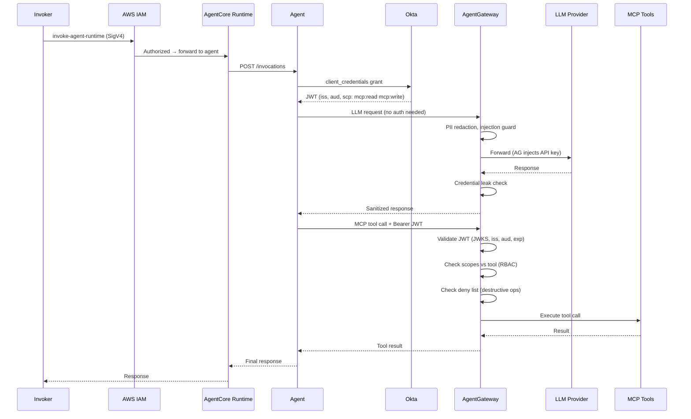

You wouldn't deploy microservices without an API gateway. So why are teams deploying AI agents with direct, ungoverned access to LLMs and external tools?

If you're running agents on AWS Bedrock AgentCore — or anywhere else — and those agents are calling Claude, GPT-4, or hitting MCP tool servers directly, you have a governance gap. No rate limiting. No audit trail. No PII filtering. No failover. Every team wiring up their own retry logic, their own auth handling, their own cost tracking. It's 2016 microservices all over again, except the blast radius includes sending your customer database to a third-party LLM.

[AgentGateway](https://github.com/agentgateway/agentgateway) fixes this. It's an open-source (CNCF) gateway purpose-built for AI agent traffic — both LLM calls and MCP tool calls — giving you a single control plane for everything your agents talk to.

But here's the thing: you don't need *another* gateway from your cloud provider to do it. AgentGateway is your gateway — for auth, RBAC, observability, and security. Your cloud just provides compute.

This post walks through why, how the auth chain works end-to-end, and how the [aws-agentcore-demo](https://github.com/ProfessorSeb/aws-agentcore-demo) wires it all together.

---

## The Problem: Agents Without Guardrails

An AI agent is, at its core, a loop: receive input → call an LLM → maybe call some tools → return output. The interesting part is what happens in those calls.

When an agent on AgentCore calls Anthropic's API directly:

- **API keys live in the agent container.** Every developer who can deploy an agent has access to production LLM credentials.
- **No visibility.** What prompts are being sent? What data is in them? You don't know until something leaks.
- **No cost controls.** One runaway agent loop burns through your API budget in minutes. There's no per-user or per-agent rate limiting.
- **No failover.** Anthropic has an outage? Your agent is dead. Hope someone set up a retry with exponential backoff — oh wait, each team did it differently.
- **No security policies.** PII goes straight to the LLM. Prompt injection attempts pass through unfiltered. Credentials in responses get forwarded to users.

And then there's MCP. Your agent discovers tools — Slack, GitHub, internal APIs — via Model Context Protocol servers. Each MCP server needs auth. Each one is another surface to secure, another thing to monitor, another connection to manage.

Every team solving these problems independently is wasted engineering. Worse, most teams don't solve them at all.

---

## The Trap: Another Vendor Gateway

Cloud providers see this problem too. Their solution? Another managed service. AWS has AgentCore Gateway. Others will follow.

But think about what that means:

- **You're locked in.** That gateway only works on AWS. Move to GCP, Azure, or on-prem? Rebuild your auth, RBAC, and observability from scratch.
- **Double the gateways.** Now you have a cloud gateway *and* your actual governance layer. Two hops, two configurations, two things to debug.
- **Weakest-link security.** If your cloud gateway does JWT validation but your real tools don't, you have a false sense of security. If both do it, you're paying for redundancy.
- **Vendor roadmap dependency.** Need scope-based MCP RBAC? PII filtering? Prompt injection detection? You're waiting on their feature backlog.

The right answer: use your cloud provider for what it's good at — **compute** — and use a purpose-built, portable gateway for **governance**.

---

## The Solution: AgentGateway

AgentGateway sits between your agents and everything they talk to. LLMs and MCP tool servers both route through it.

This isn't Envoy with some AI plugins bolted on. AgentGateway is a purpose-built proxy with its own xDS-inspired control plane, designed from the ground up for agent traffic patterns. It understands:

- **LLM protocols** — OpenAI-compatible chat completions, streaming, token counting
- **MCP protocol** — tool discovery, tool invocation, server lifecycle
- **Agent-specific policies** — PII redaction, prompt injection detection, per-user token budgets
- **JWT authentication** — validate Okta/Entra/any OIDC tokens on MCP routes with scope-based RBAC

Two logical functions, one binary:

1. **LLM Proxy** — OpenAI-compatible endpoint that routes to any provider (Anthropic, OpenAI, xAI, local models)
2. **MCP Gateway** — aggregates multiple MCP servers, presents a unified tool catalog to agents, enforces auth + RBAC

Your agent code barely changes. Point it at AgentGateway instead of the LLM provider directly. Add a Bearer token to MCP calls. That's it.

---

## Traffic Flow: How This Demo Works

The [aws-agentcore-demo](https://github.com/ProfessorSeb/aws-agentcore-demo) is a working reference architecture. Here's what's actually running:

```
┌───────────────────────────────┐
│   AWS Bedrock AgentCore        │
│  ┌───────────────────────────┐ │
│  │ Agent Container            │ │
│  │ (arm64, Python/FastAPI)    │ │
│  │                            │ │
│  │ Gets Okta JWT              │ │
│  │ (client_credentials)       │ │
│  └──────┬──────────┬──────────┘ │
│         │          │            │
│  ┌──────▼──┐  ┌────▼─────────┐ │
│  │ Runtime  │  │ (no gateway) │ │
│  │ Endpoint │  │              │ │
│  └─────────┘  └──────────────┘ │
└────────────────────┼────────────┘
                     │ ngrok tunnels
                     ▼
┌────────────────────────────────────┐
│  k8s-rooster (on-prem k8s)         │
│                                     │
│  AgentGateway (Enterprise)          │
│  ┌──────────┐ ┌──────────────────┐ │
│  │  LLM     │ │  MCP             │ │
│  │  Proxy   │ │  Gateway         │ │
│  │ (no auth)│ │ (Okta JWT auth)  │ │
│  │          │ │ (scope RBAC)     │ │
│  └────┬─────┘ └──────┬───────────┘ │
└───────┼──────────────┼─────────────┘
        │              │
   ┌────▼────┐  ┌──────▼──────────┐
   │Anthropic│  │  MCP Servers     │
   │OpenAI   │  │  - Slack         │
   │xAI      │  │  - GitHub        │
   └─────────┘  │  - Tools         │
                └─────────────────┘
```

**The agent container** runs on AgentCore as an arm64 Python/FastAPI application. It doesn't hold any LLM API keys. It knows two endpoints: AgentGateway's LLM proxy and MCP gateway.

**LLM calls** go through AgentGateway's OpenAI-compatible proxy — no auth needed. AgentGateway holds the API keys (stored as Kubernetes Secrets, managed by ArgoCD), applies policies, logs the interaction, and returns the response.

**MCP tool calls** go through AgentGateway's MCP gateway. The agent includes its Okta JWT (obtained via `client_credentials` grant) in every MCP request. AgentGateway validates the token, checks scopes, and enforces RBAC before the tool call reaches the upstream MCP server.

**Connectivity** between AWS and the on-prem k8s-rooster cluster uses ngrok tunnels — pragmatic for a demo. In production, you'd use VPC peering, PrivateLink, or similar.

**No AgentCore Gateway.** The agent container is invoked directly through the AgentCore Runtime endpoint. AWS IAM controls who can invoke the agent. AgentGateway controls what the agent can do.

---

## Authentication: End-to-End

Every MCP request traverses an authenticated chain — from AWS IAM through Okta to tool invocation. **No ambient credentials, no hardcoded API keys in agent code, no unauthenticated MCP hops.**

### The Auth Stack



### Two Layers of Access Control

**Layer 1: AWS IAM** — controls who can invoke the agent. Standard AWS access management. You already know this.

**Layer 2: AgentGateway (Okta JWT + RBAC)** — controls what the agent can do with MCP tools. This is where it gets interesting.

### Okta Configuration

One OAuth2 service app provides the agent's identity:

```hcl
resource "okta_app_oauth" "agentcore_service" {
  label                      = "devops-copilot-service"
  type                       = "service"
  grant_types                = ["client_credentials"]
  token_endpoint_auth_method = "client_secret_basic"
  response_types             = ["token"]
}
```

Custom MCP scopes control fine-grained tool access:

```hcl
resource "okta_auth_server_scope" "mcp_read" {
  name    = "mcp:read"
  consent = "IMPLICIT"
}

resource "okta_auth_server_scope" "mcp_write" {
  name    = "mcp:write"
  consent = "IMPLICIT"
}

resource "okta_auth_server_scope" "mcp_admin" {
  name    = "mcp:admin"
  consent = "REQUIRED"  # Explicit consent required
}
```

### How the Agent Gets Its Token

The agent uses `client_credentials` — simple, no user interaction:

```python
async def get_okta_token() -> str:
    """Get Okta JWT via client_credentials. Cached with 5-min buffer."""
    if _token_cache["access_token"] and time.time() < _token_cache["expires_at"] - 300:
        return _token_cache["access_token"]

    resp = await http_client.post(
        OKTA_TOKEN_URL,
        data={"grant_type": "client_credentials", "scope": "mcp:read mcp:write"},
        auth=(OKTA_CLIENT_ID, OKTA_CLIENT_SECRET),
    )
    data = resp.json()
    _token_cache["access_token"] = data["access_token"]
    _token_cache["expires_at"] = time.time() + data.get("expires_in", 3600)
    return data["access_token"]
```

The JWT payload:
```json
{
  "iss": "https://integrator-7147223.okta.com/oauth2/aus104zseyg64swj3698",
  "aud": "api://default",
  "sub": "0oa...",
  "scp": ["mcp:read", "mcp:write"],
  "exp": 1739544600
}
```

Every MCP call includes this token:
```python
headers["Authorization"] = f"Bearer {token}"
```

### AgentGateway Enforces Three Layers of MCP Access Control

**Layer 1: JWT Authentication** — Enterprise policy validates Okta JWTs on every MCP request. No valid token = no tool access.

```yaml
traffic:
  jwtAuthentication:
    mode: Strict
    providers:
    - issuer: "https://your-okta.okta.com/oauth2/your-auth-server"
      audiences: ["api://default"]
      jwks:
        remote:
          url: "https://your-okta.okta.com/oauth2/your-auth-server/v1/keys"
          cacheDuration: 3600s
```

**Layer 2: Scope-Based RBAC** — CEL expressions match JWT scopes to tool operations:

```yaml
backend:
  mcp:
    authorization:
      action: Allow
      policy:
        matchExpressions:
        - >-
          claims.scp.exists(s, s == 'mcp:read') && (
            tool.name.startsWith('list_') || tool.name.startsWith('get_')
          )
        - >-
          claims.scp.exists(s, s == 'mcp:write') && (
            tool.name.startsWith('post_') || tool.name.startsWith('create_')
          )
```

| Scope | Allowed | Denied |
|-------|---------|--------|
| `mcp:read` | List channels, get issues, search code | Post messages, create issues |
| `mcp:write` | All of read + post, create, comment | Delete, admin operations |
| `mcp:admin` | All of write + admin operations | Destructive ops (always blocked) |

Key detail: `tools/list` responses are **filtered** (unauthorized tools hidden from the agent), `tools/call` requests **rejected** if scopes don't match.

**Layer 3: Destructive Operation Blocking** — always denied regardless of scope:

```yaml
denyPolicy:
  matchExpressions:
  - >-
    tool.name.contains('delete') || tool.name.contains('merge_pull_request')
```

---

## Why Not Both Gateways?

"Why not keep the AgentCore Gateway *and* use AgentGateway?"

You can. But you shouldn't. Here's why:

1. **Redundant JWT validation.** Both validate the same Okta token. One is enough. Having two means debugging auth failures in two places.

2. **AgentCore Gateway can't do what matters.** It validates JWTs. Great. But it doesn't do PII filtering, prompt injection detection, scope-based MCP RBAC, rate limiting per token budget, or LLM failover. You need AgentGateway for all of that anyway.

3. **Portability.** The `EnterpriseAgentgatewayPolicy` you write for AWS works identically on GKE, AKS, bare metal, or your laptop. The AgentCore Gateway works on AWS only.

4. **Fewer moving parts.** One gateway, one auth config, one place to look when something breaks.

The demo architecture is intentionally minimal:
- **AWS provides compute** (AgentCore Runtime)
- **AgentGateway provides governance** (auth, RBAC, security, observability)
- **Okta provides identity** (JWT tokens)

Each component does one thing well.

---

## Guardrails: The Full Picture

### Security Policies

**PII Protection.** Before a prompt reaches the LLM, AgentGateway scans for personally identifiable information and redacts it. Social security numbers, email addresses, phone numbers — stripped before they leave your network.

**Prompt Injection Detection.** Agents process user input. Users (or attackers) submit malicious prompts designed to hijack the agent's behavior. AgentGateway detects common jailbreak patterns and blocks them before the LLM ever sees them.

**Credential Leak Prevention.** LLMs sometimes echo back credentials that appeared in training data or context. AgentGateway scans responses for patterns matching API keys, tokens, and passwords, blocking them before they reach users.

### Traffic Management

**Rate limiting** operates at two levels — requests and tokens:

```yaml
rate_limiting:
  - match:
      provider: xai
    limits:
      - requests_per_minute: 10
      - tokens_per_minute: 5000
```

Per-identity limits (from JWT `sub` claim) prevent any single agent or user from monopolizing LLM capacity.

**Multi-provider failover:** Configure primary and fallback providers. Anthropic down? AgentGateway routes to OpenAI automatically — your agent code doesn't change.

### Observability

Every LLM call and MCP tool invocation is traced end-to-end:

- **Langfuse** — LLM-specific traces with prompt/completion pairs, token usage, latency, cost
- **ClickHouse** — raw OTLP spans for custom dashboards and alerting
- **Identity attribution** — every trace tagged with the JWT identity that triggered it

---

## The Takeaway

Your cloud provider should run your agents. It shouldn't govern them.

AgentGateway gives you one place to enforce auth, RBAC, security policies, rate limits, and observability — regardless of where your agents run. Write the policy once, deploy it anywhere.

The [aws-agentcore-demo](https://github.com/ProfessorSeb/aws-agentcore-demo) proves it: a fully functional agent on AWS Bedrock AgentCore, with zero vendor-specific gateways, and complete governance through AgentGateway.

**Resources:**
- [AgentGateway GitHub](https://github.com/agentgateway/agentgateway)
- [Enterprise AgentGateway](https://www.solo.io/products/agentgateway)
- [Demo repo](https://github.com/ProfessorSeb/aws-agentcore-demo)
