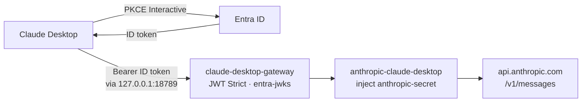

Claude Desktop is great until the Anthropic key lives on every laptop and nobody can answer who called which model, when, or for how much.

The pattern I want is the same one I use for [Claude Code / Codex](/articles/2026-05-08-claude-codex-passthrough-through-agentgateway/) and [MCP through agentgateway](/articles/2026-02-18-route-mcp-traffic-claude-through-agentgateway/): **SSO at the edge, provider secret in the cluster, one place for policy and cost.**

This guide is the Claude Desktop path running in my lab:

👉 **[sebbycorp/k8s-goose](https://github.com/sebbycorp/k8s-goose)** · Live page: **[goose.maniak.ai/claude-desktop.html](https://goose.maniak.ai/claude-desktop.html)** · Deep dive: [`docs/claude-desktop-gateway.md`](https://github.com/sebbycorp/k8s-goose/blob/main/docs/claude-desktop-gateway.md)

---

## Architecture

Claude Desktop authenticates with **Entra (PKCE)**, sends an **ID token** as Bearer, the gateway validates it **Strict** against Entra JWKS, then injects the Anthropic key upstream.



| Hop | What happens |
|-----|----------------|
| **1 · PKCE** | Entra Interactive public client (`agw-claude-desktop`) |
| **2 · Bearer** | **ID token**, not access token |
| **3 · Gateway** | JWT Strict against `entra-jwks` |
| **4 · Upstream** | Anthropic via `anthropic-secret` |

Path is `/` on this dedicated Gateway so Claude Desktop can call `{base}/v1/messages`. The open Anthropic path for kagent stays on `anthropic-claude-gateway` (different NodePort / path).

---

## Why a loopback proxy

Claude Desktop allows **plain HTTP only on loopback**. Direct lab HTTPS into Electron often dies with `ERR_CERT_AUTHORITY_INVALID` even when browsers can be taught to trust the cert.

So the recommended lab path is:

1. Run a tiny TCP proxy on your laptop
2. Point Claude Desktop at `http://127.0.0.1:18789/`
3. Let the proxy forward to the cluster HTTP NodePort

From [k8s-goose](https://github.com/sebbycorp/k8s-goose):

```bash
python3 scripts/claude-desktop-lab-proxy.py
```

Leave that process running.

| Thing | Lab value |
|-------|-----------|
| Service | `claude-desktop-gateway` · ns `agentgateway-system` |
| Claude Desktop base URL | `http://127.0.0.1:18789/` |
| Messages path | `http://127.0.0.1:18789/v1/messages` |
| Proxy upstream (HTTP NodePort) | `172.16.10.155:31938` · Service `80:31938/TCP` |
| HTTPS NodePort (optional / advanced) | `https://172.16.10.155:31211/` · often rejected by Electron |

Confirm NodePorts anytime:

```bash
kubectl --context maniak-goose -n agentgateway-system get svc claude-desktop-gateway -o wide
```

Anonymous calls should **401/403**. A valid Entra ID token should reach Anthropic.

---

## Entra app

Public client already registered for Claude Desktop’s loopback PKCE flow.

| Field | Value |
|-------|-------|
| App name | `agw-claude-desktop` |
| Tenant ID | `8635e970-2205-4189-bc77-77519ff5064f` |
| Client ID | `adf4a4f8-45a4-4bda-a7e2-35f39b1db59d` |
| Issuer | `https://login.microsoftonline.com/8635e970-2205-4189-bc77-77519ff5064f/v2.0` |
| Platform | **Mobile and desktop applications** (not Web) |
| Redirect URI | `http://127.0.0.1/callback` |
| Public client flows | Yes (no client secret · PKCE) |

### Critical Entra callouts

**Bearer must be an ID token.**  
Default Claude Desktop mode and this gateway’s `aud` = the app’s client ID. Access tokens have a different audience story and fail Strict JWT.

**Redirect must include `/callback`.**  
Register `http://127.0.0.1/callback`. `http://127.0.0.1` alone fails with `AADSTS50011`. The port is wildcarded.

**Platform = Mobile and desktop — not Web.**  
Entra rejects the loopback PKCE callback on the Web platform. Public client, no secret.

Include `offline_access` so users are not re-prompted every ~1h when using ID tokens.

---

## Claude Desktop developer config

1. **Help → Troubleshooting → Enable Developer Mode**
2. **Developer → Configure Third-Party Inference…**
3. Fully quit and relaunch after edits if the UI is sticky

**Start the proxy first**, then set:

| Field | Value |
|-------|-------|
| Connection / Inference provider | Gateway |
| Gateway base URL | `http://127.0.0.1:18789/` |
| Credential kind | Interactive sign-in |
| Client ID | `adf4a4f8-45a4-4bda-a7e2-35f39b1db59d` |
| Issuer URL | `https://login.microsoftonline.com/8635e970-2205-4189-bc77-77519ff5064f/v2.0` |
| Bearer token | **ID token** (not Access token) |
| Scopes | `openid email profile offline_access` |
| Model discovery | On → `http://127.0.0.1:18789/v1/models` |

Walkthrough expectation: Entra consent → signed in as your org profile → model discovery fills the picker → a trivial chat (`whats 2+2`) comes back through the gateway footer.

Screenshots from a working lab session live under [`assets/claude-desktop/`](https://github.com/sebbycorp/k8s-goose/tree/main/assets/claude-desktop) in k8s-goose.

---

## Cluster resources (GitOps)

Everything is under `config/` via the Argo app `agentgateway-config`. Push + sync is enough for the laptop proxy path — no Gateway/JWT YAML changes required just to point Claude Desktop at the lab.

| Kind | Name | File |
|------|------|------|
| Gateway | `claude-desktop-gateway` | `config/gateway/claude-desktop-gateway.yaml` |
| HTTPRoute | `claude-desktop` | `config/routes/claude-desktop-route.yaml` |
| AgentgatewayBackend | `anthropic-claude-desktop` | `config/backends/anthropic-claude-desktop.yaml` |
| AgentgatewayPolicy | `claude-desktop-jwt-auth` | `config/policies/claude-desktop-jwt-auth.yaml` |
| Lab proxy | — | `scripts/claude-desktop-lab-proxy.py` |

**Reused — do not recreate:** `AgentgatewayBackend/entra-jwks`, `Secret/anthropic-secret` (ExternalSecret → Vault), `Secret/solo-ui-tls` (HTTPS terminate), cost catalog parameters.

---

## Why bother

| Without gateway | With this path |
|-----------------|----------------|
| Anthropic key on the laptop | Key stays in Vault / cluster |
| Claude.ai account or raw API key sprawl | Org Entra sign-in |
| No shared policy / spend story | Same agentgateway budgets, traces, and cost catalog as the rest of the lab |

If you already route Claude Code or MCP through agentgateway, this is the Desktop sibling: same identity story, dedicated Gateway so `/v1/messages` just works.

---

## Further reading

- Live lab page: [goose.maniak.ai/claude-desktop.html](https://goose.maniak.ai/claude-desktop.html)
- Markdown deep-dive: [docs/claude-desktop-gateway.md](https://github.com/sebbycorp/k8s-goose/blob/main/docs/claude-desktop-gateway.md)
- Related: [Claude Code & Codex through agentgateway](/articles/2026-05-08-claude-codex-passthrough-through-agentgateway/)
- Related: [Route MCP / Claude traffic through agentgateway](/articles/2026-02-18-route-mcp-traffic-claude-through-agentgateway/)
