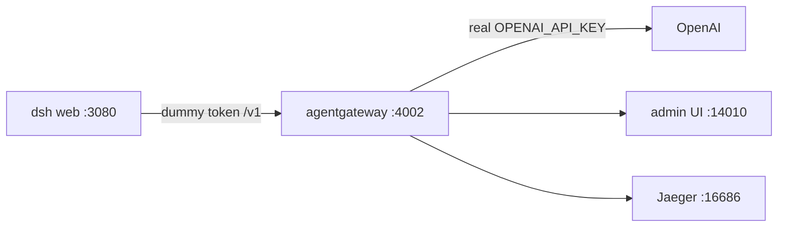

Another local agent UI, another form field asking for my OpenAI key. This time it was [DeepSeek Harness](https://github.com/deepseek-ai/dsh) — `dsh`, the agent UI you get from a single `npx`.

Same answer as always: **the UI gets a dummy token, the gateway holds the real one.**

Harness talks to `http://127.0.0.1:4002/v1` with a string I made up. Standalone [agentgateway](https://agentgateway.dev) is the only process on the box that ever sees `OPENAI_API_KEY`. Token counts, the USD number, and the Jaeger traces live on the gateway, not in the app.

Two turns through it — `2+2` and the capital of France — came out to **39 tokens, 2 calls, $0.0000072**. That's the whole point: I can say that number out loud.

👉 Everything here is in the repo: **[sebbycorp/deepseek-agw](https://github.com/sebbycorp/deepseek-agw)** · Haven't run the binary yet? Start with **[agentgateway standalone locally](/articles/2026-03-12-agentgateway-quickstart-standalone/)**


---

## Architecture

Three processes on one laptop. Harness is the one I talk to. The gateway is the one with the wallet.



| Piece | Holds the real key? | What it does |
|-------|---------------------|--------------|
| **DeepSeek Harness** `:3080` | No — dummy token | The agent UI. Speaks OpenAI-compatible to the gateway. |
| **agentgateway** `:4002` | **Yes** — process env only | Injects the real key, meters tokens and cost, emits traces. |
| **Admin UI** `:14010` | No | Analytics, Logs, Costs for everything above. |
| **Jaeger** `:16686` | No | OTLP traces from the gateway. |

The key is not in GitHub, not in `$DSH_HOME`, and not in the harness process. A mode-600 file gets sourced by a start script and exported into the gateway process only. The committed YAML has a `$OPENAI_API_KEY` placeholder and nothing else.

---

## What was actually on my desk

| Thing | Value |
|-------|-------|
| agentgateway | **1.4.1**, pinned |
| Node | **24** — Node 20 is too old for current `dsh` |
| Harness UI | `http://127.0.0.1:3080` |
| LLM listener | `http://127.0.0.1:4002/v1` |
| Admin UI | `http://127.0.0.1:14010/ui` |
| Metrics | `http://127.0.0.1:14030` |
| Models | `gpt-4o`, `gpt-4o-mini` |
| Session title | "Simple Arithmetic Query" |
| The bill | 39 tokens · 2 calls · $0.0000072 |

---

## Standalone agentgateway

Node 24 first, because current `dsh` won't run on 20:

```bash
nvm install 24
nvm use 24
node -v
```

Gateway and `agctl`, pinned. I'm on the [1.4 OSS line](/articles/2026-07-27-agentgateway-1-4-oss-from-1-3/):

```bash
curl -sL https://agentgateway.dev/install | bash -s -- --version v1.4.1
agentgateway --version
```

Import the cost catalog once. This is what turns raw token counts into a dollar figure:

```bash
mkdir -p costs
agctl costs import --source models.dev --providers openai --out ./costs/catalog.json
```

Jaeger all-in-one, if you want the traces:

```bash
docker run -d --name jaeger \
  -e COLLECTOR_OTLP_ENABLED=true \
  -p 16686:16686 -p 4317:4317 -p 4318:4318 \
  jaegertracing/all-in-one:latest
```

The config carries **no secret** — just the placeholder:

```yaml
config:
  adminAddr: localhost:14010
  statsAddr: "[::]:14030"
  modelCatalog:
    - file: ./costs/catalog.json
  tracing:
    otlpEndpoint: http://localhost:4317
    randomSampling: true

gateways:
  default:
    port: 4002

llm:
  models:
    - name: "*"
      provider: openAI
      params:
        apiKey: "$OPENAI_API_KEY"
```

The real key goes in a mode-600 file that git never sees:

```bash
mkdir -p .secrets
umask 077
printf 'export OPENAI_API_KEY=sk-...\n' > .secrets/openai.env
chmod 600 .secrets/openai.env
```

And the start script sources that file into **this process only**, refusing to boot if it's missing or empty:

```bash
#!/usr/bin/env bash
set -euo pipefail
SECRET="${AGW_SECRET_FILE:-$ROOT/.secrets/openai.env}"
[[ -f "$SECRET" ]] || { echo "missing $SECRET" >&2; exit 1; }
set -a; . "$SECRET"; set +a
[[ -n "${OPENAI_API_KEY:-}" ]] || { echo "OPENAI_API_KEY is empty" >&2; exit 1; }
exec agentgateway -f "$ROOT/agentgateway.yaml"
```

```bash
./start-agw.sh
```

Confirm the admin UI at `http://127.0.0.1:14010/ui` **before** you touch Harness. If the gateway isn't up, the next section just produces confusing errors.

---

## Start Harness with a fake key

```bash
export GATEWAY_API_KEY=local-harness-not-openai
npx @deepseek-ai/dsh web
```

That's the dummy. Read it again — `local-harness-not-openai`. It is not a credential, it's a label. The gateway is on loopback and swaps in the real thing.

Now **don't send a turn yet.** Out of the box, the first message goes to `deepseek-official` with no `DEEPSEEK_API_KEY` on this box, and you get a confusing failure that has nothing to do with the gateway. Wire it up first.

---

## Wire Harness to the gateway

Open `http://127.0.0.1:3080` and go to **Settings → Models**. DeepSeek stays red here — there's no DeepSeek key on this laptop, and I don't want one. The custom agentgateway row is green.


Add a custom provider — or edit the one already in `$DSH_HOME/settings.yaml`:

| Field | Value |
|-------|-------|
| Provider ID | `agw` |
| Display name | `agentgateway (OpenAI via dummy token)` |
| API protocol | `openai-completions` |
| Base URL | `http://127.0.0.1:4002/v1` |
| `apiKeyEnv` | `GATEWAY_API_KEY` |
| Key value | `local-harness-not-openai` — **not** the real OpenAI key |


Then add the models — at least `gpt-4o` and `gpt-4o-mini` — and **change max output tokens to 8192**. This is the one that cost me a few minutes, so it gets its own section below.


**New Session**, and pick **agentgateway / gpt-4o**. The picker groups the DeepSeek models separately from the custom provider, so it's hard to get wrong once you know to look.


Prefer files? The UI just writes `$DSH_HOME/settings.yaml` (usually `~/.dsh`), so you can skip the clicking:

```yaml
llm-pi-ai:
  providers:
    agw:
      apiKeyEnv: GATEWAY_API_KEY
      api: openai-completions
      baseURL: http://127.0.0.1:4002/v1
      models:
        - id: gpt-4o
          maxTokens: 8192
        - id: gpt-4o-mini
          maxTokens: 8192
```

The dummy token lands in `$DSH_HOME/.credentials.yaml`. That file holds `GATEWAY_API_KEY`, never `OPENAI_API_KEY`. If you exported the variable before `npx`, Harness resolves it from the env instead. Same dummy, same rule: **nothing real goes in `$DSH_HOME`.**

---

## The two gotchas

Both of these bit me, and neither is the gateway's fault:

| Symptom | What's happening | Fix |
|---------|------------------|-----|
| `gpt-4o` returns **400** | Harness defaults `maxTokens` to **32768**. `gpt-4o` caps completion tokens at **16384**. | Set max output tokens to 16384 or 8192 |
| First turn fails on a missing key | The session is still on `deepseek-official`, and there's no `DEEPSEEK_API_KEY` here | **New Session** → `agw` / `gpt-4o` |

That's the entire troubleshooting section. Once the provider is right and the token cap is sane, it just works.

---

## Two turns, then the receipts

I kept the test deliberately boring:

- *"What is 2+2? Reply with just the number."* → **4**
- *"Name the capital of France in one word."* → **Paris**


Now the part I actually care about. Open the admin UI and the traffic is right there — **39 tokens, 2 calls, $0.0000072** — broken down by model, user, and provider:


And the Logs page proves the dummy-token path really did reach OpenAI — two `CHAT` / `200` rows, with model routing resolving `gpt-4o-mini` → `gpt-4o-mini-2024-07-18`, provider `openai`. No key anywhere on the page:


If you want the deeper version of this view, I wrote up the [cost and tokenomics dashboard](/articles/2026-06-24-agentgateway-cost-tokenomics-dashboard/) separately.

---

## The same thing on Kubernetes

The pattern doesn't change when you move it to a cluster — only where the secret lives. The mode-600 file becomes a Secret, and the local config becomes CRDs. The repo has these as applyable files under [`k8s/`](https://github.com/sebbycorp/deepseek-agw/tree/main/k8s):

| Standalone | Kubernetes |
|------------|------------|
| mode-600 `.secrets/openai.env` | `openai-secret` Secret, `Authorization` key |
| `llm.models` in the YAML | `AgentgatewayBackend` + `/v1` `HTTPRoute` |
| `config.modelCatalog` | ConfigMap + `AgentgatewayParameters` on the **Gateway** |
| `config.tracing` | `AgentgatewayPolicy` → Jaeger |
| `http://127.0.0.1:4002/v1` | `http://127.0.0.1:8080/v1` via port-forward |

```bash
kubectl port-forward -n agentgateway-system deploy/agentgateway-proxy 8080:80
export GATEWAY_API_KEY=local-harness-not-openai
npx @deepseek-ai/dsh web
```

Harness doesn't care. Same provider form, same dummy token, different base URL.

One trap worth repeating: the cost catalog has to be attached to the **Gateway** through `AgentgatewayParameters`. A GatewayClass-level catalog is quietly ignored.

**Fair warning:** I ran the standalone path end to end — that's where the screenshots come from. The Kubernetes manifests mirror the 1.4.x CRDs but I didn't stand a cluster up for this one, so treat them as a starting point rather than something I've proven. The general cluster walkthrough is in [agentgateway quickstart on Kubernetes](/articles/2026-03-12-agentgateway-quickstart-kubernetes/).

---

## Why bother

| Without the gateway | With it |
|---------------------|---------|
| Real OpenAI key pasted into an agent UI's settings | Key lives in one process, in one mode-600 file |
| The key spreads to `$DSH_HOME`, then to a backup, then who knows | `$DSH_HOME` holds a string I invented |
| "What did that session cost?" — no idea | 39 tokens, 2 calls, $0.0000072 |
| Rotating the key means touching every tool | Rotate the file, restart the gateway |
| No traces for a local agent | Jaeger on `:16686` |

MCP isn't wired in this first pass — same gateway, later. But the shape is already familiar: whether it's [Claude Code and Codex](/articles/2026-05-08-claude-codex-passthrough-through-agentgateway/), [OpenMausBot](/articles/2026-08-15-openmausbot-standalone-agentgateway/), or DeepSeek Harness, the app stays on loopback and the secret stays in the gateway. Every new toy just points at `/v1`.

---

## Further reading

- Repo: [sebbycorp/deepseek-agw](https://github.com/sebbycorp/deepseek-agw)
- Official: [agentgateway LLM clients](https://agentgateway.dev/docs/standalone/latest/integrations/llm-clients/)
- Related: [How To: Run agentgateway standalone locally](/articles/2026-03-12-agentgateway-quickstart-standalone/)
- Related: [How To: Point OpenMausBot at standalone agentgateway](/articles/2026-08-15-openmausbot-standalone-agentgateway/)
- Related: [How To: Connect Claude Code & Codex through agentgateway](/articles/2026-05-08-claude-codex-passthrough-through-agentgateway/)
- Related: [agentgateway standalone cost & tokenomics dashboard](/articles/2026-06-24-agentgateway-cost-tokenomics-dashboard/)
- Related: [agentgateway 1.4 OSS: what changed from 1.3](/articles/2026-07-27-agentgateway-1-4-oss-from-1-3/)
- Related: [agentgateway quickstart on Kubernetes](/articles/2026-03-12-agentgateway-quickstart-kubernetes/)
- Related: [Proxying all your LLM traffic through agentgateway](/articles/2026-05-20-proxying-all-llm-traffic-through-agentgateway-with-grok-build/)
- Related: [Why your AI agents need a gateway](/articles/2026-02-19-why-your-ai-agents-need-a-gateway/)
- Related: [What is agentgateway.dev?](/articles/2026-03-12-what-is-agentgateway-dev/)
