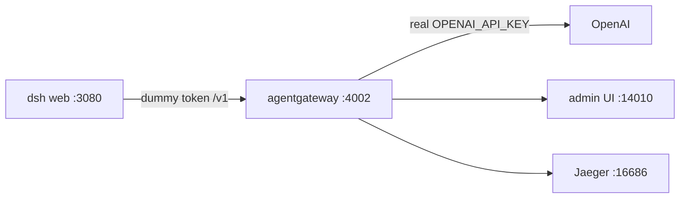

## First, what is DeepSeek Harness?

Two days ago — **August 13, 2026** — DeepSeek open-sourced [DeepSeek Harness](https://github.com/deepseek-ai/deepseek-harness), and the README's pitch is one line: **everything is a plugin.**

Not marketing-everything. Actually everything. Models, tools, skills, sessions, sandboxes, storage, the agent loop, scheduling, even the UI are all swappable from configuration. It's MIT licensed, it's an honest developer preview — the package reads `0.1.0-rc.5` and the README promises breaking changes — and you can be running it in one command:

```bash
npx @deepseek-ai/dsh web
```

What comes up is a local agent workspace: chat on one side, the agent's trajectory on the other, sessions in a sidebar, a model picker at the bottom. It runs on your laptop, with filesystem and shell access, and it's good.

The plugin that matters for this post is the one deciding **where the tokens come from.** Harness will talk to DeepSeek's own models, or to any OpenAI-compatible endpoint you point it at. It asks for exactly one thing in return, on the **Settings → Models** screen: an API key.

That's the moment worth pausing on. A two-day-old agent framework, running with shell access, asking for a provider key it will write to a file in my home directory — and once it has it, every call it makes is between those two parties. No one else sees the traffic. Nothing counts it. Nothing constrains it.

## And what is agentgateway?

**[agentgateway](https://agentgateway.dev)** is an open source connectivity data plane built specifically for agent traffic — LLM calls, MCP tool calls, and agent-to-agent. I've written about [why that needs to be its own thing](/articles/2026-03-12-what-is-agentgateway-dev/) rather than a reverse proxy with extra steps.

For this post the relevant part is simple: it's a single binary that speaks the OpenAI API dialect. Anything that can call OpenAI can call it instead — including Harness.

## What we're actually here to do

Put the gateway between Harness and the provider, and that one hop becomes the place where five things live that the harness has no opinion about:

- **Govern** — one place that decides what this client is allowed to ask for. Virtual keys, prompt guards, rate limits, spend caps.
- **Secure** — the real `OPENAI_API_KEY` stays inside the gateway process. Harness gets a token I invented, and it works just as well.
- **Route** — Harness asks for a model by name; the gateway decides which provider and which exact model version actually serves it.
- **Log** — every call, its status, and the model it resolved to, on one page. Without a proxy, this traffic is invisible.
- **Cost** — tokens turned into dollars with a cost catalog, attributed per model and per user.

Honest scope: this walkthrough wires up **secure, route, log, and cost**. The governance knobs — virtual keys, regex guards, rate limits — are the same gateway and a config block away, and I set those up in the [OpenMausBot post](/articles/2026-08-15-openmausbot-standalone-agentgateway/) if you want them now.

By the end of it I asked Harness two deliberately boring questions, and the gateway handed me a receipt: **39 tokens, 2 calls, $0.0000072.** A meaningless amount of money, and exactly the point — that number simply does not exist when an agent talks to a provider directly.

Here's the whole build, including the two places I broke it.

👉 Everything below is in the repo: **[sebbycorp/deepseek-agw](https://github.com/sebbycorp/deepseek-agw)** · Never run the gateway binary before? Start with **[agentgateway standalone locally](/articles/2026-03-12-agentgateway-quickstart-standalone/)**


---

## The shape of it

Three processes on one laptop, and the only interesting part is which one holds the secret.



Harness thinks it's talking to OpenAI. It isn't — it's talking to a gateway on `127.0.0.1:4002` that speaks the same OpenAI-compatible dialect, accepts my made-up token, and quietly swaps in the real key on the way out. Because every request passes through that one process, it's also the natural place to count tokens, add up dollars, and emit traces.

The rule I care about: **the key is not in GitHub, not in Harness's config directory, and not in the Harness process.** It lives in one file on disk with mode 600, and it gets loaded into exactly one process.

---

## Standing up the gateway

Node first, and this one is worth stating plainly because it cost me a confusing minute: current `dsh` does not run on Node 20. Use 24.

```bash
nvm install 24
nvm use 24
node -v
```

Then the gateway itself, pinned to 1.4.1 — I'm on the [1.4 OSS line](/articles/2026-07-27-agentgateway-1-4-oss-from-1-3/):

```bash
curl -sL https://agentgateway.dev/install | bash -s -- --version v1.4.1
agentgateway --version
```

Next, the piece people skip. The gateway can count tokens on its own, but tokens aren't money. Import the cost catalog once and it can turn those counts into dollars:

```bash
mkdir -p costs
agctl costs import --source models.dev --providers openai --out ./costs/catalog.json
```

If you want traces too, Jaeger all-in-one is one command. Skip it if you don't care — nothing else depends on it:

```bash
docker run -d --name jaeger \
  -e COLLECTOR_OTLP_ENABLED=true \
  -p 16686:16686 -p 4317:4317 -p 4318:4318 \
  jaegertracing/all-in-one:latest
```

Now the config. The thing to notice is what *isn't* in it — there's no secret here, just a placeholder, which is why this file is safe to commit:

```yaml
config:
  adminAddr: localhost:14010
  statsAddr: "[::]:14030"
  modelCatalog:
    - file: ./costs/catalog.json
  tracing:
    otlpEndpoint: http://localhost:4317
    randomSampling: true

gateways:
  default:
    port: 4002

llm:
  models:
    - name: "*"
      provider: openAI
      params:
        apiKey: "$OPENAI_API_KEY"
```

The real key goes in its own file, locked down, and git never sees it:

```bash
mkdir -p .secrets
umask 077
printf 'export OPENAI_API_KEY=sk-...\n' > .secrets/openai.env
chmod 600 .secrets/openai.env
```

And a small start script does the only clever thing in this whole setup — it sources that file into *this process and nothing else*, then refuses to start if the key didn't make it:

```bash
#!/usr/bin/env bash
set -euo pipefail
SECRET="${AGW_SECRET_FILE:-$ROOT/.secrets/openai.env}"
[[ -f "$SECRET" ]] || { echo "missing $SECRET" >&2; exit 1; }
set -a; . "$SECRET"; set +a
[[ -n "${OPENAI_API_KEY:-}" ]] || { echo "OPENAI_API_KEY is empty" >&2; exit 1; }
exec agentgateway -f "$ROOT/agentgateway.yaml"
```

```bash
./start-agw.sh
```

Open `http://127.0.0.1:14010/ui` and make sure the admin UI is actually there before moving on. If the gateway isn't running, everything in the next section fails in ways that look like Harness problems but aren't.

---

## Handing Harness a fake key

```bash
export GATEWAY_API_KEY=local-harness-not-openai
npx @deepseek-ai/dsh web
```

Read that token again: `local-harness-not-openai`. It isn't a credential, it's a label. The gateway is sitting on loopback and will accept it happily, then attach the real key on the way upstream.

Harness comes up on `http://127.0.0.1:3080`. **Don't send a message yet** — mine failed, and I'll get to why in a minute. Wire the provider first.

Go to **Settings → Models**. DeepSeek shows up red here because there's no DeepSeek key on this laptop and I don't want one. The custom agentgateway row is the green one:


Add a custom provider and fill in the form. This is the entire integration — a base URL and a fake token:

| Field | Value |
|-------|-------|
| Provider ID | `agw` |
| Display name | `agentgateway (OpenAI via dummy token)` |
| API protocol | `openai-completions` |
| Base URL | `http://127.0.0.1:4002/v1` |
| `apiKeyEnv` | `GATEWAY_API_KEY` |
| Key value | `local-harness-not-openai` — **not** the real OpenAI key |


Then add the models — `gpt-4o` and `gpt-4o-mini` are enough to start — and change **max output tokens to 8192** while you're in there. That number matters more than it looks, which is the first of my two mistakes:


Finally, **New Session**, and pick **agentgateway / gpt-4o**. The picker keeps the DeepSeek models in their own group above the custom provider, so once you know to look it's hard to get wrong:


None of this has to happen in the browser, by the way. The UI is just writing `$DSH_HOME/settings.yaml` — usually `~/.dsh` — so you can skip the clicking entirely:

```yaml
llm-pi-ai:
  providers:
    agw:
      apiKeyEnv: GATEWAY_API_KEY
      api: openai-completions
      baseURL: http://127.0.0.1:4002/v1
      models:
        - id: gpt-4o
          maxTokens: 8192
        - id: gpt-4o-mini
          maxTokens: 8192
```

The token lands in a second file, `$DSH_HOME/.credentials.yaml`. Worth opening once just to reassure yourself: it holds `GATEWAY_API_KEY`, the fake one. `OPENAI_API_KEY` never appears anywhere in that directory.

---

## Where I tripped

Two failures, ten minutes, neither one the gateway's fault. I'm writing both down because I'd have saved the evening if someone else had.

**The first turn failed on a missing key.** I'd wired everything up, typed a message, and got an error about a DeepSeek credential — which made no sense, because I'd just spent twenty minutes making sure this thing pointed at OpenAI. The catch: my session had been created *before* I added the provider, so it was still sitting on `deepseek-official`, and there's no `DEEPSEEK_API_KEY` on this box. My careful config was real; the session just wasn't using it. **New Session**, pick `agw`, move on.

**Then `gpt-4o` started returning 400.** This one is sneakier. Harness defaults max output tokens to **32768**, and `gpt-4o` caps completion tokens at **16384**. Every request was asking for more headroom than the model allows, and OpenAI was rejecting it before a single token got generated. Set it to 16384 or 8192 and it clears up immediately.

That's the entire troubleshooting section. Fix the provider, fix the ceiling, and it just works.

---

## Two boring questions

I kept the test deliberately dull, because I wasn't testing the model — I was testing the plumbing:

- *"What is 2+2? Reply with just the number."* → **4**
- *"Name the capital of France in one word."* → **Paris**


Four and Paris. Not exactly a demo you'd put on a conference slide. But those two answers travelled from a UI holding a fake token, through a gateway holding the real one, out to OpenAI and back — which is the only thing I wanted to prove.

Now the part I actually built this for. Over in the admin UI, that conversation has a receipt: **39 tokens, 2 calls, $0.0000072**, broken out by model, user, and provider.


The Logs page is the proof that the dummy token really did reach OpenAI and come back: two `CHAT` rows, both `200`, model routing resolving `gpt-4o-mini` to `gpt-4o-mini-2024-07-18` on provider `openai`. And no key anywhere on the page, which is the whole idea.


Scale that thought up. It's a rounding error for two arithmetic questions, but it's the same counter when an agent runs unattended for an hour. If you want the richer version of this view, I went deeper on it in the [cost and tokenomics dashboard](/articles/2026-06-24-agentgateway-cost-tokenomics-dashboard/) post.

---

## The same trick on a cluster

Nothing about the pattern changes when this moves off the laptop. Only the hiding place for the secret does — the mode-600 file becomes a Kubernetes Secret, and the local YAML becomes a handful of CRDs. The repo has them as applyable files under [`k8s/`](https://github.com/sebbycorp/deepseek-agw/tree/main/k8s):

| On my laptop | On a cluster |
|--------------|--------------|
| mode-600 `.secrets/openai.env` | `openai-secret` Secret, `Authorization` key |
| `llm.models` in the YAML | `AgentgatewayBackend` + a `/v1` `HTTPRoute` |
| `config.modelCatalog` | ConfigMap + `AgentgatewayParameters` on the **Gateway** |
| `config.tracing` | `AgentgatewayPolicy` → Jaeger |
| `http://127.0.0.1:4002/v1` | `http://127.0.0.1:8080/v1` through a port-forward |

Harness doesn't notice the difference. Same provider form, same fake token, one different URL:

```bash
kubectl port-forward -n agentgateway-system deploy/agentgateway-proxy 8080:80
export GATEWAY_API_KEY=local-harness-not-openai
npx @deepseek-ai/dsh web
```

One trap worth repeating, because it fails silently: the cost catalog has to be attached to the **Gateway** via `AgentgatewayParameters`. Hang it off the GatewayClass and it's simply ignored — no error, just no dollar figures.

**Being straight with you:** the standalone path is the one I actually ran, and every screenshot above comes from it. The manifests mirror the 1.4.x CRDs, but I didn't stand a cluster up for this one, so treat them as a starting point rather than something I've proven. For a cluster walkthrough I *have* run, see [agentgateway quickstart on Kubernetes](/articles/2026-03-12-agentgateway-quickstart-kubernetes/).

---

## Why I keep doing this

The setup takes an evening. What I get back is the five things I opened with, and they're all boring in the best way.

The key lives in one file, loaded by one process — **secure**. Rotating it means editing that file and restarting one thing, instead of hunting through four config directories, and `~/.dsh` holds a string I invented, so if that directory ends up somewhere it shouldn't, nothing happens. Harness asks for `gpt-4o` and the gateway decides what actually answers — **route**. Every call is on a page with its status and resolved model — **log**. And when someone asks what an agent cost to run, I have a number instead of a shrug — **cost**.

**Govern** is the one I left on the table here, and it's the one that matters most the day you stop being the only user. It's the same binary: a virtual key per client, a regex guard on what can be sent, a rate limit, a spend cap. Nothing about Harness changes when you turn those on — that's the whole advantage of putting the control point outside the app.

MCP isn't wired into this one yet — same gateway, later. Given that Harness makes *everything* a plugin, including its tools, that's the obvious next stop. But the shape keeps repeating. Whether it's [Claude Code and Codex](/articles/2026-05-08-claude-codex-passthrough-through-agentgateway/), [OpenMausBot](/articles/2026-08-15-openmausbot-standalone-agentgateway/), or DeepSeek Harness, the app stays on loopback with a fake token and the secret stays in the gateway. Every new toy just points at `/v1`.

Which means the next one takes ten minutes, not an evening. That's really why I bother.

---

## Further reading

- Repo: [sebbycorp/deepseek-agw](https://github.com/sebbycorp/deepseek-agw)
- Official: [agentgateway LLM clients](https://agentgateway.dev/docs/standalone/latest/integrations/llm-clients/)
- Related: [How To: Run agentgateway standalone locally](/articles/2026-03-12-agentgateway-quickstart-standalone/)
- Related: [How To: Point OpenMausBot at standalone agentgateway](/articles/2026-08-15-openmausbot-standalone-agentgateway/)
- Related: [How To: Connect Claude Code & Codex through agentgateway](/articles/2026-05-08-claude-codex-passthrough-through-agentgateway/)
- Related: [agentgateway standalone cost & tokenomics dashboard](/articles/2026-06-24-agentgateway-cost-tokenomics-dashboard/)
- Related: [agentgateway 1.4 OSS: what changed from 1.3](/articles/2026-07-27-agentgateway-1-4-oss-from-1-3/)
- Related: [agentgateway quickstart on Kubernetes](/articles/2026-03-12-agentgateway-quickstart-kubernetes/)
- Related: [Proxying all your LLM traffic through agentgateway](/articles/2026-05-20-proxying-all-llm-traffic-through-agentgateway-with-grok-build/)
- Related: [Why your AI agents need a gateway](/articles/2026-02-19-why-your-ai-agents-need-a-gateway/)
- Related: [What is agentgateway.dev?](/articles/2026-03-12-what-is-agentgateway-dev/)
