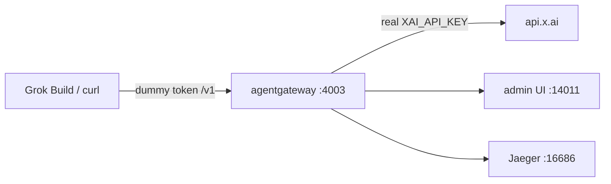

## First, what is Grok Build?

**Grok Build** is xAI's coding agent. It lives in the terminal, reads the repo, edits files, and shells out. Out of the box it talks straight to `api.x.ai` with a key sitting in `~/.grok` or an env var.

That's fine for one laptop. It's ugly the moment you have more than one tool, more than one model, or you actually want to know what you spent.

The setting that matters for this post is a custom model in `~/.grok/config.toml`. Grok Build will talk to any OpenAI-compatible endpoint you give it a `base_url` for. It asks for exactly one thing in return: a key.

That's the moment worth pausing on. A coding agent with shell access, asking for a provider key it will keep on disk — and once it has it, every call is between those two parties. No one else sees the traffic. Nothing counts it. Nothing constrains it.

## And what is agentgateway?

**[agentgateway](https://agentgateway.dev)** is an open source connectivity data plane built specifically for agent traffic — LLM calls, MCP tool calls, and agent-to-agent. I've written about [why that needs to be its own thing](/articles/2026-03-12-what-is-agentgateway-dev/) rather than a reverse proxy with extra steps.

For this post the relevant part is simple: it's a single binary that speaks the OpenAI `/v1` dialect. Anything that can call OpenAI can call it instead — including Grok Build, and including curl. The client never holds the real key.

## What we're actually here to do

Put the gateway between Grok Build and xAI, and that one hop becomes the place where five things live that the agent has no opinion about:

- **Govern** — one place that decides what this client is allowed to ask for. Virtual keys, prompt guards, rate limits, spend caps.
- **Secure** — the real `XAI_API_KEY` stays inside the gateway process. Grok Build gets a token I invented, and it works just as well.
- **Route** — Grok Build asks for `grok-4-latest`; the gateway decides which provider and which exact model version actually serves it. Mine resolved to `grok-4.3`.
- **Log** — every call, its status, and the model it resolved to, on one page. Without a proxy, this traffic is invisible.
- **Cost** — tokens turned into dollars with a cost catalog, attributed per model and per provider.

I'll build the standalone path we actually ran on one box. No cluster required. Secure, route, log, and cost come first, because you want to see traffic before you start refusing it. Governance is the same door getting pickier later — I walked that part in the [DeepSeek Harness post](/articles/2026-08-15-deepseek-harness-standalone-agentgateway/) from today. This Saturday I wanted the hop working, and a receipt.

The older kind runbook — client holds the key, gateway just forwards `Authorization` — is a different path: [`docs/grok-passthrough-kind.md`](https://github.com/sebbycorp/grok-build-with-agentgateway/blob/main/docs/grok-passthrough-kind.md). Mentioning it so you don't follow it by accident.

By the end of it I asked two deliberately boring questions, and the gateway handed me a receipt: **$0.0044 / 623 tokens / 2 calls.** A small amount of money, and exactly the point — that number simply does not exist when an agent talks to xAI directly.

Here's the whole build, including the five places I tripped.

👉 Everything below is in the repo: **[sebbycorp/grok-build-with-agentgateway](https://github.com/sebbycorp/grok-build-with-agentgateway)** · Never run the gateway binary before? Start with **[agentgateway standalone locally](/articles/2026-03-12-agentgateway-quickstart-standalone/)**


---

## The shape of it

Two processes on one laptop, and the only interesting part is which one holds the secret.



| Hop | What happens |
|-----|----------------|
| **1 · Client** | Grok Build or curl hits `http://127.0.0.1:4003/v1` with `Authorization: Bearer local-grok-not-xai`. |
| **2 · Gateway** | agentgateway accepts the dummy token and injects `XAI_API_KEY` from process env. Tokens and cost get metered here. |
| **3 · Upstream** | Official [xAI provider](https://agentgateway.dev/docs/standalone/latest/llm/providers/xai/). Default upstream is `https://api.x.ai/v1`. |
| **4 · Receipt** | Admin UI on `:14011`. Metrics on `:14032`. Jaeger on `:16686` if you started it. |

Grok Build thinks it's talking to xAI. It isn't — it's talking to a gateway on `127.0.0.1:4003` that speaks the same OpenAI-compatible dialect, accepts my made-up token, and quietly swaps in the real key on the way out. Because every request passes through that one process, it's also the natural place to count tokens, add up dollars, and emit traces.

The rule I care about: **the key is not in GitHub, not in `~/.grok`, and not in the Grok Build process.** It lives in one file on disk with mode 600, and it gets loaded into exactly one process.

Ports are **4003 / 14011** on purpose, so this instance can sit next to an OpenAI gateway on `4002 / 14010` — the [DeepSeek Harness](/articles/2026-08-15-deepseek-harness-standalone-agentgateway/) / [OpenMausBot](/articles/2026-08-15-openmausbot-standalone-agentgateway/) lab. Same laptop, two providers, two doors.

---

## Standing up the gateway

Pinned to 1.4.1 — I'm on the [1.4 OSS line](/articles/2026-07-27-agentgateway-1-4-oss-from-1-3/):

```bash
curl -sL https://agentgateway.dev/install | bash -s -- --version v1.4.1
agentgateway --version
```

Next, the piece people skip. The gateway can count tokens on its own, but tokens aren't money. Import the cost catalog once and it can turn those counts into dollars:

```bash
mkdir -p costs
agctl costs import --source models.dev --providers xai --out ./costs/catalog.json
```

If you want traces too, Jaeger all-in-one is one command. Skip it if you don't care — nothing else depends on it:

```bash
docker run -d --name jaeger \
  -e COLLECTOR_OTLP_ENABLED=true \
  -p 16686:16686 -p 4317:4317 -p 4318:4318 \
  jaegertracing/all-in-one:latest
```

Now the config. The thing to notice is what *isn't* in it — there's no secret here, just a placeholder, which is why this file is safe to commit. Standalone has a first-class `provider: xai`. Default upstream is `https://api.x.ai/v1`.

```yaml
# yaml-language-server: $schema=https://agentgateway.dev/schema/config
config:
  adminAddr: localhost:14011
  statsAddr: "[::]:14032"
  readinessAddr: "[::]:14033"
  database:
    url: "sqlite://./data.db?mode=rwc"
  modelCatalog:
  - file: ./costs/catalog.json
  tracing:
    otlpEndpoint: http://localhost:4317
    randomSampling: true

gateways:
  default:
    port: 4003

llm:
  models:
  - name: "*"
    provider: xai
    params:
      apiKey: "$XAI_API_KEY"
```

The sqlite URL is what makes Analytics and Logs actually store rows. Skip it and the admin UI looks empty even when the calls succeeded.

The real key goes in its own file, locked down, and git never sees it:

```bash
mkdir -p .secrets
umask 077
printf 'export XAI_API_KEY=xai-...\n' > .secrets/xai.env
chmod 600 .secrets/xai.env
```

And a small start script does the only clever thing in this whole setup — it sources that file into *this process and nothing else*, then refuses to start if the key didn't make it:

```bash
#!/usr/bin/env bash
set -euo pipefail
ROOT="$(cd "$(dirname "$0")" && pwd)"
cd "$ROOT"
SECRET="${AGW_SECRET_FILE:-$ROOT/.secrets/xai.env}"
[[ -f "$SECRET" ]] || { echo "missing $SECRET" >&2; exit 1; }
set -a; . "$SECRET"; set +a
[[ -n "${XAI_API_KEY:-}" ]] || { echo "XAI_API_KEY is empty after sourcing $SECRET" >&2; exit 1; }
exec agentgateway -f "$ROOT/agentgateway.yaml"
```

```bash
./start-agw.sh
```

Open `http://127.0.0.1:14011/ui` and make sure the admin UI is actually there before moving on. If the gateway isn't running, everything in the next section fails in ways that look like Grok problems but aren't.


---

## Two boring questions

I kept the test deliberately dull, because I wasn't testing the model — I was testing the plumbing. Dummy inbound token. Real key stays on the gateway.

```bash
curl -sS http://127.0.0.1:4003/v1/chat/completions \
  -H "Content-Type: application/json" \
  -H "Authorization: Bearer local-grok-not-xai" \
  -d '{
    "model": "grok-4-latest",
    "messages": [
      {"role": "user", "content": "What is 2+2? Reply with just the number."}
    ]
  }' | jq
```

Read that token again: `local-grok-not-xai`. It isn't a credential, it's a label. The gateway is sitting on loopback and will accept it happily, then attach the real key on the way upstream.

Then a second short turn so Analytics has more than one row:

```bash
curl -sS http://127.0.0.1:4003/v1/chat/completions \
  -H "Content-Type: application/json" \
  -H "Authorization: Bearer local-grok-not-xai" \
  -d '{
    "model": "grok-4-latest",
    "messages": [
      {"role": "user", "content": "Name the capital of France in one word."}
    ]
  }' | jq
```

This box: both returned **200**. `grok-4-latest` routed to `grok-4.3`. Answers were `4` and `Paris`.

- *"What is 2+2? Reply with just the number."* → **4**
- *"Name the capital of France in one word."* → **Paris**

Four and Paris. Not exactly a demo you'd put on a conference slide. But those two answers travelled from a client holding a fake token, through a gateway holding the real one, out to xAI and back — which is the only thing I wanted to prove.

Official agentgateway docs mention `grok-2-latest`. This box used `grok-4-latest`. If a model 404s, list what your account actually has through the same listener:

```bash
curl -sS http://127.0.0.1:4003/v1/models \
  -H "Authorization: Bearer local-grok-not-xai" | jq
```

---

## A receipt

Now the part I actually built this for. Over in the admin UI, that conversation has a receipt: **$0.0044 / 623 tokens / 2 calls**.


The Logs page is the proof that the dummy token really did reach xAI and come back: two `CHAT` rows, both `200`, model routing resolving `grok-4-latest` to `grok-4.3` on provider `xai`. And no key anywhere on those pages, which is the whole idea.


Scale that thought up. It's a small bill for two short questions, but it's the same counter when an agent runs unattended for an hour. If you want the richer version of this view, I went deeper on it in the [cost and tokenomics dashboard](/articles/2026-06-24-agentgateway-cost-tokenomics-dashboard/) post.

---

## Point Grok Build at the same door

Grok Build reads `~/.grok/config.toml`. Add a custom model that talks to the gateway with the **dummy** token, not `XAI_API_KEY`.


```toml
[model.agw]
model = "grok-4-latest"
base_url = "http://127.0.0.1:4003/v1"
env_key = "GATEWAY_API_KEY"

[models]
default = "agw"
```

```bash
export GATEWAY_API_KEY=local-grok-not-xai
grok
```

Or `grok -m agw`. `env_key` is the name of an env var Grok Build reads. That var is the dummy. The real xAI key never enters `~/.grok`. Switch models in the TUI with `/model`.

---

## Where I tripped

Five failures, all of them mine, none of them the gateway's fault. I'm writing them down because I'd have saved the evening if someone else had.

**`start-agw.sh` refused to start.** I'd typed the YAML, I'd typed the curls, and the launcher said `missing .secrets/xai.env`. The script is doing the only clever thing in this setup on purpose: it will not bring the process up if the mode-600 file is missing or if `XAI_API_KEY` is empty after sourcing it. Redo the 600 file. Do not put the key in the YAML.

**Then the curls came back 401 from upstream.** Same class of mistake, later in the path. The dummy token was fine — `local-grok-not-xai` is a label, not a credential. The real key was empty or wrong in the process env. Check the 600 file. Still do not put the key in the YAML.

**Then a model 404.** Official agentgateway docs mention `grok-2-latest`. This box used `grok-4-latest`. If the id isn't on your xAI account, `GET /v1/models` through the same listener and pick one you have.

**Analytics and Logs stayed empty.** The calls had returned 200. The admin UI looked like nothing had happened. Two causes, both boring: the client wasn't actually hitting `:4003`, or `config.database` was missing. The sample YAML includes `sqlite://./data.db?mode=rwc` for a reason. Recheck the base URL before you rebuild the catalog.

**Port already in use.** Another agentgateway was already sitting on `4002 / 14010` — the OpenAI door from the DeepSeek / OpenMausBot lab. This config uses `4003 / 14011` on purpose so they can share a laptop. If you copy the OpenAI YAML and forget to change the ports, the second process loses.

That's the entire troubleshooting section. Fix the file, fix the key, pick a model you have, keep the sqlite URL, stay off the other door.

---

## The same trick on a cluster

Nothing about the pattern changes when this moves off the laptop. Only the hiding place for the secret does — the mode-600 file becomes a Kubernetes Secret, and the local YAML becomes a handful of CRDs. The repo has them under [`k8s/`](https://github.com/sebbycorp/grok-build-with-agentgateway/tree/main/k8s), with a walkthrough in [`docs/kubernetes.md`](https://github.com/sebbycorp/grok-build-with-agentgateway/blob/main/docs/kubernetes.md).

**Being straight with you:** the standalone path is the one I actually ran, and every screenshot above comes from it. The manifests exist. I didn't stand a cluster up for this one, so treat them as a starting point rather than something I've proven. For a cluster walkthrough I *have* run, see [proxying all your LLM traffic through agentgateway with Grok Build](/articles/2026-05-20-proxying-all-llm-traffic-through-agentgateway-with-grok-build/) and [agentgateway quickstart on Kubernetes](/articles/2026-03-12-agentgateway-quickstart-kubernetes/).

The older kind passthrough — client holds the key — is still [`docs/grok-passthrough-kind.md`](https://github.com/sebbycorp/grok-build-with-agentgateway/blob/main/docs/grok-passthrough-kind.md). Different runbook. Not this path.

MCP isn't wired into this one yet. Same gateway, later.

---

## Why I keep doing this

The setup takes an evening. What I get back is the five things I opened with, and they're all boring in the best way.

| Without the gateway | With this path |
|---------------------|----------------|
| Grok Build talks straight to `api.x.ai` with a key in `~/.grok` | Dummy token in `~/.grok`. Real `XAI_API_KEY` lives in one process. |
| Nothing decides who may call, or what they may send | The hop is where govern lives — virtual keys, guards, ceilings — when you want the door pickier |
| `grok-4-latest` is whatever xAI serves today | The gateway routes it. Mine landed on `grok-4.3`. |
| The traffic is invisible | Two `CHAT` / `200` rows on Logs, provider `xai`, no key on the page |
| "What did this cost?" shrugged off | **$0.0044 / 623 tokens / 2 calls** on Analytics |

The real key lives in one file, loaded by one process, and `~/.grok` holds a dummy token that's worthless anywhere else — **secure**. Rotating the real one means editing a file and restarting a single thing. Grok Build asks for `grok-4-latest` and the gateway decides what actually answers — **route**. Every call is on a page with its status and resolved model — **log**. When someone asks what an agent cost to run, I have a number instead of a shrug — **cost**. And the door can get pickier later without the agent learning that any of this exists — **govern**.

That last one is the reason this is worth an evening rather than a `curl`. The first four make the setup pleasant. Governance is what makes it something you can leave running while you're asleep, or hand to someone who isn't you. I flipped that on for [DeepSeek Harness](/articles/2026-08-15-deepseek-harness-standalone-agentgateway/) today. The agent never learned that any of it happened.

And notice where all of it lives: five controls, none of them inside Grok Build. The TUI never learned that any of this exists.

The shape keeps repeating. Whether it's [Claude Code and Codex](/articles/2026-05-08-claude-codex-passthrough-through-agentgateway/), [OpenMausBot](/articles/2026-08-15-openmausbot-standalone-agentgateway/), [DeepSeek Harness](/articles/2026-08-15-deepseek-harness-standalone-agentgateway/), or Grok Build, the app stays on loopback with a fake token and the secret stays in the gateway. Every new toy just points at `/v1`.

Which means the next one takes ten minutes, not an evening. That's really why I bother.

---

## Further reading

- Repo: [sebbycorp/grok-build-with-agentgateway](https://github.com/sebbycorp/grok-build-with-agentgateway)
- Official: [xAI in standalone agentgateway](https://agentgateway.dev/docs/standalone/latest/llm/providers/xai/)
- Related: [How To: Run agentgateway standalone locally](/articles/2026-03-12-agentgateway-quickstart-standalone/)
- Related: [How To: Point DeepSeek Harness at standalone agentgateway](/articles/2026-08-15-deepseek-harness-standalone-agentgateway/)
- Related: [How To: Point OpenMausBot at standalone agentgateway](/articles/2026-08-15-openmausbot-standalone-agentgateway/)
- Related: [How To: Connect Claude Code & Codex through agentgateway](/articles/2026-05-08-claude-codex-passthrough-through-agentgateway/)
- Related: [How To: Point Claude Desktop at agentgateway with Entra SSO](/articles/2026-08-12-claude-desktop-entra-agentgateway/)
- Related: [agentgateway standalone cost & tokenomics dashboard](/articles/2026-06-24-agentgateway-cost-tokenomics-dashboard/)
- Related: [Proxying all your LLM traffic through agentgateway with Grok Build](/articles/2026-05-20-proxying-all-llm-traffic-through-agentgateway-with-grok-build/)
- Related: [agentgateway 1.4 OSS: what changed from 1.3](/articles/2026-07-27-agentgateway-1-4-oss-from-1-3/)
- Related: [agentgateway quickstart on Kubernetes](/articles/2026-03-12-agentgateway-quickstart-kubernetes/)
- Related: [Why your AI agents need a gateway](/articles/2026-02-19-why-your-ai-agents-need-a-gateway/)
- Related: [What is agentgateway.dev?](/articles/2026-03-12-what-is-agentgateway-dev/)
