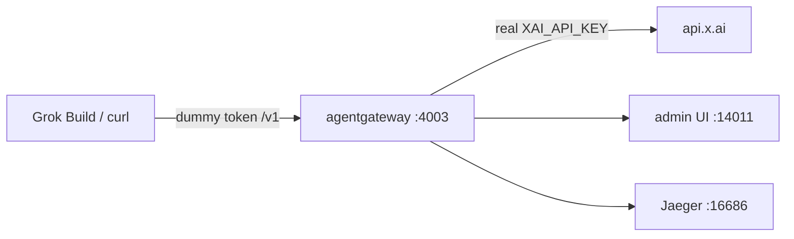

## First, what is Grok Build?

**[Grok Build](https://x.ai/cli)** is xAI's coding agent. It runs in your terminal, reads the repo, edits files, and shells out. SuperGrok and X Premium Plus get it with one install:

```bash
curl -fsSL https://x.ai/cli/install.sh | bash
```

Out of the box it talks straight to `api.x.ai`. The key lives in `~/.grok` or an env var, and every call is between those two parties. Fine for one laptop. Ugly the moment you have more than one tool, more than one model, or you actually want to know what you spent.

The plugin that matters for this post is a custom model in `~/.grok/config.toml`. Grok Build will talk to any OpenAI-compatible endpoint you give it a `base_url` for. It asks for exactly one thing in return: a key.

That's the moment worth pausing on. A coding agent with shell access, asking for a provider key it will keep on disk — and once it has it, nothing else sees the traffic. Nothing counts it. Nothing constrains it.

## And what is agentgateway?

**[agentgateway](https://agentgateway.dev)** is an open source connectivity data plane built specifically for agent traffic — LLM calls, MCP tool calls, and agent-to-agent. I've written about [why that needs to be its own thing](/articles/2026-03-12-what-is-agentgateway-dev/) rather than a reverse proxy with extra steps.

For this post the relevant part is simple: it's a single binary that speaks the OpenAI API dialect. Anything that can call OpenAI can call it instead — including Grok Build.

That is why the gateway matters. One place to **govern** who can call what, **route** traffic to the right model, **optimize** the path, and **analyze** tokens and spend. Analytics and Logs on the admin UI are not a nice-to-have. They are the point.

## What we're actually here to do

Put the gateway between Grok Build and xAI, and that one hop becomes the place where five things live that the agent has no opinion about:

- **Govern** — one place that decides what this client is allowed to ask for. Virtual keys, prompt guards, rate limits, spend caps.
- **Secure** — the real `XAI_API_KEY` stays inside the gateway process. Grok Build gets a token I invented, and it works just as well.
- **Route** — Grok Build asks for `grok-4-latest`; the gateway decides which provider and which exact model version actually serves it. Mine resolved to `grok-4.3`.
- **Optimize** — one `/v1` for every tool. Swap the upstream, add a cheaper model, send coding work to a local box, without touching `~/.grok` again.
- **Analyze** — every call, its status, the model it resolved to, tokens turned into dollars. Without a proxy, this traffic is invisible.

I'll build the standalone path we actually ran on one machine. Secure, route, and analyze come first, because you want to see traffic before you start refusing it. Governance is the same door getting pickier later — I walked that part in the [DeepSeek Harness post](/articles/2026-08-15-deepseek-harness-standalone-agentgateway/) from today, and the YAML is the same idea here.

By the end of it I sent two deliberately boring questions, and the gateway handed me a receipt: **623 tokens, 2 calls, $0.0044.** A small amount of money, and exactly the point — that number simply does not exist when an agent talks to xAI directly.

👉 Everything below is in the repo: **[sebbycorp/grok-build-with-agentgateway](https://github.com/sebbycorp/grok-build-with-agentgateway)** · Never run the gateway binary before? Start with **[agentgateway standalone locally](/articles/2026-03-12-agentgateway-quickstart-standalone/)**


---

## The shape of it

Two processes on one laptop, and the only interesting part is which one holds the secret.



Grok Build thinks it's talking to xAI. It isn't — it's talking to a gateway on `127.0.0.1:4003` that speaks the same OpenAI-compatible dialect, accepts my made-up token, and quietly swaps in the real key on the way out. Because every request passes through that one process, it's also the natural place to count tokens, add up dollars, and emit traces.

The rule I care about: **the key is not in GitHub, not in `~/.grok`, and not in the Grok Build process.** It lives in one file on disk with mode 600, and it gets loaded into exactly one process.

Ports are **4003 / 14011** on purpose, so this instance can sit next to an OpenAI gateway on `4002 / 14010`. Same laptop, two providers, two doors.

---

## Standing up the gateway

Pinned to 1.4.1 — I'm on the [1.4 OSS line](/articles/2026-07-27-agentgateway-1-4-oss-from-1-3/):

```bash
curl -sL https://agentgateway.dev/install | bash -s -- --version v1.4.1
agentgateway --version
```

Next, the piece people skip. The gateway can count tokens on its own, but tokens aren't money. Import the cost catalog once and it can turn those counts into dollars:

```bash
mkdir -p costs
agctl costs import --source models.dev --providers xai --out ./costs/catalog.json
```

If you want traces too, Jaeger all-in-one is one command. Skip it if you don't care — nothing else depends on it:

```bash
docker run -d --name jaeger \
  -e COLLECTOR_OTLP_ENABLED=true \
  -p 16686:16686 -p 4317:4317 -p 4318:4318 \
  jaegertracing/all-in-one:latest
```

Now the config. The thing to notice is what *isn't* in it — there's no secret here, just a placeholder, which is why this file is safe to commit. Standalone has a first-class `provider: xai`. Default upstream is `https://api.x.ai/v1`.

```yaml
config:
  adminAddr: localhost:14011
  statsAddr: "[::]:14032"
  database:
    url: "sqlite://./data.db?mode=rwc"
  modelCatalog:
    - file: ./costs/catalog.json
  tracing:
    otlpEndpoint: http://localhost:4317
    randomSampling: true

gateways:
  default:
    port: 4003

llm:
  models:
    - name: "*"
      provider: xai
      params:
        apiKey: "$XAI_API_KEY"
```

The sqlite URL is what makes Analytics and Logs actually store rows. Skip it and the admin UI looks empty even when the calls succeeded.

The real key goes in its own file, locked down, and git never sees it:

```bash
mkdir -p .secrets
umask 077
printf 'export XAI_API_KEY=xai-...\n' > .secrets/xai.env
chmod 600 .secrets/xai.env
```

And a small start script does the only clever thing in this whole setup — it sources that file into *this process and nothing else*, then refuses to start if the key didn't make it:

```bash
#!/usr/bin/env bash
set -euo pipefail
SECRET="${AGW_SECRET_FILE:-$ROOT/.secrets/xai.env}"
[[ -f "$SECRET" ]] || { echo "missing $SECRET" >&2; exit 1; }
set -a; . "$SECRET"; set +a
[[ -n "${XAI_API_KEY:-}" ]] || { echo "XAI_API_KEY is empty" >&2; exit 1; }
exec agentgateway -f "$ROOT/agentgateway.yaml"
```

```bash
./start-agw.sh
```

Open `http://127.0.0.1:14011/ui` and make sure the admin UI is actually there before moving on. If the gateway isn't running, everything in the next section fails in ways that look like Grok problems but aren't.

---

## Prove it with a fake key

```bash
curl -sS http://127.0.0.1:4003/v1/chat/completions \
  -H "Content-Type: application/json" \
  -H "Authorization: Bearer local-grok-not-xai" \
  -d '{
    "model": "grok-4-latest",
    "messages": [
      {"role": "user", "content": "What is 2+2? Reply with just the number."}
    ]
  }' | jq
```

Read that token again: `local-grok-not-xai`. It isn't a credential, it's a label. The gateway is sitting on loopback and will accept it happily, then attach the real key on the way upstream.

Then a second short turn so Analytics has more than one row:

```bash
curl -sS http://127.0.0.1:4003/v1/chat/completions \
  -H "Content-Type: application/json" \
  -H "Authorization: Bearer local-grok-not-xai" \
  -d '{
    "model": "grok-4-latest",
    "messages": [
      {"role": "user", "content": "Name the capital of France in one word."}
    ]
  }' | jq
```

This box: both returned **200**. `grok-4-latest` routed to `grok-4.3`. Answers were `4` and `Paris`.


Official agentgateway docs use `grok-2-latest`. If a model 404s, list what your account actually has through the same listener:

```bash
curl -sS http://127.0.0.1:4003/v1/models \
  -H "Authorization: Bearer local-grok-not-xai" | jq
```

---

## Point Grok Build at the same door

Grok Build reads `~/.grok/config.toml`. Add a custom model that talks to the gateway with the **dummy** token, not `XAI_API_KEY`.


```toml
[model.agw]
model = "grok-4-latest"
base_url = "http://127.0.0.1:4003/v1"
env_key = "GATEWAY_API_KEY"

[models]
default = "agw"
```

```bash
export GATEWAY_API_KEY=local-grok-not-xai
grok
```

`env_key` is the name of an env var Grok Build reads. That var is the dummy. The real xAI key never enters `~/.grok`. Switch models in the TUI with `/model` or `grok -m agw`.

---

## Two boring questions, one receipt

I kept the test deliberately dull, because I wasn't testing the model — I was testing the plumbing:

- *"What is 2+2? Reply with just the number."* → **4**
- *"Name the capital of France in one word."* → **Paris**

Four and Paris. Not exactly a demo you'd put on a conference slide. But those two answers travelled from a client holding a fake token, through a gateway holding the real one, out to xAI and back — which is the only thing I wanted to prove.

Now the part I actually built this for. Over in the admin UI, that conversation has a receipt: **$0.0044 / 623 tokens / 2 calls**, broken out by model and provider.


The Logs page is the proof that the dummy token really did reach xAI and come back: two `CHAT` rows, both `200`, model routing resolving `grok-4-latest` to `grok-4.3` on provider `xai`. And no key anywhere on the page, which is the whole idea.


Scale that thought up. It's a small bill for two short questions, but it's the same counter when an agent runs unattended for an hour. If you want the richer version of this view, I went deeper on it in the [cost and tokenomics dashboard](/articles/2026-06-24-agentgateway-cost-tokenomics-dashboard/) post.

---

## The same trick on a cluster

Nothing about the pattern changes when this moves off the laptop. Only the hiding place for the secret does — the mode-600 file becomes a Kubernetes Secret, and the local YAML becomes a handful of CRDs. The repo has them as applyable files under [`k8s/`](https://github.com/sebbycorp/grok-build-with-agentgateway/tree/main/k8s):

| On my laptop | On a cluster |
|--------------|--------------|
| mode-600 `.secrets/xai.env` | `xai-secret` Secret, `Authorization` key |
| first-class `provider: xai` | `ai.provider.openai` pointed at `api.x.ai` + TLS SNI |
| `config.modelCatalog` | ConfigMap + `AgentgatewayParameters` on the **Gateway** |
| `config.tracing` | `AgentgatewayPolicy` → Jaeger |
| `http://127.0.0.1:4003/v1` | `http://127.0.0.1:8080/v1` through a port-forward |

Grok Build doesn't notice the difference. Same `config.toml`, same fake token, one different URL:

```bash
./k8s/install.sh
kubectl port-forward -n agentgateway-system deploy/agentgateway-proxy 8080:80
export GATEWAY_API_KEY=local-grok-not-xai
```

```toml
[model.agw]
model = "grok-4-latest"
base_url = "http://127.0.0.1:8080/v1"
env_key = "GATEWAY_API_KEY"
```

One trap worth repeating, because it fails silently: the cost catalog has to be attached to the **Gateway** via `AgentgatewayParameters`. Hang it off the GatewayClass and it's simply ignored — no error, just no dollar figures.

TLS + SNI on `api.x.ai:443` is required. Without it the proxy speaks plain HTTP to port 443 and Cloudflare returns 400. I burned that one on the older kind passthrough runbook, which is still in the repo at [docs/grok-passthrough-kind.md](https://github.com/sebbycorp/grok-build-with-agentgateway/blob/main/docs/grok-passthrough-kind.md) if you want the client to hold the key instead.

**Being straight with you:** the standalone path is the one I actually ran, and every screenshot above comes from it. The manifests mirror the 1.4.x CRDs, but I didn't stand a cluster up for this rewrite, so treat them as a starting point rather than something I've proven. For a cluster walkthrough I *have* run, see [proxying all your LLM traffic through agentgateway with Grok Build](/articles/2026-05-20-proxying-all-llm-traffic-through-agentgateway-with-grok-build/) and [agentgateway quickstart on Kubernetes](/articles/2026-03-12-agentgateway-quickstart-kubernetes/).

---

## Why I keep doing this

The setup takes an evening. What I get back is the five things I opened with, and they're all boring in the best way.

The real key lives in one file, loaded by one process, and `~/.grok` holds a dummy token that's worthless anywhere else — **secure**. Rotating the real one means editing a file and restarting a single thing. Grok Build asks for `grok-4-latest` and the gateway decides what actually answers — **route**. One `/v1` for every tool, so the next client is a config line, not a new key hunt — **optimize**. Every call is on a page with its status, resolved model, tokens, and dollars — **analyze**. And the door can get pickier later without the agent learning that any of this exists — **govern**.

That last one is the reason this is worth an evening rather than a `curl`. The first four make the setup pleasant. Governance is what makes it something you can leave running while you're asleep, or hand to someone who isn't you. I flipped `apiKey.mode: strict`, a token ceiling, and prompt guardrails on the DeepSeek Harness box this morning. Same YAML shape works here. The agent never learned that any of it happened.

MCP isn't wired into this one yet — same gateway, later. Grok Build already speaks MCP. The obvious next stop is putting those tool calls through the same door. But the shape keeps repeating. Whether it's [Claude Code and Codex](/articles/2026-05-08-claude-codex-passthrough-through-agentgateway/), [DeepSeek Harness](/articles/2026-08-15-deepseek-harness-standalone-agentgateway/), [OpenMausBot](/articles/2026-08-15-openmausbot-standalone-agentgateway/), or Grok Build, the app stays on loopback with a fake token and the secret stays in the gateway. Every new toy just points at `/v1`.

Which means the next one takes ten minutes, not an evening. That's really why I bother.

---

## Further reading

- Repo: [sebbycorp/grok-build-with-agentgateway](https://github.com/sebbycorp/grok-build-with-agentgateway)
- Official: [xAI in standalone agentgateway](https://agentgateway.dev/docs/standalone/latest/llm/providers/xai/)
- Related: [How To: Run agentgateway standalone locally](/articles/2026-03-12-agentgateway-quickstart-standalone/)
- Related: [How To: Point DeepSeek Harness at standalone agentgateway](/articles/2026-08-15-deepseek-harness-standalone-agentgateway/)
- Related: [How To: Point OpenMausBot at standalone agentgateway](/articles/2026-08-15-openmausbot-standalone-agentgateway/)
- Related: [How To: Connect Claude Code & Codex through agentgateway](/articles/2026-05-08-claude-codex-passthrough-through-agentgateway/)
- Related: [Proxying all your LLM traffic through agentgateway with Grok Build](/articles/2026-05-20-proxying-all-llm-traffic-through-agentgateway-with-grok-build/)
- Related: [agentgateway standalone cost & tokenomics dashboard](/articles/2026-06-24-agentgateway-cost-tokenomics-dashboard/)
- Related: [agentgateway 1.4 OSS: what changed from 1.3](/articles/2026-07-27-agentgateway-1-4-oss-from-1-3/)
- Related: [agentgateway quickstart on Kubernetes](/articles/2026-03-12-agentgateway-quickstart-kubernetes/)
- Related: [Why your AI agents need a gateway](/articles/2026-02-19-why-your-ai-agents-need-a-gateway/)
- Related: [What is agentgateway.dev?](/articles/2026-03-12-what-is-agentgateway-dev/)
