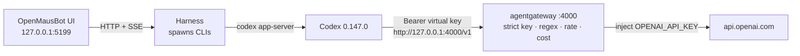

I sat down on Saturday with [OpenMausBot](https://github.com/milind-soni/OpenMausBot) because I wanted a chat app that felt like texting a teammate, not another terminal. I named the bot **Indigo**, picked **GPT-5.6 Sol**, and asked it to say hi in five words.

It did: **Hi, I'm Indigo, your bot.**

The part I loved — and the part that made me reach for [agentgateway](https://agentgateway.dev) — is that OpenMausBot never called OpenAI. It spawned `codex` on my laptop. That's charming until you want a real key, a guardrail, a rate limit, or a cost number that isn't "trust me, I watched the terminal."

So I did what I always do. Same pattern as [Claude Code / Codex](/articles/2026-05-08-claude-codex-passthrough-through-agentgateway/) and [Claude Desktop](/articles/2026-08-12-claude-desktop-entra-agentgateway/): **the chat app stays on loopback, the secret and the policy live in the gateway.**

This is that Saturday, written down so you can replay it.

👉 **[milind-soni/OpenMausBot](https://github.com/milind-soni/OpenMausBot)** · Official recipe: **[Codex → agentgateway](https://agentgateway.dev/docs/standalone/latest/integrations/llm-clients/codex/)** · If you haven't run the binary yet: **[standalone locally](/articles/2026-03-12-agentgateway-quickstart-standalone/)**

---

## Architecture

Think of it as three people in a room. OpenMausBot is the friendly one you talk to. Codex does the work. agentgateway is the grown-up who holds the wallet.



| Hop | What happens |
|-----|----------------|
| **1 · Chat** | I talk to **Indigo** at `http://127.0.0.1:5199`. The UI never sees a provider key — and that's how I want it. |
| **2 · Spawn** | The harness starts `codex`. The Codex driver **deletes `OPENAI_API_KEY`** from the child env on purpose, so a leaked key can't quietly flip billing to pay-as-you-go. |
| **3 · Codex** | Codex 0.147.0 uses `model_provider = "agentgateway"` and `base_url = "http://127.0.0.1:4000/v1"`. |
| **4 · Gateway** | Virtual key, regex guard, token budget, cost catalog — then the real OpenAI key goes upstream. |

Codex calls `{base}/v1/responses` on the standalone LLM listener. Official docs were tested against `codex-cli 0.144.4`. I was on **0.147.0**. OpenMausBot's default Codex model in this build is **GPT-5.6 Sol**.

I tried Claude first. It face-planted (`exit 127`). Codex is the path that said hello.

---

## Why OpenMausBot never holds the key

This is the bit that made me smile when I read the source. Before it even starts the CLI, OpenMausBot strips the provider secrets:

- **Codex** deletes `OPENAI_API_KEY`
- **Claude** deletes `ANTHROPIC_API_KEY` (and the Claude Code identity vars)

You can paste a key into the OpenMausBot process and the bot still won't send it. The CLI either uses its own login, or it talks to whatever `base_url` you gave it.

That's my invitation. Standalone agentgateway *is* that `base_url`. One binary on my desk held the real `OPENAI_API_KEY`, a virtual key tagged `user: openmausbot` / `tier: live`, the regex guards, the rate limit, and the cost catalog. Indigo didn't need to know any of that.

---

## What was actually on my desk

| Thing | Saturday's value |
|-------|------------------|
| OpenMausBot UI | `http://127.0.0.1:5199` |
| Harness | `127.0.0.1:8799` |
| Bot | Indigo |
| Model picker | **GPT-5.6 Sol** |
| Codex | `0.147.0` · `wire_api = "responses"` |
| agentgateway LLM | `http://127.0.0.1:4000/v1` |
| Admin UI | `http://127.0.0.1:15000/ui/` |
| Virtual key metadata | `user: openmausbot` · `tier: live` |
| Gateway Overview | LLM **Enabled** · **1 model** · **Port 4000** |
| The prompt I used | `say hi in five words.` |
| What came back | `Hi, I'm Indigo, your bot.` |

Sanity check whenever something feels off:

```bash
agentgateway --version
codex --version
```

Once `apiKey.mode` is `strict`, a call with no key should **401**. A call with the virtual key should reach OpenAI. That's the whole handshake.

---

## Standalone agentgateway

I installed the [binary](https://agentgateway.dev/docs/standalone/latest/deployment/binary/) and wrote a config that does the four jobs I actually wanted that afternoon: talk to OpenAI, know *who* called, refuse sloppy secrets in the prompt, and put a number on the turn.

```bash
curl -sL https://agentgateway.dev/install | bash
mkdir -p ~/agw-openmausbot/costs
cd ~/agw-openmausbot
agctl costs import --source models.dev --providers openai --out ./costs/catalog.json
```

```bash
cat > config.yaml << 'EOF'
# yaml-language-server: $schema=https://agentgateway.dev/schema/config
config:
  modelCatalog:
  - file: ./costs/catalog.json

llm:
  policies:
    apiKey:
      mode: strict
      keys:
      - key: "$OPENMAUSBOT_VIRTUAL_KEY"
        metadata:
          user: openmausbot
          tier: live
    localRateLimit:
    - maxTokens: 200000
      tokensPerFill: 200000
      fillInterval: 3600s
      type: tokens
  models:
  - name: "*"
    provider: openAI
    params:
      apiKey: "$OPENAI_API_KEY"
      tokenize: true
    guardrails:
      request:
      - regex:
          action: reject
          rules:
          - pattern: "api[_-]?key[=:]\\s*\\S+"
          - pattern: "sk-[A-Za-z0-9_-]{10,}"
          - builtin: email
        rejection:
          status: 400
          headers:
            set:
              content-type: "application/json"
          body: |
            {
              "error": {
                "message": "Request rejected: sensitive content",
                "type": "invalid_request_error",
                "code": "content_policy_violation"
              }
            }
EOF
```

```bash
export OPENAI_API_KEY='sk-...'                 # gateway process only
export OPENMAUSBOT_VIRTUAL_KEY='sk-omb-...'    # what Codex presents; not an OpenAI key
agentgateway -f config.yaml
```

| Port | What I used it for |
|------|--------------------|
| **4000** | The front door Codex hits (`/v1/responses`, `/v1/chat/completions`, `/v1/models`) |
| **15000** | The Admin UI I left open in a tab — [http://127.0.0.1:15000/ui/](http://127.0.0.1:15000/ui/) |
| **15020** | Stats, if you like watching tokens (`agentgateway_gen_ai_client_token_usage`) |

Leave it running. My Gateway Overview said **LLM Enabled**, **1 model**, **Port 4000**. I didn't turn on MCP or Traffic. I didn't need them to say hello.


Keep the model name as `*`. Codex sends `gpt-5.6-sol` itself. If you pin the gateway to one model, you'll spend an hour wondering why Indigo looks confused.

---

## Virtual API key

I didn't want Codex holding the real OpenAI key. I wanted a *house key* — something that says "this is OpenMausBot" when I look at cost later.

**LLM → Virtual API Keys → + New key.** I tagged mine like this:

| Field | What I used |
|-------|-------------|
| Name | I left it `Unnamed key`. You can be nicer. |
| `user` | `openmausbot` |
| `tier` | `live` |

Copy it once. The UI masks it (`sk-omb-…`). That value opens *your* gateway. It does nothing at OpenAI.


A few things I wish someone had said out loud:

**Go `strict` once you care who paid.**  
`optional` is fine for the first `curl`. The moment you want `user: openmausbot` on the cost page, `optional` is just a hole.

**Don't name the virtual key `OPENAI_API_KEY`.**  
OpenMausBot deletes that name before Codex starts. I put it in `OPENMAUSBOT_VIRTUAL_KEY` and told Codex via `env_key`. The harness can inherit it. Codex still sees it after spawn.

**Client Setup is a printer, not a wizard.**  
[Admin UI → Client Setup](https://agentgateway.dev/docs/standalone/latest/operations/ui/#generate-llm-client-settings) will copy the Codex snippet from config you already wrote. It will not invent a route, a model, or a key. I still like it — less typing, fewer typos.

More in the [virtual key docs](https://agentgateway.dev/docs/standalone/latest/llm/cost-controls/virtual-keys/).

---

## Guardrails, rate limits, cost

This is why I didn't just export a key and call it a day. The YAML above is what I actually ran:

| Control | Why I put it there |
|---------|---------------------|
| Regex `reject` | I don't want a prompt that looks like `api_key=…`, `sk-…`, or an email to leave the laptop ([regex filters](https://agentgateway.dev/docs/standalone/latest/llm/prompt-guards/regex/)) |
| `localRateLimit` `type: tokens` | 200k tokens an hour — enough for a Saturday, not enough for a runaway loop |
| `tokenize: true` | Count the prompt *before* OpenAI sees it, so a fat turn can 429 without spending |
| `modelCatalog` | So each Indigo turn has a dollar number (`agw.ai.usage.cost.total`) |

On standalone, that rate limit is for the whole gateway. If you later want per-key daily budgets, you'll want a remote rate-limit server — [budget limits](https://agentgateway.dev/docs/standalone/latest/llm/cost-controls/budget-limits/) and my [hard spend limits](/articles/2026-07-02-agentgateway-ai-budgets-hard-spend-limits/) post. Cost catalog walkthrough: [standalone dashboard](/articles/2026-06-24-agentgateway-cost-tokenomics-dashboard/). If you want a heavier scanner in front of the same door: [F5 guardrails](/articles/2026-07-03-agentgateway-f5-guardrails-ui-first-steps/).

None of that YAML lives in OpenMausBot. Indigo just chats. I like that.

---

## Codex → `:4000/v1`

This is the [official Codex recipe](https://agentgateway.dev/docs/standalone/latest/integrations/llm-clients/codex/). I wrote a profile, then made it the default so the CLI OpenMausBot spawns would pick it up without me thinking about it.

```bash
mkdir -p ~/.codex
cat > ~/.codex/agentgateway.config.toml <<'EOF'
model_provider = "agentgateway"

[model_providers.agentgateway]
name = "OpenAI via agentgateway"
base_url = "http://127.0.0.1:4000/v1"
wire_api = "responses"
env_key = "OPENMAUSBOT_VIRTUAL_KEY"
EOF

cp ~/.codex/config.toml ~/.codex/config.toml.bak 2>/dev/null || true
cp ~/.codex/agentgateway.config.toml ~/.codex/config.toml
```

If you'd rather not touch the default file:

```bash
codex -c 'model_provider="agentgateway"' \
  -c 'model_providers.agentgateway.name="OpenAI via agentgateway"' \
  -c 'model_providers.agentgateway.base_url="http://127.0.0.1:4000/v1"' \
  -c 'model_providers.agentgateway.wire_api="responses"' \
  -c 'model_providers.agentgateway.env_key="OPENMAUSBOT_VIRTUAL_KEY"'
```

The three gotchas that ate my morning:

**`wire_api = "responses"`.**  
Codex speaks `/v1/responses`, not only chat completions. Miss this and you'll stare at a quiet gateway log while the CLI looks busy.

**`env_key` cannot be `OPENAI_API_KEY`.**  
That name is gone by the time Codex starts. `OPENMAUSBOT_VIRTUAL_KEY` survives.

**Codex also knocks on `/v1/models`.**  
Until [agentgateway#1462](https://github.com/agentgateway/agentgateway/issues/1462) grows a model list, you may get a metadata warning. Ignore it. `/v1/responses` still works.

I always smoke-test the CLI *before* I open the pretty chat UI. Saves a lot of "is it the bot or the gateway?"

```bash
export OPENMAUSBOT_VIRTUAL_KEY='sk-omb-...'
codex --profile agentgateway "Hello"
```

You want a `200` on `/v1/responses` in the agentgateway log (`endpoint=api.openai.com:443`, `gen_ai.provider.name=openai`). If Codex logs into ChatGPT instead, the profile didn't load. Coffee, then check `~/.codex/config.toml`.

---

## Talking to Indigo

Desktop builds embed the harness. From source I run both:

```bash
git clone https://github.com/milind-soni/OpenMausBot && cd OpenMausBot
pnpm install
export OPENMAUSBOT_VIRTUAL_KEY='sk-omb-...'   # virtual key only
pnpm dev:server    # 127.0.0.1:8799
pnpm dev           # http://127.0.0.1:5199
```

Then, in the browser:

1. Open `http://127.0.0.1:5199`
2. Click **Indigo**
3. Model picker → **GPT-5.6 Sol**
4. Type `say hi in five words.`

I picked the categories it offered (Work & projects — I was not in a "life admin" mood). Claude failed first, which I'll get to. Then Codex came back through the gateway and I grinned at five words.

**Hi, I'm Indigo, your bot.**


---

## The Claude face-plant

The first bubble in that thread was a red box. I left it in the screenshot on purpose. Saturday labs should be honest.

```text
claude exited 127 before result: openmausbot-agw wrapper: real claude CLI not installed
ANTHROPIC_BASE_URL=http://127.0.0.1:4000 (agentgateway)
```

`127` means "I can't find that command." A wrapper was already pointing Claude at agentgateway — the redirect was right — but I hadn't actually installed `claude`. OpenMausBot will not invent an Anthropic client because you wished for one.

If you want that path later, install the CLI and keep `ANTHROPIC_API_KEY` on the gateway. The Claude driver deletes it from the child the same way Codex deletes `OPENAI_API_KEY`.

```bash
# after `claude` is actually installed
export ANTHROPIC_BASE_URL='http://127.0.0.1:4000'
```

I stayed on Codex. Five words were enough for the day.

---

## Why bother

| Without the gateway | How Saturday felt with it |
|---------------------|---------------------------|
| OpenAI key on the laptop, or worse, in the bot | The key stayed in the agentgateway process. I slept better. |
| Codex talking to OpenAI with no shared rules | Virtual key, regex guards, a rate limit I can change without touching Indigo |
| "What did this cost?" shrugged off | Cost catalog + `user: openmausbot` on the turn |
| Every new chat app grows another secret | One `:4000` door. Next weekend's toy can use it too. |

If you already send Claude Code or Codex through agentgateway, this is the same idea with a nicer living room: localhost, `/v1`, a bot named Indigo instead of a blinking cursor.

---

## Further reading

- Official: [Codex → agentgateway](https://agentgateway.dev/docs/standalone/latest/integrations/llm-clients/codex/)
- Official: [Virtual keys](https://agentgateway.dev/docs/standalone/latest/llm/cost-controls/virtual-keys/)
- Official: [Regex guardrails](https://agentgateway.dev/docs/standalone/latest/llm/prompt-guards/regex/)
- OpenMausBot: [milind-soni/OpenMausBot](https://github.com/milind-soni/OpenMausBot)
- Related: [How To: Run agentgateway standalone locally](/articles/2026-03-12-agentgateway-quickstart-standalone/)
- Related: [How To: Connect Claude Code & Codex through agentgateway](/articles/2026-05-08-claude-codex-passthrough-through-agentgateway/)
- Related: [How To: Point Claude Desktop at agentgateway with Entra SSO](/articles/2026-08-12-claude-desktop-entra-agentgateway/)
- Related: [Route MCP / Claude traffic through agentgateway](/articles/2026-02-18-route-mcp-traffic-claude-through-agentgateway/)
- Related: [agentgateway standalone cost & tokenomics dashboard](/articles/2026-06-24-agentgateway-cost-tokenomics-dashboard/)
- Related: [Hard spend limits for LLM traffic](/articles/2026-07-02-agentgateway-ai-budgets-hard-spend-limits/)
- Related: [First steps: agentgateway and F5 AI Guardrails](/articles/2026-07-03-agentgateway-f5-guardrails-ui-first-steps/)
- Related: [What is agentgateway.dev?](/articles/2026-03-12-what-is-agentgateway-dev/)
- Related: [Why your AI agents need a gateway](/articles/2026-02-19-why-your-ai-agents-need-a-gateway/)
