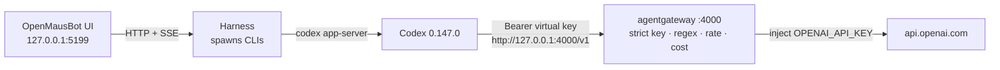

OpenMausBot is great until you realize it never calls OpenAI. It spawns `codex` or `claude` on your laptop, and nobody can answer which bot used which model, when, or for how much.

The pattern I want is the same one I use for [Claude Code / Codex](/articles/2026-05-08-claude-codex-passthrough-through-agentgateway/) and [Claude Desktop](/articles/2026-08-12-claude-desktop-entra-agentgateway/): **client on loopback, provider secret in the gateway, one place for policy and cost.**

This guide is the OpenMausBot path running in my lab:

👉 **[milind-soni/OpenMausBot](https://github.com/milind-soni/OpenMausBot)** · Official recipe: **[Codex → agentgateway](https://agentgateway.dev/docs/standalone/latest/integrations/llm-clients/codex/)** · Standalone install: **[run agentgateway locally](/articles/2026-03-12-agentgateway-quickstart-standalone/)**

---

## Architecture

OpenMausBot is the chat shell. Codex is the agent. Standalone agentgateway is the only process that sees `OPENAI_API_KEY`.



| Hop | What happens |
|-----|----------------|
| **1 · Chat** | You talk to a bot (here: **Indigo**) at `http://127.0.0.1:5199`. The UI never sees a provider key. |
| **2 · Spawn** | The harness starts `codex`. The Codex driver **deletes `OPENAI_API_KEY`** from the child env so a leaked key cannot flip billing to pay-as-you-go. |
| **3 · Codex** | Codex 0.147.0 uses `model_provider = "agentgateway"` and `base_url = "http://127.0.0.1:4000/v1"`. |
| **4 · Gateway** | Strict virtual key, regex guardrails, token rate limit, cost catalog, then inject the real OpenAI key upstream. |

Path is `/v1` on the standalone LLM listener so Codex can call `{base}/v1/responses`. Official docs were tested against `codex-cli 0.144.4`. This lab used **0.147.0**. Default OpenMausBot Codex model in this build is **GPT-5.6 Sol** (`gpt-5.6-sol`).

Claude is the same idea with `ANTHROPIC_BASE_URL`. In this session that path died first (`claude exited 127`). Codex is the path that returned the five-word hello.

---

## Why OpenMausBot never holds the key

OpenMausBot's own drivers make the split explicit. Before spawn:

- **Codex** deletes `OPENAI_API_KEY`
- **Claude** deletes `ANTHROPIC_API_KEY` (and Claude Code identity vars)

Paste a provider key into the OpenMausBot process and the bot still will not send it. The CLI either uses its own login, or it talks to whatever `base_url` you configured.

Standalone agentgateway is that `base_url`. One binary holds the real `OPENAI_API_KEY`, a virtual key tagged `user: openmausbot` / `tier: live`, regex guardrails, rate limits, and the cost catalog.

---

## Lab values

| Thing | Lab value |
|-------|-----------|
| OpenMausBot UI | `http://127.0.0.1:5199` |
| Harness | `127.0.0.1:8799` |
| Bot | Indigo |
| Model picker | **GPT-5.6 Sol** |
| Codex | `0.147.0` · `wire_api = "responses"` |
| agentgateway LLM | `http://127.0.0.1:4000/v1` |
| Admin UI | `http://127.0.0.1:15000/ui/` |
| Virtual key metadata | `user: openmausbot` · `tier: live` |
| Gateway Overview | LLM **Enabled** · **1 model** · **Port 4000** |
| Smoke prompt | `say hi in five words.` |
| Live reply | `Hi, I'm Indigo, your bot.` |

Confirm the binary anytime:

```bash
agentgateway --version
codex --version
```

Anonymous calls to `:4000` should **401** once `apiKey.mode` is `strict`. A valid virtual key should reach OpenAI.

---

## Standalone agentgateway

Install the [binary](https://agentgateway.dev/docs/standalone/latest/deployment/binary/), then start with a config that does the four jobs this lab cares about: OpenAI upstream, virtual key, regex guard, token budget, cost catalog.

```bash
curl -sL https://agentgateway.dev/install | bash
mkdir -p ~/agw-openmausbot/costs
cd ~/agw-openmausbot
agctl costs import --source models.dev --providers openai --out ./costs/catalog.json
```

```bash
cat > config.yaml << 'EOF'
# yaml-language-server: $schema=https://agentgateway.dev/schema/config
config:
  modelCatalog:
  - file: ./costs/catalog.json

llm:
  policies:
    apiKey:
      mode: strict
      keys:
      - key: "$OPENMAUSBOT_VIRTUAL_KEY"
        metadata:
          user: openmausbot
          tier: live
    localRateLimit:
    - maxTokens: 200000
      tokensPerFill: 200000
      fillInterval: 3600s
      type: tokens
  models:
  - name: "*"
    provider: openAI
    params:
      apiKey: "$OPENAI_API_KEY"
      tokenize: true
    guardrails:
      request:
      - regex:
          action: reject
          rules:
          - pattern: "api[_-]?key[=:]\\s*\\S+"
          - pattern: "sk-[A-Za-z0-9_-]{10,}"
          - builtin: email
        rejection:
          status: 400
          headers:
            set:
              content-type: "application/json"
          body: |
            {
              "error": {
                "message": "Request rejected: sensitive content",
                "type": "invalid_request_error",
                "code": "content_policy_violation"
              }
            }
EOF
```

```bash
export OPENAI_API_KEY='sk-...'                 # gateway process only
export OPENMAUSBOT_VIRTUAL_KEY='sk-omb-...'    # what Codex presents; not an OpenAI key
agentgateway -f config.yaml
```

| Port | What it serves |
|------|----------------|
| **4000** | OpenAI-compatible front door (`/v1/responses`, `/v1/chat/completions`, `/v1/models`) |
| **15000** | Admin UI — [http://127.0.0.1:15000/ui/](http://127.0.0.1:15000/ui/) |
| **15020** | Prometheus stats (`agentgateway_gen_ai_client_token_usage`) |

Leave that process running. Gateway Overview in this lab: **LLM Enabled**, **1 model**, **0 virtual models**, **Port 4000**. MCP and Traffic stayed off. That is enough for Codex.


`*` on the model name is required. Codex sends the model on each request; you do not pin `gpt-5.6-sol` in the gateway unless you want to reject everything else.

---

## Virtual API key

Do not hand Codex the real OpenAI key. Issue a virtual key and tag it so cost and logs attribute to this caller.

**LLM → Virtual API Keys → + New key.** Metadata used here:

| Field | Lab value |
|-------|-----------|
| Name | whatever you want (UI showed `Unnamed key`) |
| `user` | `openmausbot` |
| `tier` | `live` |

Copy the value once. The UI masks it (`sk-omb-…`). It authenticates to **your** gateway, not to OpenAI.


### Critical callouts

**`apiKey.mode` must be `strict` once you care about attribution.**  
`optional` lets unauthenticated calls through. Fine for a first `curl`. Wrong once `user: openmausbot` is how you read the cost dashboard.

**The virtual key is not `OPENAI_API_KEY`.**  
OpenMausBot's Codex driver deletes that name from the child env. Put the virtual key in a *different* var (`OPENMAUSBOT_VIRTUAL_KEY`) and point Codex at it with `env_key`. The harness can inherit that var; Codex will still see it after spawn.

**Client Setup does not create anything.**  
[Admin UI → Client Setup](https://agentgateway.dev/docs/standalone/latest/operations/ui/#generate-llm-client-settings) prints the Codex snippet from config that already exists. It will not invent a route, a model, or a key.

Docs: [virtual key management](https://agentgateway.dev/docs/standalone/latest/llm/cost-controls/virtual-keys/).

---

## Guardrails, rate limits, cost

This is the reason the bot does not talk to OpenAI directly. The block in `config.yaml` above is the lab set:

| Control | What it does in this lab |
|---------|--------------------------|
| Regex `reject` | Blocks prompts that look like `api_key=…`, `sk-…`, or an email ([regex filters](https://agentgateway.dev/docs/standalone/latest/llm/prompt-guards/regex/)) |
| `localRateLimit` `type: tokens` | 200k tokens / hour on the LLM listener — stop a looping bot |
| `tokenize: true` | Estimate prompt tokens *before* the provider call so an oversized turn can 429 without spending |
| `modelCatalog` | Price each Codex turn (`agw.ai.usage.cost.total`) |

`localRateLimit` is gateway-wide on standalone. Per-key daily budgets need a remote rate-limit server — see [budget limits](https://agentgateway.dev/docs/standalone/latest/llm/cost-controls/budget-limits/) and the [hard spend limits](/articles/2026-07-02-agentgateway-ai-budgets-hard-spend-limits/) post if you outgrow the laptop binary.

Cost catalog walkthrough: [standalone cost & tokenomics dashboard](/articles/2026-06-24-agentgateway-cost-tokenomics-dashboard/). Heavier scanner in front of the same OpenAI-compatible door: [F5 guardrails first steps](/articles/2026-07-03-agentgateway-f5-guardrails-ui-first-steps/).

None of that YAML lives in OpenMausBot. The chat app stays a chat app.

---

## Codex → `:4000/v1`

This is the [official standalone Codex integration](https://agentgateway.dev/docs/standalone/latest/integrations/llm-clients/codex/). Write a profile, then make it the default Codex config OpenMausBot's spawned CLI will read.

```bash
mkdir -p ~/.codex
cat > ~/.codex/agentgateway.config.toml <<'EOF'
model_provider = "agentgateway"

[model_providers.agentgateway]
name = "OpenAI via agentgateway"
base_url = "http://127.0.0.1:4000/v1"
wire_api = "responses"
env_key = "OPENMAUSBOT_VIRTUAL_KEY"
EOF

cp ~/.codex/config.toml ~/.codex/config.toml.bak 2>/dev/null || true
cp ~/.codex/agentgateway.config.toml ~/.codex/config.toml
```

One-shot override if you do not want to touch the default file:

```bash
codex -c 'model_provider="agentgateway"' \
  -c 'model_providers.agentgateway.name="OpenAI via agentgateway"' \
  -c 'model_providers.agentgateway.base_url="http://127.0.0.1:4000/v1"' \
  -c 'model_providers.agentgateway.wire_api="responses"' \
  -c 'model_providers.agentgateway.env_key="OPENMAUSBOT_VIRTUAL_KEY"'
```

### Critical Codex callouts

**`wire_api = "responses"`.**  
Codex talks `/v1/responses`, not only `/v1/chat/completions`. Miss this and the CLI looks up while the gateway log stays quiet.

**`env_key` must not be `OPENAI_API_KEY`.**  
That name is stripped on spawn. `OPENMAUSBOT_VIRTUAL_KEY` survives.

**Codex also probes `/v1/models`.**  
Until [agentgateway#1462](https://github.com/agentgateway/agentgateway/issues/1462) ships a gateway-generated list, you may see a metadata warning. It does not block `/v1/responses`.

Smoke-test the CLI *before* you open the chat UI:

```bash
export OPENMAUSBOT_VIRTUAL_KEY='sk-omb-...'
codex --profile agentgateway "Hello"
```

You want a `200` on `/v1/responses` in the agentgateway log (`endpoint=api.openai.com:443`, `gen_ai.provider.name=openai`). A direct ChatGPT login from the bot means the profile did not load.

---

## OpenMausBot / Indigo

Start the harness, then the app. Released desktop builds embed the harness; from source you need both:

```bash
git clone https://github.com/milind-soni/OpenMausBot && cd OpenMausBot
pnpm install
export OPENMAUSBOT_VIRTUAL_KEY='sk-omb-...'   # virtual key only
pnpm dev:server    # 127.0.0.1:8799
pnpm dev           # http://127.0.0.1:5199
```

1. Open `http://127.0.0.1:5199`
2. Select the bot (**Indigo**)
3. Model picker → **GPT-5.6 Sol**
4. Send `say hi in five words.`

Walkthrough expectation: first Claude turn may fail if `claude` is not installed (see below) → switch / stay on Codex → five-word reply comes back through the gateway footer.

**Hi, I'm Indigo, your bot.**


---

## Claude path: exit 127

The first turn in that thread failed with:

```text
claude exited 127 before result: openmausbot-agw wrapper: real claude CLI not installed
ANTHROPIC_BASE_URL=http://127.0.0.1:4000 (agentgateway)
```

Exit `127` is "command not found". A PATH wrapper was already pointing Claude at agentgateway; the real `claude` binary was not on disk. The wrapper is doing the right redirect. OpenMausBot will not invent an Anthropic client for you.

Install the CLI if you want that path, and keep `ANTHROPIC_API_KEY` on the gateway — the Claude driver deletes it from the child the same way Codex deletes `OPENAI_API_KEY`.

```bash
# after `claude` is actually installed
export ANTHROPIC_BASE_URL='http://127.0.0.1:4000'
```

---

## Why bother

| Without gateway | With this path |
|-----------------|----------------|
| OpenAI key on the laptop / in the bot process | Key stays in the agentgateway environment |
| Codex talks to OpenAI with no shared policy | Virtual key + regex guardrails + rate limits |
| No per-bot spend story | Cost catalog and `user: openmausbot` attribution |
| Every new chat app grows another secret | One `:4000` front door, many clients |

If you already route Claude Code or Codex through agentgateway, this is the chat-app sibling: same localhost proxy, same `/v1`, a bot named Indigo instead of a terminal.

---

## Further reading

- Official: [Codex → agentgateway](https://agentgateway.dev/docs/standalone/latest/integrations/llm-clients/codex/)
- Official: [Virtual keys](https://agentgateway.dev/docs/standalone/latest/llm/cost-controls/virtual-keys/)
- Official: [Regex guardrails](https://agentgateway.dev/docs/standalone/latest/llm/prompt-guards/regex/)
- OpenMausBot: [milind-soni/OpenMausBot](https://github.com/milind-soni/OpenMausBot)
- Related: [How To: Run agentgateway standalone locally](/articles/2026-03-12-agentgateway-quickstart-standalone/)
- Related: [How To: Connect Claude Code & Codex through agentgateway](/articles/2026-05-08-claude-codex-passthrough-through-agentgateway/)
- Related: [How To: Point Claude Desktop at agentgateway with Entra SSO](/articles/2026-08-12-claude-desktop-entra-agentgateway/)
- Related: [Route MCP / Claude traffic through agentgateway](/articles/2026-02-18-route-mcp-traffic-claude-through-agentgateway/)
- Related: [agentgateway standalone cost & tokenomics dashboard](/articles/2026-06-24-agentgateway-cost-tokenomics-dashboard/)
- Related: [Hard spend limits for LLM traffic](/articles/2026-07-02-agentgateway-ai-budgets-hard-spend-limits/)
- Related: [First steps: agentgateway and F5 AI Guardrails](/articles/2026-07-03-agentgateway-f5-guardrails-ui-first-steps/)
- Related: [What is agentgateway.dev?](/articles/2026-03-12-what-is-agentgateway-dev/)
- Related: [Why your AI agents need a gateway](/articles/2026-02-19-why-your-ai-agents-need-a-gateway/)
