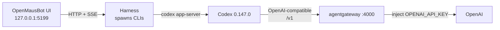

[OpenMausBot](https://github.com/milind-soni/OpenMausBot) looks like a chat app. Under the hood it is a harness: the UI on `127.0.0.1:5199` talks to a local server, and that server **spawns `codex` or `claude` on your machine**. It does not call OpenAI. It does not hold `OPENAI_API_KEY`.

That is the right shape for a bot roster. It is the wrong shape for a shared OpenAI key, regex guardrails, rate limits, or a cost catalog. Those belong in **[agentgateway](https://agentgateway.dev)** running standalone on `:4000`.

The path that worked in this lab:

**OpenMausBot → Codex 0.147.0 → agentgateway `:4000` `/v1` → OpenAI**

Proof from Indigo, after "say hi in five words":

**Hi, I'm Indigo, your bot.**

Official Codex recipe: [Point Codex at agentgateway](https://agentgateway.dev/docs/standalone/latest/integrations/llm-clients/codex/). Sibling walkthroughs on this site: [Claude Code & Codex through agentgateway](/articles/2026-05-08-claude-codex-passthrough-through-agentgateway/) and [run standalone locally](/articles/2026-03-12-agentgateway-quickstart-standalone/).

---

## Architecture

OpenMausBot is the chat shell. Codex is the agent. agentgateway is the only process that sees the provider secret.



| Hop | What happens |
|-----|----------------|
| **1 · Chat** | You talk to a bot (here: **Indigo**) in OpenMausBot. The UI never sees a provider key. |
| **2 · Spawn** | The harness starts the `codex` CLI. The Codex driver **deletes `OPENAI_API_KEY`** from the child env on purpose so a leaked key cannot flip billing to pay-as-you-go. |
| **3 · Codex** | Codex 0.147.0 uses its `agentgateway` provider: `base_url = http://127.0.0.1:4000/v1`. |
| **4 · Gateway** | Standalone agentgateway authenticates a **virtual key**, applies regex guardrails and rate limits, prices the call, then injects the real `OPENAI_API_KEY` upstream. |

Claude is the same idea with `ANTHROPIC_BASE_URL`. In this session the Claude path died first (`claude exited 127` — wrapper present, real CLI not installed). Codex on **GPT-5.6 Sol** is the path that returned the five-word hello.

---

## Why the key stays in agentgateway

OpenMausBot's own drivers make the split explicit:

- **Codex** strips `OPENAI_API_KEY` before spawn.
- **Claude** strips `ANTHROPIC_API_KEY` (and related Claude Code identity vars) before spawn.

So if you paste a provider key into the OpenMausBot process environment, the bot still will not send it. The CLI either uses its own login, or it talks to whatever `base_url` you configured.

Standalone agentgateway is that `base_url`. One binary holds:

- the real `OPENAI_API_KEY`
- a virtual key for the OpenMausBot caller (`user: openmausbot`, `tier: live`)
- regex guardrails
- rate limits
- the cost catalog

Same pattern as [pointing Claude Desktop at agentgateway](/articles/2026-08-12-claude-desktop-entra-agentgateway/): **client on loopback, secret and policy in the gateway.**

---

## Prerequisites

- [OpenMausBot](https://github.com/milind-soni/OpenMausBot) from source (`pnpm dev:server` + `pnpm dev`) or a desktop build. Dev UI is `http://127.0.0.1:5199`.
- [`codex` CLI 0.147.0](https://github.com/openai/codex) on your `PATH`. Official agentgateway docs were tested against `0.144.4`; this lab used `0.147.0`.
- The [`agentgateway` binary](https://agentgateway.dev/docs/standalone/latest/deployment/binary/) (or the container image).
- An `OPENAI_API_KEY` that lives **only** in the gateway environment — not in OpenMausBot, not in a screenshot, not in git.

Optional: a `claude` CLI if you also want the Anthropic path. Without it, a wrapper that sets `ANTHROPIC_BASE_URL=http://127.0.0.1:4000` will exit `127` before any model call.

---

## 1. Run standalone agentgateway

Install and start the binary with an OpenAI backend. The wildcard model name accepts whatever Codex sends.

```yaml
# yaml-language-server: $schema=https://agentgateway.dev/schema/config
llm:
  models:
  - name: "*"
    provider: openAI
    params:
      apiKey: "$OPENAI_API_KEY"
```

```bash
export OPENAI_API_KEY='sk-...'   # gateway process only
agentgateway -f config.yaml
```

You should get two listeners:

| Port | What it is |
|------|------------|
| **4000** | OpenAI-compatible LLM front door (`/v1`) |
| **15000** | Admin UI — [http://localhost:15000/ui/](http://localhost:15000/ui/) |

The Gateway Overview in this lab showed **LLM Enabled**, **1 model**, **0 virtual models**, **Port 4000**. MCP and Traffic stayed off. That is enough for Codex.


Client Setup in the UI can emit the Codex snippet for you. It does not create the model, the virtual key, or the provider credential — it only prints client-side values from config that already exists. Details: [Admin UI / Client Setup](https://agentgateway.dev/docs/standalone/latest/operations/ui/#generate-llm-client-settings).

---

## 2. Issue a virtual key for OpenMausBot

Do not hand Codex the real OpenAI key. Issue a **virtual key** and tag it so cost and logs attribute to this caller.

In the Admin UI: **LLM → Virtual API Keys → + New key**. Metadata used here:

| Key | Value |
|-----|--------|
| `user` | `openmausbot` |
| `tier` | `live` |

The UI shows the secret masked (`sk-omb-…`). Copy it once. Treat it like any other credential: it authenticates to **your** gateway, not to OpenAI.


Equivalent config (placeholder value only):

```yaml
llm:
  policies:
    apiKey:
      mode: strict
      keys:
      - key: "$OPENMAUSBOT_VIRTUAL_KEY"
        metadata:
          user: openmausbot
          tier: live
  models:
  - name: "*"
    provider: openAI
    params:
      apiKey: "$OPENAI_API_KEY"
```

`strict` means Codex must send `Authorization: Bearer <virtual key>`. `optional` lets unauthenticated calls through — fine for a laptop smoke test, not what you want once the key is the attribution handle.

Docs: [Virtual key management](https://agentgateway.dev/docs/standalone/latest/llm/cost-controls/virtual-keys/).

---

## 3. Guardrails, rate limits, cost

This is the reason the bot does not talk to OpenAI directly.

**Regex guardrails** inspect the prompt (and optionally the response) before the provider sees it. Built-in detectors cover email, phone, SSN, credit card; custom rules catch `api_key=…` style leaks. Reject on the way in, mask or reject on the way out. See [regex filters](https://agentgateway.dev/docs/standalone/latest/llm/prompt-guards/regex/) and the longer [F5 guardrails first steps](/articles/2026-07-03-agentgateway-f5-guardrails-ui-first-steps/) if you want a scanner in front of the same OpenAI-compatible door.

**Rate limits** stop a looping bot from burning the catalog. Pair them with the virtual-key `user` metadata so Indigo has a budget that is not shared with every other client on `:4000`. Token and dollar budgets: [virtual keys](https://agentgateway.dev/docs/standalone/latest/llm/cost-controls/virtual-keys/) and [hard spend limits](/articles/2026-07-02-agentgateway-ai-budgets-hard-spend-limits/).

**Cost** is a catalog, not a guess. Load `config.modelCatalog` (Admin UI **LLM → Costs**, or `agctl costs import`) so each Codex turn gets `agw.ai.usage.cost.total`. Walkthrough: [standalone cost & tokenomics dashboard](/articles/2026-06-24-agentgateway-cost-tokenomics-dashboard/).

None of that configuration lives in OpenMausBot. The chat app stays a chat app.

---

## 4. Point Codex at `:4000/v1`

This is the [official standalone Codex integration](https://agentgateway.dev/docs/standalone/latest/integrations/llm-clients/codex/). Persistent profile:

```bash
mkdir -p ~/.codex
cat > ~/.codex/agentgateway.config.toml <<'EOF'
model_provider = "agentgateway"

[model_providers.agentgateway]
name = "OpenAI via agentgateway"
base_url = "http://127.0.0.1:4000/v1"
wire_api = "responses"
EOF
```

One-shot override:

```bash
codex -c 'model_provider="agentgateway"' \
  -c 'model_providers.agentgateway.name="OpenAI via agentgateway"' \
  -c 'model_providers.agentgateway.base_url="http://127.0.0.1:4000/v1"'
```

If the gateway is in `apiKey.mode: strict`, Codex must present the **virtual** key. Do not put the real `OPENAI_API_KEY` back into the OpenMausBot process — the Codex driver will delete that name. Use a dedicated env var (for example `AGENTGATEWAY_API_KEY`) and point Codex at it with `env_key`, or let Client Setup print the recipe for your key.

Smoke-test the CLI before you open the chat UI:

```bash
codex --profile agentgateway "Hello"
```

You want a `200` on `/v1/responses` in the agentgateway log, not a direct `api.openai.com` call from the bot.

OpenMausBot's default Codex model in this build is **GPT-5.6 Sol** (`gpt-5.6-sol`). That is what the Indigo picker showed when the five-word reply landed.

---

## 5. Talk to Indigo

1. Start the harness and the app (`pnpm dev:server` / `pnpm dev`, or the desktop build).
2. Open `http://127.0.0.1:5199`.
3. Pick the bot (here: **Indigo**), set the model to **GPT-5.6 Sol**.
4. Send a boring prompt: `say hi in five words.`

Expected reply:

> Hi, I'm Indigo, your bot.


That screenshot is the whole story in one thread: a red Claude failure, then a Codex turn that came back through the gateway.

---

## What the Claude path told me

The first turn in that thread failed with:

```text
claude exited 127 before result: openmausbot-agw wrapper: real claude CLI not installed
ANTHROPIC_BASE_URL=http://127.0.0.1:4000 (agentgateway)
```

Exit `127` is "command not found". A PATH wrapper was already pointing Claude at agentgateway; the real `claude` binary was not installed. Useful as a diagnostic — the wrapper is doing the right redirect — and a reminder that OpenMausBot will not invent an Anthropic client for you. Install the CLI, or stay on Codex.

Same rule as the Codex driver: even after you install `claude`, keep `ANTHROPIC_API_KEY` on the gateway, not in the bot.

---

## Why bother

| Without the gateway | With this path |
|---------------------|----------------|
| OpenAI key on the laptop / in the bot process | Key stays in the agentgateway environment |
| Codex talks to OpenAI with no shared policy | Virtual key + regex guardrails + rate limits |
| No per-bot spend story | Cost catalog and `user: openmausbot` attribution |
| Every new chat app grows another secret | One `:4000` front door, many clients |

If you already route [Claude Code or Codex](/articles/2026-05-08-claude-codex-passthrough-through-agentgateway/) through agentgateway, this is the chat-app sibling: same localhost proxy, same `/v1`, a bot named Indigo instead of a terminal.

---

## Further reading

- Official: [Codex → agentgateway](https://agentgateway.dev/docs/standalone/latest/integrations/llm-clients/codex/)
- Official: [Virtual keys](https://agentgateway.dev/docs/standalone/latest/llm/cost-controls/virtual-keys/)
- Official: [Regex guardrails](https://agentgateway.dev/docs/standalone/latest/llm/prompt-guards/regex/)
- OpenMausBot: [milind-soni/OpenMausBot](https://github.com/milind-soni/OpenMausBot)
- Related: [How To: Run agentgateway standalone locally](/articles/2026-03-12-agentgateway-quickstart-standalone/)
- Related: [How To: Connect Claude Code & Codex through agentgateway](/articles/2026-05-08-claude-codex-passthrough-through-agentgateway/)
- Related: [How To: Point Claude Desktop at agentgateway with Entra SSO](/articles/2026-08-12-claude-desktop-entra-agentgateway/)
- Related: [agentgateway standalone cost & tokenomics dashboard](/articles/2026-06-24-agentgateway-cost-tokenomics-dashboard/)
- Related: [Hard spend limits for LLM traffic](/articles/2026-07-02-agentgateway-ai-budgets-hard-spend-limits/)
- Related: [First steps: agentgateway and F5 AI Guardrails](/articles/2026-07-03-agentgateway-f5-guardrails-ui-first-steps/)
- Related: [What is agentgateway.dev?](/articles/2026-03-12-what-is-agentgateway-dev/)
- Related: [Why your AI agents need a gateway](/articles/2026-02-19-why-your-ai-agents-need-a-gateway/)
- Related: [The 8 principles of an AI gateway](/articles/2026-07-12-eight-principles-of-an-ai-gateway-agentgateway/)
