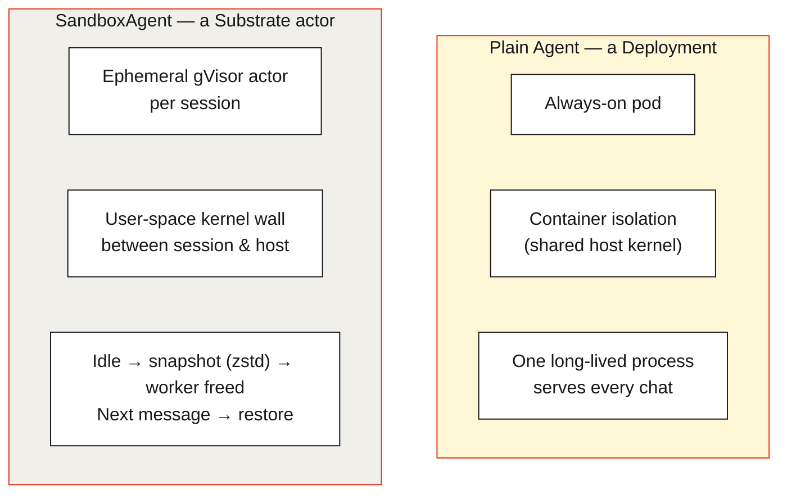
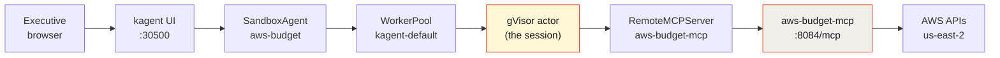
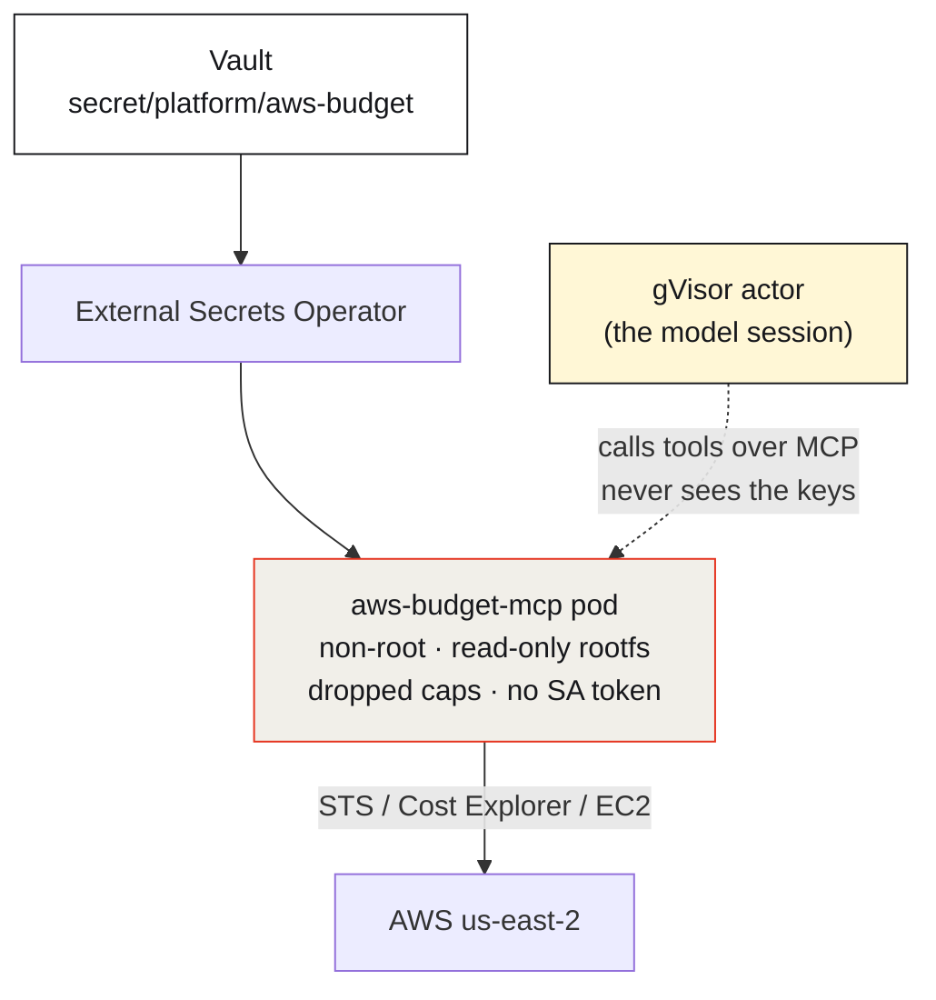
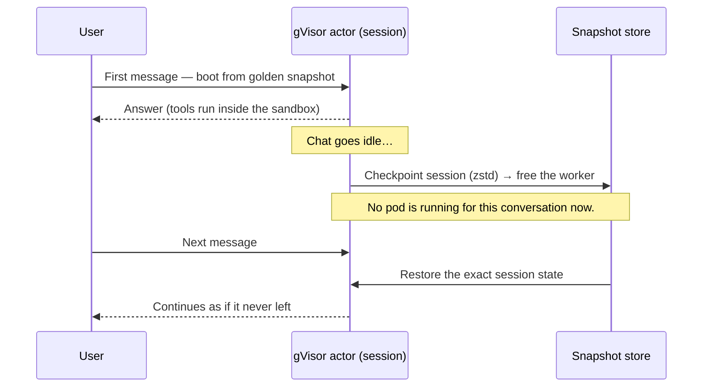

For a couple of years, "AI safety" in production mostly meant *content* safety: don't let the model say the wrong thing, leak a prompt, or hallucinate a number. That framing is now dangerously incomplete. Modern agents don't just emit text — they **act**. They get a filesystem, a chunk of memory, and a live network connection for the entire length of a conversation, and they use tools that reach into your cloud accounts, your firewalls, and your data.

The moment an agent can *do* things, the security question changes. It's no longer "what can the model say?" It's **"what can the model's session touch — and what happens when it (or a tool, or a prompt injection) misbehaves?"**

This article argues that the answer is a **secure sandbox substrate**: a runtime where the unit of isolation is the *agent session itself*, not a long-lived pod. To keep it concrete, we'll walk through a real one — an AWS budget assistant built on [kagent](https://kagent.dev) **Agent Substrate**, running each executive conversation inside a **gVisor** sandbox, that answers a genuinely useful question with real numbers:

> *What's our us-east-2 spend this month, and are we over capacity?*

*Live kagent UI, 2026-08-16. Three **SandboxAgent** cards — not plain Agents. Each conversation runs in its own gVisor actor.*

## The problem: agents are processes with hands

A traditional chatbot is a pure function — text in, text out. You can reason about its safety by reasoning about its words.

An agent is a **process with hands**. Give it an MCP server and it can call AWS Cost Explorer, describe your EC2 fleet, read your firewall config, or worse. To do that work it needs an execution environment: somewhere to run the model loop, hold conversation state, parse tool results, and keep working memory. That environment is real compute with real reach.

So now you have to worry about the things you'd worry about for *any* untrusted workload:

- A **prompt injection** buried in a tool result that tries to make the agent do something you never asked for.
- A **compromised or buggy tool** that the agent trusts.
- **Secret sprawl** — API keys sitting in the same process as a model that's actively being manipulated by untrusted input.
- **Blast radius** — if the session breaks out, what else on the host does it reach?

The usual answer is "run the agent in a Kubernetes pod." That helps, but it quietly makes two assumptions that don't hold at agent scale: that a **container boundary** is a strong enough wall against untrusted code, and that an **always-on pod per conversation** is an acceptable way to spend compute. Both deserve a second look.

## The idea: make the *session* the unit of isolation

A secure sandbox substrate flips the model. Instead of "one long-running deployment that handles many conversations," you get "one **strongly isolated, ephemeral sandbox per session**, that can be checkpointed and restored on demand."

In kagent's Agent Substrate, that sandbox is a **gVisor actor**. gVisor is a user-space kernel: it intercepts the sandboxed workload's syscalls and services them itself, so the agent session never talks directly to the host kernel. That's a materially stronger wall than a stock container — exactly the wall you want between "a model being fed untrusted tool output" and "the node your cluster runs on."

kagent expresses this as a first-class resource: a `SandboxAgent`, scheduled onto a `WorkerPool`, running a gVisor worker image. The difference from a normal agent is not cosmetic — it's a different execution contract.

| | Plain kagent `Agent` | `SandboxAgent` (Substrate) |
|---|---|---|
| **Kubernetes shape** | A Deployment — always-on pod | An actor on a `WorkerPool`, booted per session |
| **Isolation** | Container (shared host kernel) | **gVisor** user-space kernel |
| **Idle cost** | A pod sits running per conversation | Session snapshots and frees the worker |
| **Resume** | N/A — it never left | **Restore from snapshot** — same session, new message |
| **Right fit for** | Trusted cluster helpers | Sessions that touch money, secrets, or untrusted input |

The rule of thumb from the demo's own docs says it well: if you only need a Python container with `boto3` and no snapshot lifecycle, a plain Deployment is fine. The instant the session **talks to your AWS bill**, you want the wall and the lifecycle.

## The demo: an AWS budget agent that can't go rogue

The `aws-budget` SandboxAgent is deliberately mundane in what it *does* and deliberately strict in what it *can* do. It answers executive finance-and-capacity questions for a single region (`us-east-2`) — and that's the entire point. A boring capability, locked down properly, is exactly the shape most real enterprise agents should take.

Here it is answering the question live, with **10 of 10 tool calls** succeeding and every number sourced from a real AWS API:

*Live kagent UI, 2026-08-16. MTD **$0.67**, budget **$4.13 / $100** (4.13% used), **0** running EC2 / ASG / RDS / EBS. The agent even reports "Cost Explorer rightsizing API denied; Compute Optimizer not enrolled" instead of inventing a recommendation.*

Notice what the agent does when a permission is missing: it says the API was **denied**. It does not paper over the gap with a plausible-sounding guess. That honesty is a security property too — an agent that fabricates a "$0 spend" to be helpful is an agent you can't trust with a budget.

The tools themselves are a curated, read-mostly catalog. There is **no generic "run any AWS CLI" tool** — the single most important design decision in the whole demo.

*The agent's whole world: eleven named, read-mostly tools. Describe, Get, View, List — nothing that creates, terminates, or deletes.*

| Tool | AWS API (typical) |
|------|-------------------|
| `aws_whoami` | `sts:GetCallerIdentity` |
| `aws_cost_month` | `ce:GetCostAndUsage` |
| `aws_cost_by_service` | `ce:GetCostAndUsage` grouped by service |
| `aws_budgets` | `budgets:ViewBudget` |
| `aws_ec2_capacity` | `ec2:DescribeInstances` |
| `aws_service_quotas` | `servicequotas:GetServiceQuota` |
| `aws_executive_brief` | composes the above |

There is no `iam:Create*`, no `ec2:Terminate*`, no `budgets:Delete*`, no `s3:*` on your data. The capability boundary is enforced in three independent places — the tool code, the IAM policy, and the sandbox — so a jailbreak of any one layer still hits the next.

## The anatomy: where the trust boundaries are

Here's the full request path. Read it as a sequence of trust boundaries, because that's what it is.

The critical detail is **where the AWS keys live** — and where they don't:

Trace the secret. The AWS access key lives in **Vault**. External Secrets Operator syncs it into a Kubernetes Secret consumed only by the **MCP pod** — which is non-root, has a read-only root filesystem, drops Linux capabilities, and doesn't even mount a service-account token. The **gVisor actor — the part running the model and chewing on untrusted tool output — never holds the key at all.** It calls a tool over MCP; the tool makes the AWS call; the credential stays on the far side of the sandbox wall.

Layer that against the isolation and you get genuine defense in depth:

- **gVisor** keeps a manipulated session off the host kernel.
- **Vault + ESO** keep the secret out of the session (and out of git — the repo has only the *mapping*, never the values).
- **Least-privilege IAM**, region-conditioned to `us-east-2`, means even a leaked key can only *read*, and only in one region.
- **Read-mostly tools** mean the agent has no verb for "destroy."

No single control is novel. Composing all four around *the session* is what a substrate makes routine instead of heroic.

## The economics: snapshot, free, restore

Security is only half the argument. The other half is that "always-on pod per conversation" simply doesn't scale to a world where every employee has a dozen agents.

Substrate's answer is a lifecycle borrowed from serverless, applied to stateful agent sessions:

When a conversation goes quiet, the actor's memory and filesystem are **checkpointed (compressed with zstd)** to object storage and the worker is freed. The next message **restores that exact session** instead of cold-booting a fresh container and replaying context. You get the continuity of a long-lived process with the cost profile of something that only exists while it's being used — plus a **golden snapshot** you can resume deterministically.

That's the "substrate" in secure sandbox substrate: a fabric that boots, isolates, checkpoints, and restores agent sessions as a first-class operation.

## Proof it's real, not a slide

Everything above is running, not aspirational. The control plane reports the SandboxAgent `Ready`, the RemoteMCPServer `Accepted`, and the MCP pod `1/1 Running` — captured live, with no secrets on screen:

*Live capture, 2026-08-16 on Viper (k3s). `Ready=True`, MCP `Accepted`, pod `1/1 Running` — and deliberately nothing sensitive on screen.*

Here's the same live A2A turn as a short reel — question in, ten tool calls, executive-shaped answer out:

One tell that these really are sandboxed sessions and not plain Agents: the classic `/api/a2a/<ns>/<name>` endpoint **404s** (there is no `Agent` CR), and the UI talks to `/api/a2a-sandboxes/kagent/aws-budget` instead. The card even wears a *Sandbox: Agent Substrate* badge.

## Being honest about the tradeoffs

Substrates are early, and the demo is refreshingly candid about it:

- **Nested gVisor is finicky.** Running gVisor actors on dockerized k3s can hit `runsc`/seccomp/`/dev/kvm` issues. That's a worker-environment problem — not a reason to downgrade the agent to an unsandboxed Deployment.
- **Snapshots are local here.** In this lab they land on in-cluster `rustfs`; the `gs://` you see is a URI *prefix*, not live Google Cloud storage. Cluster-wide object storage is future work.
- **Version pinning matters.** The demo pins kagent `0.10.0-rc2` with Substrate `0.0.9` on purpose — a mismatched CRD pairing (e.g. `0.0.12`) makes the agent go `Ready=False`. Substrates are moving fast, so pin deliberately.

None of these undercut the thesis. They're the normal roughness of a capability that's ahead of its tooling — the same place containers were a decade ago.

## Why this is the future

Zoom out. Three trends are converging:

1. **Agents are proliferating.** Not one assistant per company — dozens per team, each with tools that reach real systems.
2. **Tools mean reach.** Every MCP server an agent gains is new blast radius, and much of what an agent reads (tool output, fetched pages, tickets) is untrusted input that can carry an injection.
3. **Sessions are stateful and bursty.** People talk to agents in spikes, then walk away. Paying for an always-on pod per idle conversation is indefensible at scale.

A secure sandbox substrate is the architecture that answers all three at once. It makes **strong per-session isolation** the default instead of a special project. It makes **secrets-outside-the-session** the natural shape rather than a retrofit. And it makes **ephemeral, resumable sessions** an economic reality through snapshot and restore.

The `aws-budget` agent is a small, honest proof of the pattern: a genuinely useful assistant that reads your cloud bill, holds no keys, has no verb for destruction, runs behind a user-space kernel wall, and disappears when the conversation ends — ready to resume the instant you come back.

That combination — **useful, contained, ephemeral** — is what production AI agents will need to be. The substrate is how you get there without hand-building the isolation for every single one.

---

*The full demo — manifests, the FastMCP server, IAM policy, runbooks, and the live report this article draws on — lives in [sebbycorp/kagent-agent-substrate-demos / aws-sandbox-agent](https://github.com/sebbycorp/kagent-agent-substrate-demos/tree/main/aws-sandbox-agent).*
