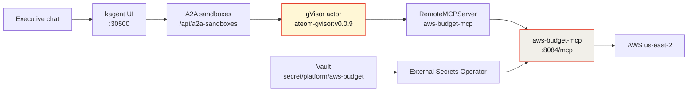

I already wrote the *why* — [why secure sandbox substrates are the future](/articles/2026-08-16-secure-sandbox-substrates-kagent-aws/). This one is the *how*. Same agent, but from the build side: every object you apply, where the AWS key lives, and the one version pin that will waste your afternoon if you get it wrong.

The goal is a single question, answered honestly:

> What's our us-east-2 spend this month, and are we over capacity?

Not "roughly." Not an estimate. Real `ce:GetCostAndUsage` numbers, or an explicit *denied*.


*Live kagent UI, 2026-08-16. Three **SandboxAgent** cards, not plain Agents. `aws-budget` is described as "Executive AWS budget and capacity assistant for us-east-2 (gVisor)."*

## Why a SandboxAgent and not a plain Agent

A normal kagent `Agent` is a Kubernetes Deployment. Always on, container isolation, same as any other pod. That is completely fine for a cluster helper that reads pod logs.

This agent talks to your AWS bill. The model gets a filesystem, memory, and a live network for the whole conversation, and it chews on tool output it did not author. Substrate puts that session in a **gVisor actor** — a user-space kernel between the session and your k3s host.

| | Plain kagent `Agent` | `SandboxAgent` (Substrate) |
|---|---|---|
| Kubernetes shape | Deployment, always-on pod | Actor on WorkerPool `kagent-default`, booted per session |
| Isolation | Container, shared host kernel | **gVisor** user-space kernel |
| Idle cost | A pod per conversation | Snapshot (zstd), worker freed |
| Resume | N/A | Restore the exact session |

Honest rule of thumb: if all you need is a Python container with `boto3` and no snapshot lifecycle, use a Deployment. The moment the session reads your bill, take the wall.

## Architecture



Read that bottom row carefully. Vault and ESO feed **the MCP pod**, not the actor. The gVisor session — the part running the model — never holds an AWS access key. It calls a tool; the tool makes the API call on the far side of the wall.

## The pins that matter (do not bump)

This is the part I would tattoo on the runbook.

| Piece | Value |
|-------|-------|
| kagent OSS Helm + CRDs | `0.10.0-rc2` |
| Agent Substrate Helm + CRDs | `0.0.9` |
| Worker image | `ghcr.io/kagent-dev/substrate/ateom-gvisor:v0.0.9` |
| Pattern | Go declarative `SandboxAgent` + FastMCP + `RemoteMCPServer` + `ExternalSecret` |
| Model | `default-model-config` (my lab: gpt-5.5 via agentgateway) |
| Region | **us-east-2** only |

kagent rc2 **always** writes an `ActorTemplate` with `spec.pauseImage` and `env[].valueFrom.secretKeyRef` (for `KAGENT_CONFIG_JSON`, `KAGENT_AGENT_CARD_JSON`, `KAGENT_SRT_SETTINGS_JSON`, `OPENAI_API_KEY`).

Substrate **0.0.9** CRDs accept that shape. Substrate **0.0.12** removed `valueFrom` and moved the pause image into `SandboxConfig`. Point rc2 at 0.0.12 and the apiserver rejects the object — you get `Ready=False`, `ActorTemplateNotFound`, or `spec.containers[0].env[…].value: Required value`.

The trap: the first time your agent is not Ready, your instinct is to upgrade. **Don't.** A pin mismatch is a CRD problem, not a staleness problem. And don't "fix" it by flattening the env into literal values either.

## Snapshots today: rustfs, and omit `snapshotsConfig`

Substrate checkpoints actor RAM and filesystem to object storage. On my Viper lab that storage is **in-cluster rustfs**, not Google Cloud:

| | Live today |
|--|--|
| atelet 0.0.9 | `ATE_STORAGE_BACKEND=s3` → `http://rustfs.ate-system.svc:9000` |
| Bucket | `ate-snapshots` (1Gi PVC) |
| SandboxAgent | **omits** `snapshotsConfig` |
| ActorTemplate location | `gs://ate-snapshots/kagent/aws-budget` |

The `gs://` scheme there is a **URI prefix only**. The bytes are on rustfs. I have a real GCS bucket (`gs://viper-kagent-ate-snapshots`, project `viper-kagent`, org maniak.io) reserved for a later cluster-wide atelet cutover, and I deliberately did **not** point this agent at it — atelet would go looking for that bucket *on rustfs*, not find it, and the golden snapshot would fail. No `ignoreDifferences`. Stay on rustfs.

## Step 1 — a dedicated IAM identity

AWS console, region us-east-2 → IAM → create user `aws-budget-agent`, no console password → attach a customer-managed policy → create an access key ("application running outside AWS").

The policy is `AwsBudgetAgentReadOnly`: `ce:Get*`, `budgets:View*`, `ec2:Describe*` and siblings, conditioned to `us-east-2` wherever IAM allows a region condition. No `iam:Create*`. No `ec2:Terminate*`. No `budgets:Delete*`. No `s3:*` on your data.

Why a dedicated identity: the agent is read-mostly and it must not borrow a human admin key. If someone talks the model into something clever, the ceiling is "read one region's billing metadata."

Two housekeeping notes:

- Enable **Cost Explorer** in the billing console if the account has never used it. Otherwise `aws_cost_*` fails honestly — and an honest failure is success, not a reason to fake `$0`.
- Compute Optimizer / CE rightsizing enrollment is optional. Skip it and `aws_rightsizing_hints` must say "not available."

## Step 2 — keys into Vault, never git

```bash
docker exec -it k3s-viper kubectl -n vault exec -i vault-0 -- \
  vault kv put secret/platform/aws-budget \
    access_key_id='<paste>' \
    secret_access_key='<paste>' \
    region='us-east-2'
```

Then let ESO do the sync:

```bash
docker exec k3s-viper kubectl -n kagent get externalsecret aws-budget-mcp
```

You want `STATUS: SecretSynced`. Git only ever holds the `ExternalSecret` **mapping** — path names and key names. Never values. And please don't `kubectl get secret -o yaml` and paste the result into Slack.

## Step 3 — build and import the MCP image

Dockerized k3s cannot see host Docker images, and there is no registry pull for `aws-budget-mcp:dev`, so you import it into containerd:

```bash
./aws-sandbox-agent/scripts/02-build-import-mcp.sh
```

That builds the image and runs `ctr images import`. The Deployment uses `imagePullPolicy: IfNotPresent` on purpose. `ImagePullBackOff` means the import didn't land or your tag doesn't match.

## Step 4 — apply the agent

Note the shape of this command. Kustomize runs on the **host**, and the output is piped into k3s — not `apply -k` against a host path the container can't see:

```bash
kubectl kustomize aws-sandbox-agent/k8s | docker exec -i k3s-viper kubectl apply -f -
```

```text
externalsecret.external-secrets.io/aws-budget-mcp created
deployment.apps/aws-budget-mcp created
service/aws-budget-mcp created
configmap/aws-budget-skills created
remotemcpserver.kagent.dev/aws-budget-mcp created
sandboxagent.kagent.dev/aws-budget created
```

One wrinkle worth knowing: kagent 0.10.0-rc2 **rejects `spec.skills`** on a `SandboxAgent`, and there is no skill-mount into the gVisor session. So the skill text lives in ConfigMap `aws-budget-skills` and gets inlined into `systemMessage` via `declarative.promptTemplate`. Keep `skills/` and `k8s/skills-configmap.yaml` in sync.

## Step 5 — what "Ready" actually means

kagent does not start a Deployment of the LLM runtime. It creates an `ActorTemplate` owned by the SandboxAgent. Substrate boots a **golden** actor once, checkpoints it, and stores that checkpoint as `status.goldenSnapshot`. New chats restore from that image.

| You see | Meaning |
|---------|---------|
| No `ActorTemplate` | Wrong CRD pin (0.0.12) or the controller isn't reconciling |
| Template, no `goldenSnapshot` | First checkpoint running (60–90s is normal), or gVisor/atelet can't write storage |
| `Ready=True` + `goldenSnapshot: gs://…` | You can talk to it |

```bash
docker exec k3s-viper kubectl -n kagent get sandboxagents,remotemcpservers
docker exec k3s-viper kubectl -n kagent get actortemplates
```

## The tool catalog — no generic shell

Eleven tools, all Describe/Get/View/List. This is the single most important design decision in the demo, and it's a design decision, not a config flag:

| Tool | AWS API (typical) |
|------|-------------------|
| `aws_whoami` | `sts:GetCallerIdentity` |
| `aws_cost_month` | `ce:GetCostAndUsage` |
| `aws_cost_by_service` | `ce:GetCostAndUsage` grouped by service |
| `aws_budgets` | `budgets:ViewBudget` |
| `aws_ec2_capacity` | `ec2:DescribeInstances` |
| `aws_asg` | `autoscaling:Describe*` |
| `aws_rds` | `rds:Describe*` |
| `aws_ebs_summary` | `ec2:DescribeVolumes` |
| `aws_service_quotas` | `servicequotas:GetServiceQuota` |
| `aws_rightsizing_hints` | CE rightsizing / Compute Optimizer |
| `aws_executive_brief` | composes the above |

There is **no** "run any aws cli" tool. The agent has no verb for destruction. That boundary is enforced three independent times — in the tool code, in the IAM policy, and in the sandbox — so getting past one layer still lands you on the next.

Small API detail that trips people up: Cost Explorer and Budgets live in **us-east-1**. The tools still *filter* results to us-east-2.

## The live run

2026-08-16 on Viper, through `/api/a2a-sandboxes/kagent/aws-budget`:

| | |
|--|--|
| Month-to-date spend | **$0.67** |
| Budget | **$4.13 / $100** (4.13% used) |
| EC2 / ASG / RDS / EBS | **0 / 0 / 0 / 0** |
| Identity | `aws-budget-agent`, account 616973157416 |
| Tool calls | **10 / 10** |


*Live kagent UI, 2026-08-16. Ten of ten tool calls, every number sourced from a real AWS API.*

The line I care about most is not the dollar figure. It's this: the agent reported "Cost Explorer rightsizing API denied; Compute Optimizer not enrolled" instead of inventing a recommendation. An agent that fabricates a helpful-sounding number to fill a gap is an agent you cannot put in front of a budget.

If yours *does* invent spend, the tools didn't run. Tell it "call the tools; do not estimate," then check the MCP logs:

```bash
docker exec k3s-viper kubectl -n kagent logs deploy/aws-budget-mcp
```

That process must never print the secret key.

## Proof, with nothing sensitive on screen


*Live capture, 2026-08-16. `Ready=True`, MCP `Accepted` with 11 tools, pod `1/1 Running` — and deliberately no Vault tokens or AWS keys in frame.*

And the whole turn as a short reel:


One tell that these are genuinely sandboxed sessions: the classic `/api/a2a/kagent/aws-budget` endpoint **404s**, because there is no `Agent` CR at all. The UI talks to `/api/a2a-sandboxes/kagent/aws-budget`, and the card wears a *Sandbox: Agent Substrate* badge.

## Honest limits

- The image must be imported on the k3s node (`ctr images import`) before the MCP pod starts.
- The Vault path must exist first, or the ExternalSecret sits unsynced forever.
- Nested gVisor on dockerized k3s can still hit `runsc` / seccomp / `/dev/kvm` problems. That's a worker-environment issue — not a reason to downgrade the agent to an unsandboxed Deployment.
- Snapshots are local rustfs. Cluster-wide object storage is future work.
- Never commit AWS or GCP secret **values**. Manifests carry paths and key names only.

## The rest of the series

Five demos, one runtime — same pins, same Vault/ESO shape, same gVisor wall. Different blast radius each time.

- **[GCP budget](/articles/2026-08-17-gcp-budget-sandboxagent-kagent-howto/)** — us-east1 capacity, and why the billing half honestly reports *unavailable*.
- **[ServiceNow triage](/articles/2026-08-17-servicenow-sandboxagent-kagent-howto/)** — 25 incidents into a manager briefing, and where write tools belong.
- **[FortiGate 80F](/articles/2026-08-17-fortigate-sandboxagent-kagent-howto/)** — my actual home firewall, 22 tools, and 3,007,844 hits on one policy.
- **[F5 BIG-IP](/articles/2026-08-17-f5-bigip-sandboxagent-kagent-howto/)** — 19 VIPs, 18 tool calls in one turn, and zero write tools.
- **[Why secure sandbox substrates are the future](/articles/2026-08-16-secure-sandbox-substrates-kagent-aws/)** — the argument behind all five.

---

*Full demo — manifests, the FastMCP server, IAM policy, runbooks, and the live report this draws on: [sebbycorp/kagent-agent-substrate-demos / aws-sandbox-agent](https://github.com/sebbycorp/kagent-agent-substrate-demos/tree/main/aws-sandbox-agent).*
