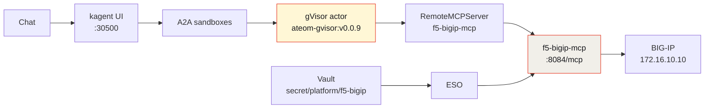

The other four agents in this series answer *what is the state of things* — [AWS spend](/articles/2026-08-17-aws-budget-sandboxagent-kagent-howto/), [GCP quota](/articles/2026-08-17-gcp-budget-sandboxagent-kagent-howto/), [open tickets](/articles/2026-08-17-servicenow-sandboxagent-kagent-howto/), [firewall policy](/articles/2026-08-17-fortigate-sandboxagent-kagent-howto/). This one answers something different, and it's the question I care about most on a load balancer:

> Which VIPs are down, and **why**?

"Down" is a lookup. "Why" is a fan-out — you have to walk from each offline virtual server to its pool, then to that pool's members, and read the reason string. On my lab BIG-IP that turned into **18 tool calls in a single turn**, and the agent did the walk itself.


*Live kagent UI, 2026-08-17. Isolated sandboxes, not plain Agents — `kagent/f5-bigip` on the grid.*

## Why a SandboxAgent and not a plain Agent

A normal kagent `Agent` is a Deployment: always on, container isolation. Fine for a cluster helper.

This one holds credentials for the box that fronts every service in my lab. The model gets a filesystem, memory, and a network for the whole chat. Substrate puts that session in a **gVisor actor** on WorkerPool `kagent-default`:

- **Isolated sandbox.** gVisor's user-space kernel sits between the model session and my Viper/k3s host. Tools call iControl REST through the MCP pod; the BIG-IP password stays in Vault, not in the actor.
- **Idle chats snapshot** (zstd) and free the worker. The next message restores that session.
- **No always-on pod** per conversation.
- A **golden snapshot** you can resume.

**Tradeoff on this lab:** nested gVisor on dockerized k3s, and snapshots are in-cluster rustfs today (`gs://` is a URI prefix only), not GCS.

## Architecture



Vault → ESO → **the MCP pod**. Not the actor. Same shape as the other four demos, and the reason is the same: the part of the system running the model and parsing untrusted output should never be the part holding the credential.

## Pins (do not bump)

| Piece | Value |
|-------|-------|
| kagent OSS Helm + CRDs | `0.10.0-rc2` |
| Agent Substrate Helm + CRDs | `0.0.9` |
| Worker image | `ghcr.io/kagent-dev/substrate/ateom-gvisor:v0.0.9` |
| Pattern | Go declarative `SandboxAgent` + FastMCP + `RemoteMCPServer` + `ExternalSecret` |
| Model | `default-model-config` (gpt-5.5 via agentgateway) |
| Box | F5 BIG-IP · `https://172.16.10.10` · LAN-only, self-signed |

rc2 always writes `ActorTemplate` with `spec.pauseImage` and `env[].valueFrom.secretKeyRef`. Substrate **0.0.9** accepts that shape; **0.0.12** does not. A `Ready=False` agent after a version bump is a CRD pin problem, not a reason to bump further.

## Build it

GitOps lives in [sebbycorp/k8s-viper](https://github.com/sebbycorp/k8s-viper) (`platform/kagent-ai/f5-bigip-*.yaml`, `images/f5-bigip-mcp/`, `docs/f5-bigip-agent.md`); the demo folder is the live-run record.

1. **BIG-IP side.** A dedicated account with a read-only role. No `tmsh` shell access.
2. **Vault.** Path `secret/platform/f5-bigip`, keys `host`, `username`, `password`. ESO syncs it to the MCP pod; git holds the mapping only.
3. **Image.** Build `f5-bigip-mcp:dev` and `ctr images import` it onto the k3s node.
4. **Apply** the SandboxAgent, RemoteMCPServer, and ExternalSecret.

Live on 2026-08-17 — the whole proof surface, with nothing sensitive in it:

```text
NAME                               READY  ACCEPTED
sandboxagent.kagent.dev/f5-bigip   True   True

NAME                                      PROTOCOL          URL                                   ACCEPTED
remotemcpserver.kagent.dev/f5-bigip-mcp   STREAMABLE_HTTP   http://f5-bigip-mcp.kagent:8084/mcp   True

NAME                                             STORETYPE           STORE           STATUS         READY
externalsecret.../f5-bigip-mcp                   ClusterSecretStore  vault-backend   SecretSynced   True

NAME                             READY  STATUS   RESTARTS  AGE
pod/f5-bigip-mcp-7f75b47b78-mdblb 1/1   Running  0         17m
image: f5-bigip-mcp:dev

NAME                                              CLASS
actortemplate.ate.dev/f5-bigip-3adfcbf7c448a873   gvisor
location: gs://ate-snapshots/kagent/f5-bigip
goldenSnapshot: gs://ate-snapshots/kagent/f5-bigip/2b9f5b6a-.../2026-08-17T14:32:42Z-23PD7HXZ5JL7OO7RNHUWZ5YOWS
phase: Ready
```

## Six tools, zero writes

| Tool | What it reads |
|------|---------------|
| `f5_system` | Product, version, build |
| `f5_list_vips` | Virtual servers |
| `f5_vip_status` | One virtual server's availability and enabled state |
| `f5_list_pools` | Pools |
| `f5_pool_status` | One pool's availability, reason string, and member states |
| `f5_vip_brief` | Composed VIP → destination → pool → availability rollup |

That's it. **No write tools exist at all** — not create, not delete, not disable, not "modify this monitor." There is also no generic "call any iControl path" tool, which is the important one: a passthrough would let anyone with chat access reach every endpoint the account can, and read-only-on-the-account would be the only remaining control.

This is a different call than I made for [FortiGate](/articles/2026-08-17-fortigate-sandboxagent-kagent-howto/) and [ServiceNow](/articles/2026-08-17-servicenow-sandboxagent-kagent-howto/), where a few narrow, reversible writes earn their place. A load balancer is the wrong place to be casual: disabling the wrong VIP is an instant outage for every service behind it, and there's no cheap undo when the thing you broke is the path your monitoring travels over. So this agent gets to observe and nothing else.

## The live run

Two questions through `/api/a2a-sandboxes/kagent/f5-bigip`.


*Live kagent UI, 2026-08-17. Two tool calls on Q1, **18** on Q2. The 17-row down table continues below the fold.*

**Q1 — "What is this BIG-IP running, and which VIPs are up?"** (~12.6s, tools: `f5_system`, `f5_vip_brief`)

`f5_system` reached `https://172.16.10.10` and returned `ok: true` — but the identity fields came back empty. Product `null`. Version `null`. Build `null`.

The agent reported exactly that. It did **not** substitute a TMOS version from anywhere, and it didn't decide the box was unreachable either — it separated "the API answered" from "the answer was empty," which are genuinely different failure modes on iControl.

Then `f5_vip_brief` returned **19** virtual servers, of which two were available:

| VIP | Destination | Pool | Availability | Enabled |
|-----|-------------|------|--------------|---------|
| `k8s_iceman_argocd_vs` | `/Common/172.16.20.60:443` | `/Common/k8s_iceman_argocd_pool` | `available` | `true` |
| `k8s_iceman_kagent_vs` | `/Common/172.16.20.62:8080` | `/Common/k8s_iceman_kagent_pool` | `available` | `true` |

The other 17: `offline`.

**Q2 — "Which VIPs are down, and why (pool members)?"** (~36.4s, tools: `f5_system`, `f5_vip_brief`, `f5_pool_status` ×16)

This is where a single-shot tool wouldn't have helped. The agent walked each offline VIP to its pool and pulled the status individually — sixteen `f5_pool_status` calls — and every one came back the same way:

- Pool availability `offline`, pool state `enabled`
- Reason: **"The children pool member(s) are down"**
- Members `state: down`, `session: monitor-enabled`

And the conclusion that actually matters: **all 17 offline VIPs were still `enabled`.** Nobody administratively disabled anything. The VIPs are fine; the backends are gone. On my lab that's the expected story — those pools point at Talos and k3s node ports across clusters I'd shut down — but "config is fine, backends are dead" versus "someone disabled the VIP" is the entire first branch of a load balancer triage tree, and the agent got there on its own.

A sample of the 17, with the down members it named:

| VIP | Destination | Pool | Down members |
|-----|-------------|------|--------------|
| `agentgateway-oss` | `/Common/172.16.20.30:8080` | `/Common/agentgetway-oss` | `172.16.10.144:30344`, `.144:30513`, `.148:30344`, `.148:30513` |
| `k8s_iceman_vault_vs` | `/Common/172.16.20.61:8200` | `/Common/k8s_iceman_vault_pool` | `talos-cp:30820`, `talos-worker:30820` |
| `kagent-oss` | `/Common/172.16.20.36:80` | `/Common/kagent-oss` | `172.16.10.144:31438`, `.144:32002`, `.148:31438`, `.148:32002` |
| `vs_mcp_gateway` | `/Common/172.16.20.123:8090` | `/Common/pool_mcp_gateway` | `172.16.10.130:30168`, `.132:30168`, `.133:30168`, `.136:30168` |
| `webui-https` | `/Common/172.16.20.31:443` | `/Common/webui-oss` | `172.16.10.144:30694`, `172.16.10.148:30694` |

Final tally: **2 available, 17 offline, 19 total.**

(Yes, one of my pool names is `agentgetway-oss`. The agent reported the name as configured rather than tidying it up, which is the correct behavior and also mildly embarrassing.)

## Why the fan-out is the interesting part

Everything above could have been a script. I want to be clear about that — `for vip in $(list); do pool_status $vip; done` is not hard to write.

What the agent added is that **nobody decided in advance how many calls to make.** The question "why are they down" doesn't specify a depth. Two VIPs up and 17 down produced sixteen pool lookups; a different day produces a different number. The agent read the shape of the first answer and sized the second turn to fit, then collapsed 16 identical reason strings into one finding instead of pasting sixteen JSON blobs at me.

That's the actual value proposition for a read-only diagnostic agent, and it's why I'm comfortable with this one having no write tools whatsoever. The scarce skill in an outage isn't *changing* things — it's asking the next question. This agent asks the next question and stops.

## Honest limits

- Import the MCP image on the k3s node before the pod starts.
- The Vault path `secret/platform/f5-bigip` must exist or the ExternalSecret stays unsynced.
- The kagent UI at `http://172.16.10.135:30500/` is **LAN-only**.
- No generic "call any iControl path" tool, no tmsh, and **no write tools** — the agent cannot create, delete, disable, or change virtuals, pools, or monitors.
- `f5_system` returned `null` product/version/build on this run. Don't read a TMOS version into that gap; I didn't.
- The BIG-IP is LAN-only with a self-signed certificate.
- Snapshots are in-cluster rustfs. `gs://` is a prefix only.
- Never commit the F5 password or Vault secret **values**.

## The rest of the series

Five demos, one runtime — same pins, same Vault/ESO shape, same gVisor wall. Different blast radius each time.

- **[AWS budget](/articles/2026-08-17-aws-budget-sandboxagent-kagent-howto/)** — Cost Explorer, least-privilege IAM, and the full build from pins to golden snapshot.
- **[GCP budget](/articles/2026-08-17-gcp-budget-sandboxagent-kagent-howto/)** — us-east1 capacity, and why the billing half honestly reports *unavailable*.
- **[ServiceNow triage](/articles/2026-08-17-servicenow-sandboxagent-kagent-howto/)** — 25 incidents into a manager briefing, and where write tools belong.
- **[FortiGate 80F](/articles/2026-08-17-fortigate-sandboxagent-kagent-howto/)** — my actual home firewall, 22 tools, and 3,007,844 hits on one policy.
- **[Why secure sandbox substrates are the future](/articles/2026-08-16-secure-sandbox-substrates-kagent-aws/)** — the argument behind all five.

---

*Live-run record: [sebbycorp/kagent-agent-substrate-demos / f5-bigip-sandbox-agent](https://github.com/sebbycorp/kagent-agent-substrate-demos/tree/main/f5-bigip-sandbox-agent). Manifests and the MCP image are in [sebbycorp/k8s-viper](https://github.com/sebbycorp/k8s-viper) — see [docs/f5-bigip-agent.md](https://github.com/sebbycorp/k8s-viper/blob/main/docs/f5-bigip-agent.md).*
