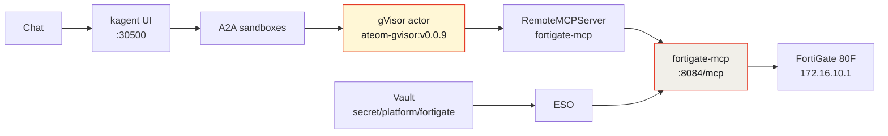

My [AWS](/articles/2026-08-17-aws-budget-sandboxagent-kagent-howto/) and [GCP](/articles/2026-08-17-gcp-budget-sandboxagent-kagent-howto/) budget agents read cloud bills. This one reads something with considerably more consequence in my house: **the firewall my family's internet goes through.**

`fw-maniak-hq` is a FortiGate 80F at `172.16.10.1`. Real traffic, real policies, and — importantly — policies I wrote months ago and no longer remember the details of. That last part is what makes a home firewall a *better* test subject than a pristine lab box. The interesting questions aren't "is it up," they're archaeological:

> What is fw-maniak-hq running, and which WAN is up?
>
> What's the YouTube policy?


*Live kagent UI, 2026-08-16. Isolated sandboxes, not plain Agents — `kagent/fortigate` on the grid.*

## Why a SandboxAgent and not a plain Agent

A normal kagent `Agent` is a Deployment: always on, container isolation, same as every other pod. Fine for a cluster helper.

This one holds a REST token for the device that gates my entire household's network. The model gets a filesystem, memory, and a live network for the whole chat. Substrate puts that session in a **gVisor actor** on WorkerPool `kagent-default`:

- **Isolated sandbox.** gVisor's user-space kernel is the wall between the model session and my Viper/k3s host. Tools call FortiOS through the MCP pod; the REST token stays in Vault, not in the actor.
- **Idle chats snapshot** (zstd) and free the worker. The next message restores the same session instead of booting a new container.
- **No always-on pod** per conversation.
- A **golden snapshot** you can resume.

**Tradeoff on this lab:** nested gVisor on dockerized k3s, and snapshots are in-cluster rustfs today (`gs://` is a URI prefix only), not GCS.

## Architecture



The REST token goes Vault → External Secrets Operator → **the MCP pod**. The actor calls tools over MCP and never holds the token. If a session gets confused by something it read, the credential is still on the far side of the sandbox wall.

## Pins (do not bump)

| Piece | Value |
|-------|-------|
| kagent OSS Helm + CRDs | `0.10.0-rc2` |
| Agent Substrate Helm + CRDs | `0.0.9` |
| Worker image | `ghcr.io/kagent-dev/substrate/ateom-gvisor:v0.0.9` |
| Pattern | Go declarative `SandboxAgent` + FastMCP + `RemoteMCPServer` + `ExternalSecret` |
| Model | `default-model-config` (gpt-5.5 via agentgateway) |
| Box | FortiGate **80F** · `fw-maniak-hq` · `172.16.10.1` |
| FortiOS | v7.4.11 build 2878 · VDOM `root` |

rc2 always writes `ActorTemplate` with `spec.pauseImage` and `env[].valueFrom.secretKeyRef`. Substrate **0.0.9** accepts that shape; **0.0.12** does not. Do not "upgrade to fix" a `Ready=False` agent — a pin mismatch is a CRD problem.

## Build it

GitOps for this one lives in [sebbycorp/k8s-viper](https://github.com/sebbycorp/k8s-viper) (`platform/kagent-ai/fortigate-*.yaml`, `images/fortigate-mcp/`, `docs/fortigate-agent.md`) — the demo folder in the substrate repo is the **live-run record**. The shape is the same as the others:

1. **FortiGate side.** Create a REST API admin with a read-mostly profile, restricted to the trusted host that the MCP pod egresses from. Generate the token once.
2. **Vault.** Path `secret/platform/fortigate`. ESO syncs it into a Kubernetes Secret the MCP pod consumes. Git holds the mapping only.
3. **Image.** Build `fortigate-mcp:dev`, `ctr images import` onto the k3s node. Dockerized k3s can't see host Docker images; `imagePullPolicy: IfNotPresent` is deliberate.
4. **Apply** the SandboxAgent, RemoteMCPServer, ExternalSecret, and skills ConfigMap.

Verified live on 2026-08-16, and this is the whole proof surface:

```text
NAME                                READY   ACCEPTED
sandboxagent.kagent.dev/fortigate   True    True

NAME                                       PROTOCOL          URL                                    ACCEPTED
remotemcpserver.kagent.dev/fortigate-mcp   STREAMABLE_HTTP   http://fortigate-mcp.kagent:8084/mcp   True

NAME                              READY   STATUS    RESTARTS   AGE
pod/fortigate-mcp-745d4c9ff5-bxjvc 1/1    Running   0          19h

NAME                                               CLASS
actortemplate.ate.dev/fortigate-b8bc65944f9bc4df   gvisor
location: gs://ate-snapshots/kagent/fortigate
goldenSnapshot: gs://ate-snapshots/kagent/fortigate/2bcc7a8b-.../2026-08-16T02:45:18Z-R7ZXMSV6CEC2D4NVN4XEX5UDO3
phase: Ready
```

`Ready=True` with a `goldenSnapshot` means Substrate booted a golden actor, checkpointed it, and new chats restore from that image rather than cold-starting.

## The tool catalog

This agent is the widest of the five demos — 22 tools, because a firewall has a lot of surfaces worth reading:

**Reads.** `fg_system_status`, `fg_resource_usage`, `fg_list_interfaces`, `fg_interface_stats`, `fg_list_policies`, `fg_get_policy`, `fg_policy_stats`, `fg_list_addresses`, `fg_list_addrgrp`, `fg_list_services`, `fg_list_routes`, `fg_list_static_routes`, `fg_vpn_status`, `fg_dhcp_leases`, `fg_list_vips`, `fg_log_state`, `fg_current_admins`.

**Writes.** `fg_create_address`, `fg_update_address`, `fg_create_policy`, `fg_set_policy_status`, `fg_update_policy_comment`.

And, more importantly, what is **absent**: there is no generic "run any FortiOS CLI" tool, no tmsh-equivalent, no config backup, no firmware operation, and no delete of anything. The write tools that exist are additive or single-field — create an address object, flip a policy's enable flag, edit a comment. The agent has to **ask before using any of them.**

That's the same position I took with the [ServiceNow agent's two write tools](/articles/2026-08-17-servicenow-sandboxagent-kagent-howto/): give it writes a human can undo in one click, and nothing else. On a firewall the stakes are higher, so the "nothing else" list is longer — a `fg_delete_policy` on a home gateway is a self-inflicted outage waiting for a bad prompt.

## The live run

Two questions through `/api/a2a-sandboxes/kagent/fortigate`, 2026-08-16 evening.


*Live kagent UI, 2026-08-16. Three tool calls on Q1, four on Q2. The right-hand pane shows the full 22-tool catalog.*

**Q1 — "What is fw-maniak-hq running, and which WAN is up?"** (~6.6s, tools: `fg_system_status`, `fg_list_interfaces`, `fg_interface_stats`)

- FortiGate **80F** / FGT80F, serial `FGT80FTK22061709`
- FortiOS **v7.4.11** build 2878, VDOM `root`
- **wan1: down**, DHCP, IP `0.0.0.0`
- **wan2: up**, DHCP, IP `24.141.221.254/20`

Six and a half seconds for hardware, firmware, and WAN failover state. Worth noting it correctly read `0.0.0.0` as *down* rather than reporting an interface that exists as an interface that works.

**Q2 — "What's the YouTube policy?"** (~12.0s, tools: `fg_list_policies`, `fg_get_policy` ×2, `fg_policy_stats`)

| ID | Name | Source | Schedule | Hits | Active sessions |
|----|------|--------|----------|-----:|----------------:|
| 8 | `Allow-YouTube-Whitelist` | `Grp-YouTube-Allowed` | always | 3,007,844 | 154 |
| 7 | `Allow-YouTube-MasterBR-Night` | `YT-AppleTV-Master-122` | `Allow-YT-MasterBR-8pm-2am` | 18,902 | 0 |

Both from `corp` → `BELL_35` / `wan2`, action accept, NAT on, logging all. Policy 8 even carried its own documentation in the comment field: *"Whitelist: these devices may use YouTube (and everything). Add devices to Grp-YouTube-Allowed."*

Then the answer I actually needed: **there is no separate YouTube block policy** in the returned list. The allow-list is doing the work by being narrow, not by pairing with an explicit deny — and the agent said that rather than assuming a deny must exist somewhere because the setup "looks like" a whitelist pattern.

## What this demo is actually good at

Two things stand out after using it.

**It reads intent, not just config.** `fg_policy_stats` turning "policy 8" into *3,007,844 hits, 154 sessions right now* is the difference between reading a rule and knowing whether the rule matters. Policy 7 has 18,902 lifetime hits and zero active sessions — its schedule window (`8pm-2am`) wasn't open. Neither of those facts is in the policy definition.

**It's honest about what it can see.** Twice in one session it declined to fill a gap: no YouTube deny policy in the compact list, and `wan1` reported as down rather than glossed. Same principle as [the GCP agent saying *unavailable*](/articles/2026-08-17-gcp-budget-sandboxagent-kagent-howto/) rather than inventing spend. On a firewall, a confidently hallucinated policy is worse than no answer — you'd go make a change based on a rule that doesn't exist.

## Honest limits

- Import the MCP image on the k3s node before the pod starts.
- The Vault path `secret/platform/fortigate` must exist or the ExternalSecret stays unsynced.
- The kagent UI at `http://172.16.10.135:30500/` is **LAN-only**. This isn't published.
- No generic FortiOS CLI tool. No delete, no config backup, no firmware operation.
- Writes exist (`fg_create_policy`, `fg_set_policy_status`, …) and the agent must ask first — a prompt-level control backed by a tool-level one, not a replacement for it.
- Snapshots are in-cluster rustfs. `gs://` is a prefix only.
- Never commit the FortiGate REST token or Vault secret **values**.

## The rest of the series

Five demos, one runtime — same pins, same Vault/ESO shape, same gVisor wall. Different blast radius each time.

- **[AWS budget](/articles/2026-08-17-aws-budget-sandboxagent-kagent-howto/)** — Cost Explorer, least-privilege IAM, and the full build from pins to golden snapshot.
- **[GCP budget](/articles/2026-08-17-gcp-budget-sandboxagent-kagent-howto/)** — us-east1 capacity, and why the billing half honestly reports *unavailable*.
- **[ServiceNow triage](/articles/2026-08-17-servicenow-sandboxagent-kagent-howto/)** — 25 incidents into a manager briefing, and where write tools belong.
- **[F5 BIG-IP](/articles/2026-08-17-f5-bigip-sandboxagent-kagent-howto/)** — 19 VIPs, 18 tool calls in one turn, and zero write tools.
- **[Why secure sandbox substrates are the future](/articles/2026-08-16-secure-sandbox-substrates-kagent-aws/)** — the argument behind all five.

---

*Live-run record: [sebbycorp/kagent-agent-substrate-demos / fortigate-sandbox-agent](https://github.com/sebbycorp/kagent-agent-substrate-demos/tree/main/fortigate-sandbox-agent). Manifests and the MCP image are in [sebbycorp/k8s-viper](https://github.com/sebbycorp/k8s-viper) — see [docs/fortigate-agent.md](https://github.com/sebbycorp/k8s-viper/blob/main/docs/fortigate-agent.md).*
