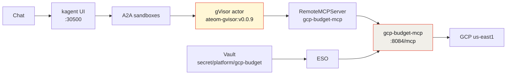

This is the GCP sibling of my [AWS budget SandboxAgent](/articles/2026-08-17-aws-budget-sandboxagent-kagent-howto/): a gVisor-isolated agent that answers

> What's our us-east1 spend this month, and are we over capacity?

for org **maniak.io**, with real Cloud Billing and Compute Engine numbers and a service-account JSON that never touches git.

Here's the thing: on the live run, half of it **didn't work**. And that turned out to be the most useful part of the demo, so I'm publishing it that way rather than re-shooting a clean take.


*Live kagent UI, 2026-08-16. Isolated sandboxes, not plain Agents — `kagent/gcp-budget` is on the grid.*

## Why a SandboxAgent and not a plain Agent

A normal kagent `Agent` is a Deployment: always on, container isolation, same as any other pod. Fine for a cluster helper.

This one reads the GCP bill and the Compute Engine inventory. The model gets a filesystem, memory, and a network for the whole chat. Substrate puts that session in a **gVisor actor** on WorkerPool `kagent-default`:

- **Isolated sandbox.** gVisor's user-space kernel is the wall between the model session and my Viper/k3s host. Tools reach GCP through the MCP pod; the service-account JSON stays in Vault, not in the actor.
- **Idle chats snapshot** (zstd) and free the worker. The next message restores that same session instead of cold-booting a container.
- **No always-on pod** per executive conversation.
- A **golden snapshot** you can resume deterministically.

If you only needed a Python container with the `google-cloud-*` clients and no snapshot lifecycle, a Deployment would do. That's not this.

**Tradeoff, stated plainly:** nested gVisor on dockerized k3s is finicky, and snapshots land on in-cluster rustfs today — the `gs://` you'll see is a URI prefix, not live GCS.

## Architecture



The service-account JSON goes Vault → External Secrets Operator → **the MCP pod**. Not the actor. The session that's running the model and parsing untrusted tool output never holds a Google credential.

## Pins (do not bump)

| Piece | Value |
|-------|-------|
| kagent OSS Helm + CRDs | `0.10.0-rc2` |
| Agent Substrate Helm + CRDs | `0.0.9` |
| Worker image | `ghcr.io/kagent-dev/substrate/ateom-gvisor:v0.0.9` |
| Model | `default-model-config` (gpt-5.5 via agentgateway) |
| Region | **us-east1** only |
| Org | **maniak.io** |
| Projects (names only) | viper-kagent, maniak-io, qr-maniak-io |

rc2 writes `ActorTemplate` with `spec.pauseImage` and `env[].valueFrom.secretKeyRef`. Substrate **0.0.9** accepts that. **0.0.12** removed `valueFrom` and moved the pause image to `SandboxConfig`, so the apiserver rejects rc2's object and you get `Ready=False` / `ActorTemplateNotFound`.

Do **not** "upgrade to fix" a Ready=False agent. That's how I already burned an afternoon on this lab. A pin mismatch is a CRD problem.

## Build it

**1. Service account.** GCP console, org maniak.io → IAM → create `gcp-budget-agent` → attach read-mostly permissions → download the JSON key once, and keep that file outside the repo. Enable Cloud Billing, Cloud Billing Budget, Compute Engine, and Cloud Resource Manager APIs on the projects it will read.

**2. Vault.** Path `secret/platform/gcp-budget`, keys `credentials_json`, `billing_account`, `project`, `region`. ESO syncs it into a Kubernetes Secret consumed only by the MCP pod. Git holds the `ExternalSecret` mapping — names, never values.

**3. Image.** Build `gcp-budget-mcp:dev` on the node and `ctr images import` it, because dockerized k3s can't see host Docker images and there's no registry pull for a `:dev` tag.

**4. Apply.** Kustomize on the host, piped into the cluster:

```bash
kubectl kustomize gcp-sandbox-agent/k8s | docker exec -i k3s-viper kubectl apply -f -
```

**5. Verify.** Expect this, and nothing sensitive in it:

```text
NAME                                      READY   ACCEPTED
sandboxagent.kagent.dev/gcp-budget        True    True

NAME                                        PROTOCOL          URL                                     ACCEPTED
remotemcpserver.kagent.dev/gcp-budget-mcp   STREAMABLE_HTTP   http://gcp-budget-mcp.kagent:8084/mcp   True

NAME                                READY   STATUS    RESTARTS   AGE
pod/gcp-budget-mcp-5664dfb8f7-pwlwv 1/1     Running   0          4m41s

NAME                                                CLASS
actortemplate.ate.dev/gcp-budget-82cc62c613737d64   gvisor
location: gs://ate-snapshots/kagent/gcp-budget
goldenSnapshot: gs://ate-snapshots/kagent/gcp-budget/5edafe3c-.../2026-08-16T17:55:34Z-XIKENZRG7IHYGCONXJZFBBFY2R
phase: Ready
```

`Ready=True` plus a `goldenSnapshot` means Substrate booted a golden actor, checkpointed it, and new chats will restore from that image.

## The tools

Eight, all read-only:

| Tool | What it reads |
|------|---------------|
| `gcp_whoami` | The service-account identity actually in use |
| `gcp_cost_month` | Month-to-date attempt via Cloud Billing |
| `gcp_cost_by_service` | Per-service breakdown |
| `gcp_budgets` | Cloud Billing Budgets |
| `gcp_projects` | Resource Manager project list |
| `gcp_compute_capacity` | Instances and disks, zone-filtered to us-east1 |
| `gcp_quotas` | Compute quotas vs. usage |
| `gcp_executive_brief` | Composes the above |

No generic "run any gcloud" tool. No project-delete, no IAM-create.

## The live run, including what broke


*Live kagent UI, 2026-08-16. Five tool calls on Q1, three on Q2. Billing unavailable with the error quoted verbatim; capacity answered cleanly.*

**Q1 — "What's our GCP budget status and which projects are on the billing account?"** (~18s, tools: `gcp_whoami`, `gcp_cost_month`, `gcp_budgets`, `gcp_cost_by_service`, `gcp_projects`)

Billing account `011C38-867461-BE95B1`, linked projects, budgets, and MTD spend all came back **unavailable**. The runtime error, quoted in the answer:

```text
ImportError: cannot import name 'billing_budgets_v1' from 'google.cloud'
```

The agent then did something I want to highlight. It separately checked Resource Manager, listed `viper-kagent`, `maniak-io`, `qr-maniak-io` — and explicitly noted that **Resource Manager visibility is not the same thing as billing-account linkage.** It didn't quietly present one as the other. My known lab budget (`trail budget`, $1) was not returned, and it said so.

**After the rebuild.** The import was wrong: `google-cloud-billing-budgets==1.21.0` was pinned and installed, but the old alias `from google.cloud import billing_budgets_v1` doesn't exist. The working path is:

```python
from google.cloud.billing import budgets_v1
client = budgets_v1.BudgetServiceClient()
```

Rebuilt as `gcp-budget-mcp:dev`, new pod, re-ran Q1. No more `ImportError` — and Cloud Billing then returned `Unauthenticated` for `billing.accounts.get`, `billingbudgets.budgets.list`, and cost-by-service. Resource Manager still listed the three projects. The $1 trail budget still didn't appear. Month-to-date spend still unavailable.

Two failures in a row, and at no point did a dollar amount get invented.

**Q2 — "Any compute running in us-east1, and are we near quota?"** (~15s, tools: `gcp_projects`, `gcp_compute_capacity`, `gcp_quotas`)

This half worked perfectly:

| Quota | Usage | Limit | Status |
|-------|------:|------:|--------|
| CPUs | 0 | 200 | OK |
| Instances | 0 | 24 | OK |
| Total disk GB | 0 | 4096 | OK |
| SSD total GB | 0 | 500 | OK |
| In-use addresses | 0 | 8 | OK |

Zero instances running, zero stopped, zero disks. Not near quota.

## The Cloud Billing gap is real, not a bug in my code

Worth separating two different problems here.

The `ImportError` was my bug and I fixed it. The `Unauthenticated` is a permissions gap on that service account. But underneath both sits a structural fact: **Cloud Billing Accounts, Budgets, and Catalog do not expose month-to-date spend.** There is no "what have I spent so far this month" call in that surface the way `ce:GetCostAndUsage` gives you on AWS. Real MTD on GCP means BigQuery billing export.

So the tools are written to say **unavailable** rather than approximate. That's the design position, and it's why the AWS agent can report `$0.67` while this one can't report anything.

## Why "unavailable" is the feature

It would have been easy to make this demo look better. Return `$0.00` on a failed billing call. Present the Resource Manager project list as "projects on the billing account." Round something plausible. Every one of those makes a nicer screenshot and a worse agent.

An agent wired to your finances has exactly one job when a tool fails: **say the tool failed.** A confident wrong number is worse than a blank, because a blank gets escalated and a wrong number gets acted on. The whole point of putting keys in Vault, tools behind MCP, and the session behind gVisor is to earn trust in what the agent reports — and you throw that away the first time it papers over a gap to be helpful.

## Honest limits

- Import the image on the k3s node before the MCP pod starts.
- The Vault path must exist or the ExternalSecret stays unsynced.
- Cloud Billing does not return MTD spend. The tools say unavailable.
- Billing APIs returned `Unauthenticated` on the live run. That's a permissions gap I haven't closed, not a fixed result.
- No generic gcloud tool, no project-delete, no IAM-create.
- Snapshots are in-cluster rustfs. `gs://` is a prefix only.
- Never commit the service-account JSON or Vault secret **values**.

## The rest of the series

Five demos, one runtime — same pins, same Vault/ESO shape, same gVisor wall. Different blast radius each time.

- **[AWS budget](/articles/2026-08-17-aws-budget-sandboxagent-kagent-howto/)** — Cost Explorer, least-privilege IAM, and the full build from pins to golden snapshot.
- **[ServiceNow triage](/articles/2026-08-17-servicenow-sandboxagent-kagent-howto/)** — 25 incidents into a manager briefing, and where write tools belong.
- **[FortiGate 80F](/articles/2026-08-17-fortigate-sandboxagent-kagent-howto/)** — my actual home firewall, 22 tools, and 3,007,844 hits on one policy.
- **[F5 BIG-IP](/articles/2026-08-17-f5-bigip-sandboxagent-kagent-howto/)** — 19 VIPs, 18 tool calls in one turn, and zero write tools.
- **[Why secure sandbox substrates are the future](/articles/2026-08-16-secure-sandbox-substrates-kagent-aws/)** — the argument behind all five.

---

*Full demo — manifests, the FastMCP server, security notes, runbooks, and the live report: [sebbycorp/kagent-agent-substrate-demos / gcp-sandbox-agent](https://github.com/sebbycorp/kagent-agent-substrate-demos/tree/main/gcp-sandbox-agent).*
