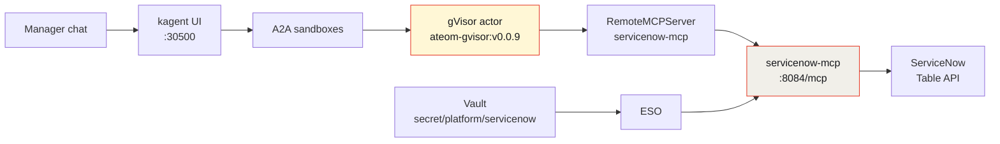

Every ITSM demo I've ever sat through answers "how many tickets are open." That's a `COUNT(*)`. The actual manager question is harder:

> What IT tickets are open right now, and how should we organize them?

That needs priority buckets, someone to notice the unassigned P1, and a list you can act on in a standup. So I built it as a gVisor `SandboxAgent` on kagent + Agent Substrate, pointed at a real ServiceNow personal developer instance, and — unlike my [AWS](/articles/2026-08-17-aws-budget-sandboxagent-kagent-howto/) and [GCP](/articles/2026-08-17-gcp-budget-sandboxagent-kagent-howto/) budget agents — I gave this one **write tools**. Two of them. That changes the design conversation.


*Live kagent UI, 2026-08-16. Isolated sandboxes, not plain Agents — `kagent/servicenow` on the grid.*

## Why a SandboxAgent and not a plain Agent

A normal kagent `Agent` is a Deployment: always on, container isolation. Fine for a cluster helper.

This one talks to a ticketing system full of text other people wrote. That matters more than it sounds — incident descriptions, work notes, and short descriptions are **untrusted input** flowing straight into a model that holds tools. Prompt injection in a ticket body is not a hypothetical attack; it's the obvious one.

Substrate puts the session in a **gVisor actor** on WorkerPool `kagent-default`:

- **Isolated sandbox.** gVisor's user-space kernel sits between the model session and my Viper/k3s host. Tools call ServiceNow through the MCP pod; username and password stay in Vault, not in the actor.
- **Idle chats snapshot** (zstd) and free the worker; the next message restores the same session.
- **No always-on pod** per manager conversation.
- A **golden snapshot** you can resume.

**Tradeoff on this lab:** nested gVisor on dockerized k3s, and snapshots are in-cluster rustfs today (`gs://` is a URI prefix only), not GCS.

## Architecture



The ServiceNow password goes Vault → ESO → **the MCP pod**. The actor calls tools; it never sees a credential.

## Pins (do not bump)

| Piece | Value |
|-------|-------|
| kagent OSS Helm + CRDs | `0.10.0-rc2` |
| Agent Substrate Helm + CRDs | `0.0.9` |
| Worker image | `ghcr.io/kagent-dev/substrate/ateom-gvisor:v0.0.9` |
| Pattern | Go declarative `SandboxAgent` + FastMCP + `RemoteMCPServer` + `ExternalSecret` |
| Model | `default-model-config` (gpt-5.5 via agentgateway) |
| Host (name only) | `https://dev203166.service-now.com` |

rc2 always writes `ActorTemplate` with `spec.pauseImage` and `env[].valueFrom.secretKeyRef`. Substrate **0.0.9** accepts that shape; **0.0.12** does not — it dropped `valueFrom` and moved the pause image into `SandboxConfig`, so the apiserver rejects rc2's object. Don't "upgrade to fix" a `Ready=False` agent.

## Build it

**1. Vault.** Path `secret/platform/servicenow`, keys `host`, `username`, `password`. Only the **host name** is safe to commit. ESO syncs into a Kubernetes Secret the MCP pod consumes.

**2. Image.** Build `servicenow-mcp:dev` and `ctr images import` it onto the k3s node — dockerized k3s can't see host Docker images, and `imagePullPolicy: IfNotPresent` is deliberate.

**3. Apply.** Kustomize on the host, piped in:

```bash
kubectl kustomize service-now-sandbox-agent/k8s | docker exec -i k3s-viper kubectl apply -f -
```

You get the skills ConfigMap, the MCP Service + Deployment, the ExternalSecret, the RemoteMCPServer, and the SandboxAgent.

**4. Verify.** What I had live on 2026-08-16:

| Object | Status |
|--------|--------|
| SandboxAgent `servicenow` | `Ready=True`, `Accepted=True` |
| RemoteMCPServer `servicenow-mcp` | Accepted, **8** tools, `STREAMABLE_HTTP` `http://servicenow-mcp.kagent:8084/mcp` |
| MCP pod | `servicenow-mcp-7c6c455c65-kvnrq` `1/1` Running, 0 restarts |
| ActorTemplate | `servicenow-f5f2dec1f2a81a41`, gvisor, Ready |
| Snapshot prefix | `gs://ate-snapshots/kagent/servicenow` (rustfs) |
| Golden snapshot | `2026-08-16T15:45:24Z-HYSFX5R3DHWLRWYVP7YXOAF4SN` |


*Live CLI, 2026-08-16. Nothing sensitive in frame.*

## Six read tools, two write tools

| Tool | Kind | What it does |
|------|------|--------------|
| `sn_whoami` | read | Which ServiceNow user the agent is acting as |
| `sn_list_incidents` | read | Active incidents, compact rows |
| `sn_get_incident` | read | One incident by number or sys_id |
| `sn_search_incidents` | read | Encoded-query search |
| `sn_incident_summary` | read | Aggregated counts by field |
| `sn_list_requested_items` | read | Service catalog requested items |
| `sn_add_work_note` | **write** | Appends a work note to an incident |
| `sn_assign_incident` | **write** | Sets an assignee |

There is **no generic shell** and no HTTP passthrough — you cannot ask this agent to hit an arbitrary Table API path. And critically: **no create, no close, no delete.** An incident cannot be conjured or disappeared.

## Where write tools belong

This is the part worth arguing about, so let me be direct about the position.

Read-only agents are easy to trust and frequently useless. "Here are your 25 open tickets" is genuinely helpful, but the manager's next sentence is always *"okay, assign the payroll one to someone and note that we're on it."* If the agent can't do that, you alt-tab into ServiceNow and the agent was a fancy report.

So the two writes exist. What makes them defensible is not that they're small — it's that they're **specific and reversible**:

- `sn_add_work_note` is **append-only**. It cannot overwrite history. Worst case, someone gets a spurious note on a ticket, and the note is signed by the agent's identity.
- `sn_assign_incident` sets one field. Wrong assignee is an annoyance, fixed by setting it again.

Compare that to what I deliberately did **not** build. A `sn_close_incident` destroys the audit story — a closed ticket stops getting looked at, which is exactly the outcome a prompt injection would want. A generic `sn_table_patch` is a shell with extra steps: any field, any table, including `sys_user` roles.

On top of that, the agent's instructions require it to **ask before writing.** That's a soft control — a model can be talked out of a soft control, which is precisely why it's the *third* layer and not the only one. The hard controls are the tool catalog (there is no verb for "close") and the ServiceNow account's own role grants. The prompt-level "ask first" is there for the ordinary case where the manager and the agent are just working through a list, not for the adversarial one.

The general rule I'd apply to any agent touching a system of record: **give it writes that a human can undo in one click, and nothing else.**

## The live run

Two questions through `/api/a2a-sandboxes/kagent/servicenow`.


*Live kagent UI, 2026-08-16. Three tool calls: `sn_whoami`, `sn_incident_summary`, `sn_list_incidents`.*

**Q1 — "What IT tickets are open right now? Give me a manager summary by priority."**

Acting as **System Administrator (admin)** on `dev203166.service-now.com`. 25 active incidents on the current page:

| Priority | Count | Manager view |
|----------|------:|--------------|
| P1 – Critical | 13 | Payroll server, DNS, wireless/network, VPN, Exchange, SAP apps |
| P2 – High | 4 | Network storage, SAP login, hotfix removal, VM launch |
| P3 – Moderate | 5 | Desk phone, email, service request, website JavaScript, SFA access |
| P5 – Planning | 3 | Weather report, replacement iPhone, Oregon mail server |

Then the section that makes it a briefing rather than a dump — **needs eyes / unassigned**:

- **INC0007001** — P1 Critical, New, unassigned: *employee payroll application server is down*
- **INC0000046** — P3 Moderate, New, unassigned: *can't access SFA software*
- **INC0000039** — P5 Planning, New, unassigned: *trouble getting to Oregon mail server*

An unassigned P1 on a payroll server is exactly the thing that falls through a queue view, and it's the first thing the agent surfaced.

**The honest bit:** `sn_incident_summary` — the aggregate-count tool — **failed** on this run. The agent said so in the answer ("the formal summary count tool failed, so priority totals below are from the returned incident list only") and derived the buckets from the rows it actually had. It didn't present a computed total as an API total. Same principle as the [GCP agent saying *unavailable*](/articles/2026-08-17-gcp-budget-sandboxagent-kagent-howto/): tell me where the number came from.

**Q2 — "What about the critical VPN and DNS ones?"**

| Incident | Short description | State | Assignee |
|----------|-------------------|-------|----------|
| INC0000015 | VPN client won't launch since the last software update | In Progress | Don Goodliffe |
| INC0000016 | Rain is leaking on the main DNS server | In Progress | ITIL User |

Rain leaking on the DNS server is stock ServiceNow demo data, and I love it too much to swap for something plausible.

Here's the same session as a scroll:


One tell that this is a real sandboxed session: `/api/a2a/kagent/servicenow` **404s** — there is no `Agent` CR — and the UI posts to `/api/a2a-sandboxes/kagent/servicenow`. The card wears a *Sandbox: Agent Substrate* badge.

## Honest limits

- Import the MCP image on the k3s node before the pod starts.
- The Vault path must exist or the ExternalSecret stays unsynced.
- No generic shell, no HTTP passthrough, no incident create / close / delete.
- The two write tools exist and the agent must ask first — that's a prompt-level control backed by a tool-level one, not a substitute for it.
- `sn_incident_summary` failed on the live run. Priority totals came from the returned rows.
- This is a personal developer instance with stock demo data, not production volume.
- Never commit the ServiceNow username or password **values**.

## The rest of the series

Five demos, one runtime — same pins, same Vault/ESO shape, same gVisor wall. Different blast radius each time.

- **[AWS budget](/articles/2026-08-17-aws-budget-sandboxagent-kagent-howto/)** — Cost Explorer, least-privilege IAM, and the full build from pins to golden snapshot.
- **[GCP budget](/articles/2026-08-17-gcp-budget-sandboxagent-kagent-howto/)** — us-east1 capacity, and why the billing half honestly reports *unavailable*.
- **[FortiGate 80F](/articles/2026-08-17-fortigate-sandboxagent-kagent-howto/)** — my actual home firewall, 22 tools, and 3,007,844 hits on one policy.
- **[F5 BIG-IP](/articles/2026-08-17-f5-bigip-sandboxagent-kagent-howto/)** — 19 VIPs, 18 tool calls in one turn, and zero write tools.
- **[Why secure sandbox substrates are the future](/articles/2026-08-16-secure-sandbox-substrates-kagent-aws/)** — the argument behind all five.

---

*Full demo — manifests, the FastMCP server, security notes, runbooks, and the live report: [sebbycorp/kagent-agent-substrate-demos / service-now-sandbox-agent](https://github.com/sebbycorp/kagent-agent-substrate-demos/tree/main/service-now-sandbox-agent).*
