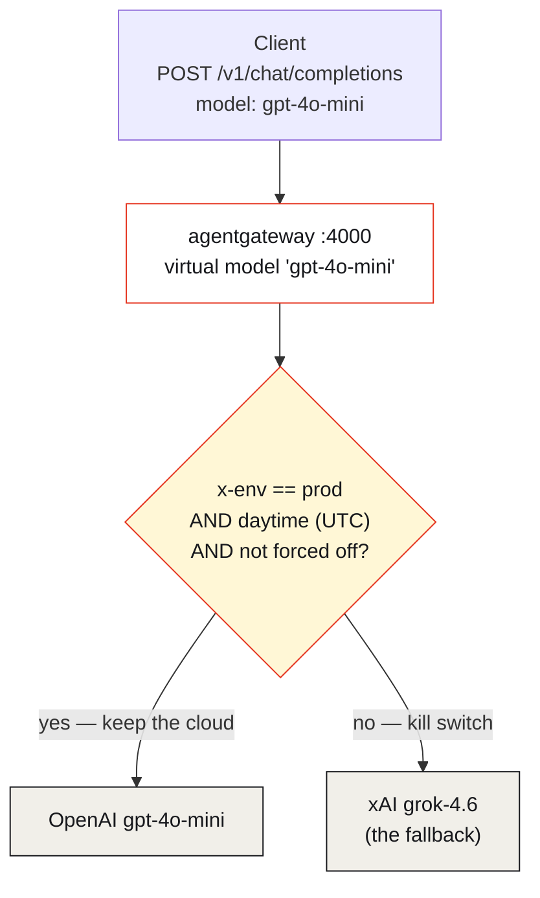
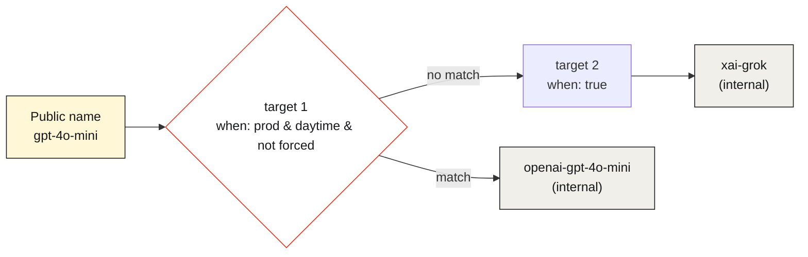

Ask where your LLM traffic actually goes and the honest answer is usually "it depends which client you look at." One service is pinned to GPT-4o. Another hardcodes Claude. A third points at whatever base URL someone set in an env var eight months ago. The routing decision — *which provider, which model, under what conditions* — is scattered across a dozen codebases, and changing it means a dozen redeploys.

That's fine until the day you need to change it **all at once, now**: costs spike overnight, a provider has an incident, a compliance rule says non-production traffic shouldn't hit a premium cloud after hours. At that moment you don't want to open twelve repos. You want **one switch**.

This is a walk through a small, complete [agentgateway](https://agentgateway.dev) demo — [`12-after-hours-kill-switch`](https://github.com/sebbycorp/agentgateway-demos/tree/main/12-after-hours-kill-switch) — that builds exactly that switch. Clients hit one OpenAI-compatible URL and ask for a model by a friendly public name. The gateway decides where the request *really* goes, based on live conditions, and keeps the premium cloud only when it should. Everything else is rewritten to a single fallback. It's a kill switch for your model egress, and it lives entirely in config.

## The idea: clients ask, the gateway decides

The whole demo turns on one inversion of control. Clients don't name a provider — they name an **intent**: `gpt-4o-mini`, `claude-sonnet`, or `grok`. Those are *public virtual models*. What each one resolves to is the gateway's decision, re-evaluated on every request.



During daytime production, `gpt-4o-mini` really means OpenAI and `claude-sonnet` really means Anthropic. Outside that window — nights, non-prod, or a manual override — *every* public name collapses to xAI's `grok-4.6`. Same URL, same client code, completely different destination. The client never knows, and never needs to.

## How it's built: virtual models + conditional routing + CEL

agentgateway's standalone `llm` mode has three moving parts here, and they compose cleanly.

**Providers** hold the credentials, once:

```yaml
providers:
  - name: openai
    provider: openAI
    params: { apiKey: "$OPENAI_API_KEY" }
  - name: anthropic
    provider: anthropic
    params: { apiKey: "$ANTHROPIC_API_KEY" }
  - name: xai
    provider: xai
    params: { apiKey: "$XAI_API_KEY" }
```

**Concrete models** are the real upstreams — and, crucially, they're marked `visibility: internal`:

```yaml
models:
  - name: openai-gpt-4o-mini
    visibility: internal
    provider: { reference: openai }
    params: { model: gpt-4o-mini }
  - name: xai-grok
    visibility: internal
    provider: { reference: xai }
    params: { model: grok-4.6 }
  # …anthropic-claude-sonnet likewise
```

**Virtual models** are the public names, each routing *conditionally* to a concrete model. The routing is a list of `when` expressions written in [CEL](https://agentgateway.dev/docs/standalone/latest/reference/cel/), evaluated top to bottom — **first match wins**:

```yaml
virtualModels:
  - name: gpt-4o-mini
    routing:
      conditional:
        targets:
          - model: openai-gpt-4o-mini
            when: |
              default(request.headers["x-env"], "") == "prod"
              && default(request.headers["x-force-after-hours"], "") != "true"
              && timestamp(request.startTime).getHours() >= 12
              && timestamp(request.startTime).getHours() < 23
          - model: xai-grok
            when: "true"      # the fallback — always matches
```

Read that as a policy sentence: *keep OpenAI only if the caller says it's prod, hasn't forced the switch, and it's inside the daytime UTC window; otherwise fall through to Grok.* The final `when: "true"` is the kill switch's safety net — it always matches, so there is never a request that fails to route somewhere.



## Why the switch can't be dodged

Here's the detail that turns a routing trick into a *control*: the concrete models are `visibility: internal`. A client cannot send `"model": "openai-gpt-4o-mini"` to skip the conditional and reach OpenAI directly — internal models aren't addressable from outside. The only doors into the gateway are the public virtual names, and every one of them runs the CEL gauntlet first.

That's the difference between a convenience and a guardrail. If clients could name the real upstream, "after-hours kill switch" would be a suggestion. Because they can't, it's enforced.

## The timezone footgun (read this before you copy the CEL)

The one thing that trips everyone up: `timestamp(request.startTime).getHours()` returns the hour in **UTC**, not your local time. The demo's business hours are America/Toronto, which in August 2026 is EDT (UTC−4), so the config translates the intended local window into UTC:

| Local (America/Toronto) | UTC `getHours()` | If `x-env: prod` |
|---|---|---|
| Daytime `08:00`–`18:59` | `12`–`22` | Keep GPT / Claude / Grok as requested |
| After-hours `19:00`–`07:59` | `23`–`11` | Rewrite to xAI `grok-4.6` |

That's why the CEL reads `>= 12 && < 23` rather than `>= 8 && < 19`. If you lift this pattern, convert your own local window to UTC — and remember it drifts by an hour across DST, so the boundaries you hardcode in August aren't the ones you want in January. (The admin UI at `:15000/ui/` has a CEL playground for checking a `when` expression against a sample request when the boundaries misbehave.)

## What each request does

The behavior is easiest to see as a truth table. All five of these calls hit the identical URL — only headers and time change:

| Client sends | Header | Time | Resolves to |
|---|---|---|---|
| `gpt-4o-mini` | `x-env: prod` | daytime | OpenAI `gpt-4o-mini` |
| `claude-sonnet` | `x-env: prod` | daytime | Anthropic `claude-sonnet-4-6` |
| `grok` | `x-env: prod` | daytime | xAI `grok-4.6` |
| `gpt-4o-mini` | *(no `x-env`)* or `x-env: workshop` | any | xAI `grok-4.6` |
| `gpt-4o-mini` | `x-env: prod` + `x-force-after-hours: true` | any | xAI `grok-4.6` |

Three levers, any one of which flips the switch:

- **Environment** — only `x-env: prod` is eligible for the cloud. Missing header, `workshop`, anything non-prod → Grok. Non-production traffic simply never reaches the premium providers.
- **Time** — outside the daytime UTC window, prod traffic still falls back. The expensive clouds are "open for business" only during business hours.
- **The manual override** — `x-force-after-hours: true` forces Grok at any hour, from any environment. That's your break-glass: one header proves the fallback works, or pulls the plug during an incident without waiting for the clock.

You can drive all five against a running gateway with the demo's `./demo.sh`; each response's `"model"` field tells you where the switch actually sent it.

## Why this is worth doing

Step back from the specifics and the pattern is a small piece of platform governance with an outsized payoff:

- **One switch, whole fleet.** Every client that speaks OpenAI-compatible HTTP is governed by this one config. Changing the after-hours destination — or the window, or which environments qualify — is a config edit, not a fleet-wide redeploy.
- **Cost control on a clock.** Premium cloud models cost real money per token. Confining them to production business hours, and defaulting everything else to a single cheaper fallback, is a lever you can actually pull without asking a dozen teams to change code.
- **Provider-agnostic clients.** Application code names an intent (`claude-sonnet`), not a vendor. Swapping the upstream, adding a failover, or retiring a model id happens in the gateway — the demo even notes it pins `grok-4.6` because xAI retired the older `grok-2-latest` the docs still show. Clients never noticed.
- **Enforced, not advisory.** Internal-visibility upstreams mean the policy is a wall, not a naming convention. There's no client-side flag to disrespect.

The honest scope: this is a standalone lab demo of *routing* governance. The `/v1` listener here has no client auth (it's a local demo, same posture as the other `00-standalone` examples), and the "kill switch" governs *which model* a request reaches, not *whether the caller is allowed* — that's a separate policy layer. What it demonstrates cleanly is the principle: the decision of where model traffic goes belongs in the gateway, expressed as policy, re-evaluated per request.

## The takeaway

A kill switch is only useful if it's in one place and someone can actually reach it. Scattering model-selection logic across every client gives you neither. Pulling it into agentgateway as a handful of virtual models and CEL expressions gives you both: a single, enforced, per-request decision about where your LLM traffic goes — flippable by a clock, an environment header, or one break-glass flag, with not a single client redeploy.

Business hours, premium clouds. After hours, one fallback. One line of CEL decides — and the clients never have to know.

---

*Full config, the five curl cases, and the run scripts are in [sebbycorp/agentgateway-demos / 12-after-hours-kill-switch](https://github.com/sebbycorp/agentgateway-demos/tree/main/12-after-hours-kill-switch). Background on virtual models and conditional routing is in the [agentgateway standalone docs](https://agentgateway.dev/docs/standalone/latest/llm/virtual-models/).*
