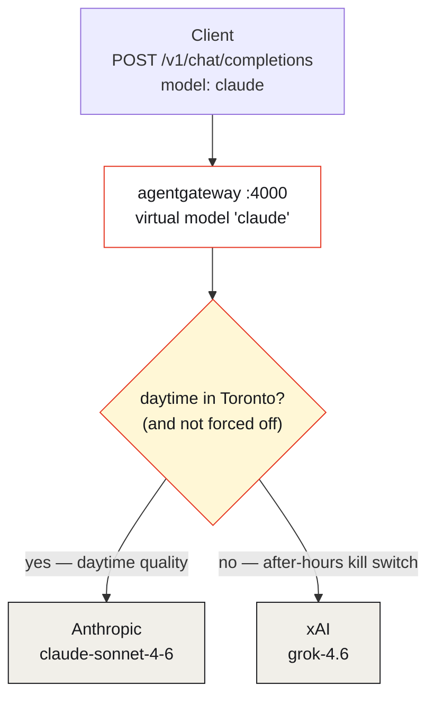
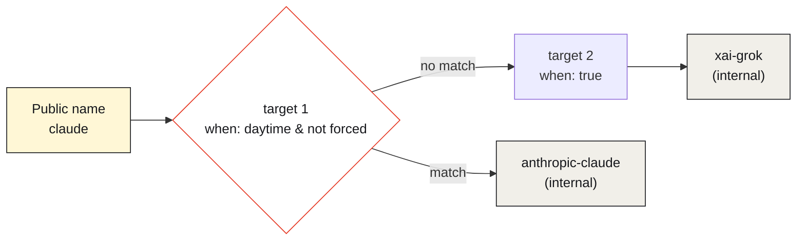

Here's a decision every team using premium models eventually faces, usually after reading a bill: *the expensive model is worth it during the workday, and it very much is not worth it at 2 a.m. for a batch job nobody is watching.* Claude's quality earns its price when a human is in the loop. Overnight, a cheaper, faster model is fine — and the difference, multiplied across every off-hours request, is real money.

The naive fix is an `if` statement in every client: check the hour, pick a model. Now that logic lives in a dozen codebases, each with its own idea of "after hours," each needing a redeploy to change. The better fix is to make the client dumb and the **gateway** smart: let every app always ask for the same model by name, and let one policy decide where that request actually goes.

This is a walk through a small, complete [agentgateway](https://agentgateway.dev) demo — [`12-after-hours-kill-switch`](https://github.com/sebbycorp/agentgateway-demos/tree/main/12-after-hours-kill-switch) — that does exactly that. Clients always send `"model": "claude"`. During daytime Toronto hours the gateway routes to Anthropic's Claude Sonnet. After 7pm it silently rewrites every one of those requests to xAI's Grok, until 8am. Same URL, same model name, no SDK change, no cron, no client-side clock check. The switch is a single CEL expression in config.

## The idea: the client asks, the gateway decides

The whole demo turns on one inversion of control. The client doesn't name a provider — it names an **intent**: `claude`. That's a *public virtual model*. What it resolves to is the gateway's decision, re-evaluated on every single request.



The application code never changes between noon and midnight. It always sends `claude`. The gateway is the only thing that knows there are two backends behind that name — and which one is in force right now.

You can see the shape of it in the standalone admin UI's overview: LLM enabled, **one virtual model** in front of **two backend models**, backed by **two shared providers**.


*The standalone admin UI at `:15000/ui/` — one virtual model, two backends, two providers. MCP isn't part of this demo; it's pure LLM routing.*

## How it's built: virtual model + conditional routing + CEL

Three pieces of `config.yaml` compose the switch.

**Providers** hold the credentials, once — just the two this demo needs:

```yaml
providers:
  - name: anthropic
    provider: anthropic
    params: { apiKey: "$ANTHROPIC_API_KEY" }
  - name: xai
    provider: xai
    params: { apiKey: "$XAI_API_KEY" }
```

**Concrete models** are the real upstreams — and, crucially, both are `visibility: internal`:

```yaml
models:
  - name: anthropic-claude
    visibility: internal
    provider: { reference: anthropic }
    params: { model: claude-sonnet-4-6 }
  - name: xai-grok
    visibility: internal
    provider: { reference: xai }
    params: { model: grok-4.6 }
```

**The virtual model** `claude` is the only public name, and it routes *conditionally*. Its `routing.conditional.targets` are a list of [CEL](https://agentgateway.dev/docs/standalone/latest/reference/cel/) `when` expressions, evaluated top to bottom — **first match wins**:

```yaml
virtualModels:
  - name: claude
    routing:
      conditional:
        targets:
          - model: anthropic-claude
            when: |
              default(request.headers["x-force-after-hours"], "") != "true"
              && timestamp(request.startTime).getHours() >= 12
              && timestamp(request.startTime).getHours() < 23
          - model: xai-grok
            when: "true"      # the fallback — always matches
```

Read it as a policy sentence: *use Anthropic only if nobody forced the switch and it's inside the daytime UTC window; otherwise fall through to Grok.* That final `when: "true"` is the safety net — it always matches, so no request ever fails to route somewhere.

The admin UI renders the same structure: two backend models with no policy, and the `claude` virtual model marked **conditional** with **2 rules**.


*`claude` is a Virtual model with a Conditional policy (2 rules). The two concrete backends carry no policy of their own — the routing lives entirely on the virtual name.*



## Why the switch can't be dodged

Here's the detail that turns a routing trick into a *control*: both concrete models are `visibility: internal`. A client cannot send `"model": "anthropic-claude"` to force Claude at 3 a.m., and cannot name `xai-grok` either — internal models aren't addressable from outside. The only door into the gateway is the public name `claude`, and it always runs the CEL gauntlet first.

That's the difference between a convenience and a guardrail. If clients could name the real upstream, "after-hours kill switch" would be a polite suggestion. Because they can't, it's enforced.

## The timezone footgun (read this before you copy the CEL)

The one thing that trips everyone up: `timestamp(request.startTime).getHours()` returns the hour in **UTC**, not your local time. The demo's business hours are America/Toronto, which in August 2026 is EDT (UTC−4), so the config translates the intended local window into UTC:

| Local (America/Toronto) | UTC `getHours()` | Served |
|---|---|---|
| Daytime `08:00`–`18:59` | `12`–`22` | Anthropic `claude-sonnet-4-6` |
| After-hours `19:00`–`07:59` | `23`–`11` | xAI `grok-4.6` |

That's why the CEL reads `>= 12 && < 23` rather than `>= 8 && < 19`. If you lift this pattern, convert your own local window to UTC — and remember it drifts by an hour across DST, so the boundaries you hardcode in August aren't the ones you want in January.

## Proof: a 7:11pm request served Grok

This is the moment the switch fires. A client asked for `claude` with **no extra headers** at **7:11pm Toronto** — past the 7pm cutoff — and the gateway served **`grok-4.6`**:


*Live, 2026-08-18 at 19:11 Toronto. Client sent `claude`; the JSON `model` field came back `grok-4.6`. The rewrite is invisible to the caller — only the response body reveals it.*

There's a subtlety worth calling out, visible in the admin UI's Chat Playground: the playground labels the request with the **public** name `claude` even on a call that Grok actually served. The rewrite isn't in the label — it's in the response's `model` field.


*The Playground always shows the public name `claude`. To see which backend served a call, read the `model` field in the response JSON (`claude-sonnet-4-6` = Anthropic, `grok-4.6` = xAI) — or `gen_ai.provider.name` in the gateway log.*

To demonstrate the night path without waiting until 7pm, the config honors one break-glass header — `x-force-after-hours: true` — which forces Grok at any hour:

```sh
curl -s http://localhost:4000/v1/chat/completions \
  -H "Content-Type: application/json" \
  -H "x-force-after-hours: true" \
  -d '{"model":"claude","messages":[{"role":"user","content":"Reply with exactly: ok"}],"max_tokens":16}' \
  | jq '{model, content: .choices[0].message.content}'
```

At noon that returns `grok-4.6` instead of `claude-sonnet-4-6` — the same rewrite the clock would trigger at night, on demand.

## Why this is worth doing

Step back from the specifics and the pattern is a small piece of platform governance with an outsized payoff:

- **One switch, whole fleet.** Every client that speaks OpenAI-compatible HTTP is governed by this one config. Changing the after-hours destination — or the window — is a config edit, not a fleet-wide redeploy.
- **Cost control on a clock.** Premium models cost real money per token. Confining Claude to business hours and defaulting off-hours traffic to a cheaper model is a lever you can pull without asking a dozen teams to touch code.
- **Provider-agnostic clients.** Application code names an intent (`claude`), not a vendor. Swapping the upstream, adding a failover, or retiring a model id happens in the gateway — the demo even pins `grok-4.6` because xAI retired the older `grok-2-latest` the docs still show. Clients never noticed.
- **Enforced, not advisory.** Internal-visibility upstreams mean the policy is a wall, not a naming convention. There's no client-side flag to disrespect.

The honest scope: this is a standalone lab demo of *routing* governance. The `/v1` listener here has no client auth (it's a local demo), and the "kill switch" governs *which model* a request reaches, not *whether the caller is allowed* — that's a separate policy layer. What it demonstrates cleanly is the principle: the decision of where model traffic goes belongs in the gateway, expressed as policy, re-evaluated per request.

## The takeaway

A kill switch is only useful if it lives in one place and someone can actually reach it. Scattering model-selection logic across every client gives you neither. Pulling it into agentgateway as one virtual model and one CEL expression gives you both: a single, enforced, per-request decision about where your LLM traffic goes — flippable by the clock or one break-glass header, with not a single client redeploy.

Business hours, Claude. After hours, Grok. Same `claude` every time — and the clients never have to know which one answered.

---

*Full config, the curl cases, the run scripts, and the live screenshots are in [sebbycorp/agentgateway-demos / 12-after-hours-kill-switch](https://github.com/sebbycorp/agentgateway-demos/tree/main/12-after-hours-kill-switch). Background on virtual models and conditional routing is in the [agentgateway standalone docs](https://agentgateway.dev/docs/standalone/latest/llm/virtual-models/).*
