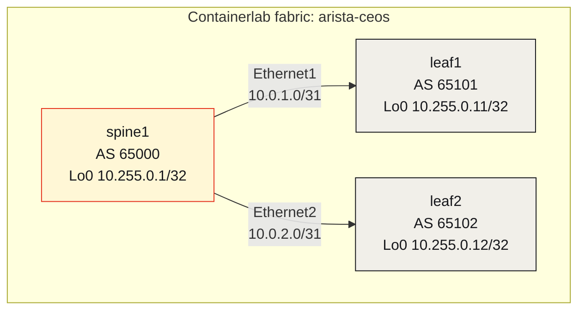
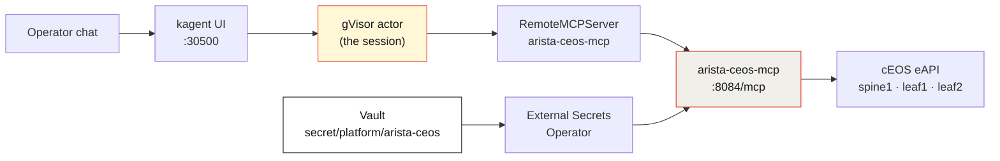
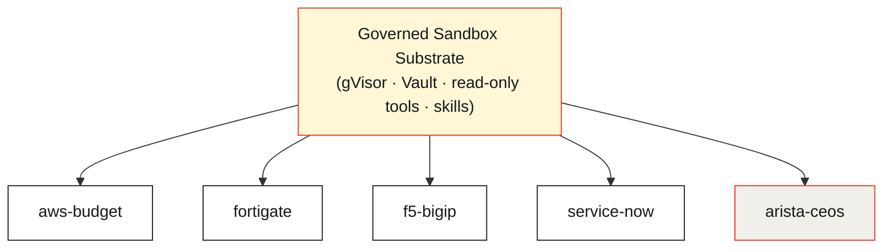

Ask a network engineer if they'd let an AI run commands on their production fabric and you'll get a very short answer. The instinct is correct: a model that can `configure`, `clear ip bgp`, or `shutdown` an interface is a model that can take down a data center between two tokens. For years that instinct has kept agents *out* of the systems where they'd be most useful.

But the instinct is aimed at the wrong thing. The danger was never "an AI touches the network." The danger is **an AI with an ungoverned reach into the network**. Remove the reach — cage it, scope it, watch it — and the same agent becomes something you'd actually want on call: a tireless read-only operator that can answer "is the fabric healthy?" at 3 a.m. without ever being able to break it.

This article is about that cage, and the art of what becomes possible once you have one. The vehicle is a real [kagent](https://kagent.dev) demo — a **`SandboxAgent`** that operates a live 3-node **Arista cEOS** fabric — and the point it proves generalizes far past networking: with a governed sandbox substrate, you can safely put an agent in front of almost anything.

*(If you want the foundations of the substrate itself — gVisor per-session isolation, snapshot/restore — start with [Why Secure Sandbox Substrates Are the Future of AI Agents](/articles/2026-08-16-secure-sandbox-substrates-kagent-aws/). This piece builds on it and focuses on **governance**: skills, tool catalogs, and blast-radius control.)*

## This time, the agent *is* the box

Most agent demos talk to a system that already exists — a cloud API, a SaaS backend. This one is different: the thing being operated is a **live network fabric** stood up just for the agent. Three Arista cEOS switches — `spine1`, `leaf1`, `leaf2` — wired into a small Clos-ish underlay with Containerlab, running real EOS and real eBGP.

*Live on Viper, 2026-08-17. Three `ceos:4.33.9M` nodes, `running`, on the `arista-ceos` management network.*

*Real EOS, not a mock: spine1 running `4.33.9M` on x86_64.*

The topology is deliberately boring — boring is checkable. eBGP on point-to-point `/31`s, one AS per switch, a loopback each. No EVPN, no MPLS, nothing an agent could misread.

Now the interesting part: a kagent `SandboxAgent` named `arista-ceos` sits in front of this fabric as a **read-only network operator**. It runs each conversation inside a gVisor actor, reaches the switches through a FastMCP server that speaks the EOS **eAPI**, and answers questions in plain English. And — this is the whole game — it is governed on three independent layers so that "operator" can never quietly become "attacker."

## Governance layer 1 — skills that encode *how to behave*

An agent's tools tell it *what it can do*. Its **skills** tell it *how it should act*. In kagent, skills are markdown that gets folded into the agent's `systemMessage` (kagent `0.10.0-rc2` deliberately rejects a `spec.skills` field on sandbox agents, so the instructions ride in the prompt). That markdown is where operational judgment — and hard guardrails — live.

The Arista agent ships three skills — `fabric`, `routing`, and `executive-brief` — and every one of them opens with the same standing rules. They read like a runbook written by someone who's been burned:

> - **Read-only.** No `configure`, no `write`, no neighbor shutdown, no image upgrade.
> - **Never invent** BGP state, prefixes, LLDP neighbors, or ping results. If eAPI fails or returns empty, say so.
> - **Never print** eAPI passwords, basic-auth headers, or Vault tokens.
> - No generic CLI dump of the full running-config — it can include the lab AAA line. Prefer the named tools.

Notice what these rules are doing. "Never invent BGP state" turns the model's most dangerous failure mode — a confident hallucination — into a contract: *if the tool didn't return it, don't say it*. "Never print passwords" is a data-exfiltration guard written in English. "Prefer the named tools over a raw config dump" keeps secrets out of the transcript by construction. The skill even dictates the **shape** of a good answer — lead with one sentence of fabric health, then a short table — so the agent is useful *and* predictable.

Skills are governance you can read, diff, and review in a pull request. That's a very different thing from hoping a general-purpose model behaves.

## Governance layer 2 — a curated, read-only tool catalog

Skills are the soft boundary. The **tool catalog** is the hard one. The agent's entire vocabulary for touching the fabric is six eAPI wrappers, and every one of them is a `show`:

| Tool | EOS command | Scope |
|------|-------------|-------|
| `arista_inventory` | `show version` | all nodes |
| `arista_bgp_summary` | `show ip bgp summary` | one or all nodes |
| `arista_interfaces` | `show interfaces` | single node |
| `arista_lldp_neighbors` | `show lldp neighbors` | one or all nodes |
| `arista_routes` | `show ip route [prefix]` | single node, optional filter |
| `arista_health` | composed summary | all nodes, concise |

There is **no** `configure`, no `clear`, no `reload`, no generic "run any EOS command" escape hatch. This matters more than any prompt rule, because it's not advisory — it's the shape of the API. Even a perfectly jailbroken model, convinced by some injected instruction that it must reset a BGP session, has no verb to do it. The catalog simply doesn't contain destruction.

This is the same design decision behind every agent in the family: expose *Describe / Get / View / Show*, and nothing that mutates. You lose nothing an operator needs for triage, and you remove the entire class of "the agent changed something" incidents.

## Governance layer 3 — the sandbox, the secrets, and the allowlist

The third wall is the runtime itself.

Three things are happening on that diagram, each a control:

- **gVisor isolation.** The model session runs in a gVisor actor — a user-space kernel between the agent and the host. Untrusted tool output (and any injection riding in it) never gets to talk to the node's real kernel.
- **Secrets the session never holds.** The eAPI username and password live in **Vault** at `secret/platform/arista-ceos` and are synced by External Secrets Operator into the **MCP pod only** — as `username`, `password`, and a `hosts_json` map of allowlisted node → eAPI URL. The gVisor actor calls a tool; the tool holds the credential; the session never sees it.
- **An explicit node allowlist.** The MCP server is pinned to `ARISTA_ALLOWED_NODES=spine1,leaf1,leaf2`. Ask it about a switch that isn't on the list and there's nowhere for the request to go. (TLS verification is disabled *for this lab only* — a documented lab shortcut, not a production posture.)

Stack the three layers and you get genuine defense in depth. A prompt injection has to get past the **skill rules**, then find a destructive **tool that doesn't exist**, then escape a **gVisor sandbox**, then reach a credential that **isn't in the session**, to touch a node that **isn't on the allowlist**. Each wall is boring on its own. Together they turn "an AI on the network" from reckless into routine.

## Watch it actually work

Here's the agent answering a real operator question — *"What is the BGP summary on spine1?"* — with exactly **one** tool call to `arista_bgp_summary`:

*Live kagent UI. The agent's whole toolset is visible on the right — six `arista_*` reads, nothing else. It reports both eBGP sessions **Established**, one prefix each, and closes with an operator-grade one-liner.*

The number that matters isn't the answer — it's that the answer is **true**. Here is the raw `show ip bgp summary` from spine1 itself:

*Ground truth from the switch: `10.0.1.1` (AS 65101) and `10.0.2.1` (AS 65102), both `Estab`, `PfxRcd 1`.*

Line them up. Router ID `10.255.0.1`, AS `65000`, peers `65101` and `65102`, both Established, one prefix each — **the chat matches the CLI exactly**. That's the skill rule "never invent BGP state" paying off: the agent read the real device and reported it, nothing more. An answer you can trust is worth more than a clever one.

## Why this is the art of the possible

Step back from Arista and the pattern is the real story. The Arista operator is one of a *family* of sibling agents in the same repo, each built the identical way — gVisor sandbox, Vault-backed secrets, read-only tools, skills in the system message — and each pointed at a different corner of the enterprise:

| SandboxAgent | Operates | Read-only reach |
|---|---|---|
| `aws-budget` | AWS account | Cost Explorer, EC2/RDS/quota describes |
| `fortigate` | A FortiGate firewall | Policy and status reads |
| `f5-bigip` | An F5 BIG-IP | LTM/virtual-server state |
| `service-now` | ServiceNow | Ticket and CMDB reads |
| `gcp` | A GCP project | Billing and inventory |
| **`arista-ceos`** | **A live Arista fabric** | **eAPI `show` commands** |

The governance is uniform; only the tools change. That's the art of the possible: once you have a governed substrate, adding a safe operator for a new system is *not* a security research project — it's writing a handful of read-only tool wrappers and a page of skill rules. The hard part (isolation, secret handling, blast-radius control) is solved once, in the substrate, and inherited by everything.

## Being honest about the edges

This is v1, and the demo says so plainly:

- **Read-only by design.** There are no write tools, on purpose. The day a `configure`-class tool is added, it belongs behind human-in-the-loop approval, not in the same catalog as the reads.
- **eBGP only.** No EVPN, VXLAN, or MPLS in the fabric yet — the underlay is kept boring so the agent's reads are checkable.
- **Lab shortcuts are labeled.** eAPI TLS verification is off *for the lab*; the cEOS image is Arista-licensed and never vendored into git; the kagent UI is LAN-only. None of these are production claims.
- **The first boot failed honestly.** cEOS died on inotify exhaustion (`Too many open files`) until the host `fs.inotify` limits were raised — a real operational wrinkle, recorded rather than airbrushed.

## The takeaway: governed autonomy

The lesson of the Arista agent isn't that the model is smart. It's that the model is **contained** — and containment is what makes the smartness usable. Skills say how to behave. A curated catalog removes the verbs for harm. A gVisor sandbox, Vault-held secrets, and a node allowlist mean even a fully hijacked session runs out of road before it reaches anything it could break.

That combination is what lets you do the thing the network engineer's instinct said you never could: put an agent in front of live infrastructure. Not because you stopped worrying about what an AI might do — but because you built the cage first, and the cage is the product.

Governed autonomy is the unlock. The art of the possible is everything you can safely point it at next.

---

*The Arista fabric, skills, MCP tool map, and the live captures in this article live in [sebbycorp/kagent-agent-substrate-demos / arista-ceos-sandbox-agent](https://github.com/sebbycorp/kagent-agent-substrate-demos/tree/main/arista-ceos-sandbox-agent), with the SandboxAgent wiring documented in [k8s-viper / docs/arista-ceos-agent.md](https://github.com/sebbycorp/k8s-viper/blob/main/docs/arista-ceos-agent.md).*
