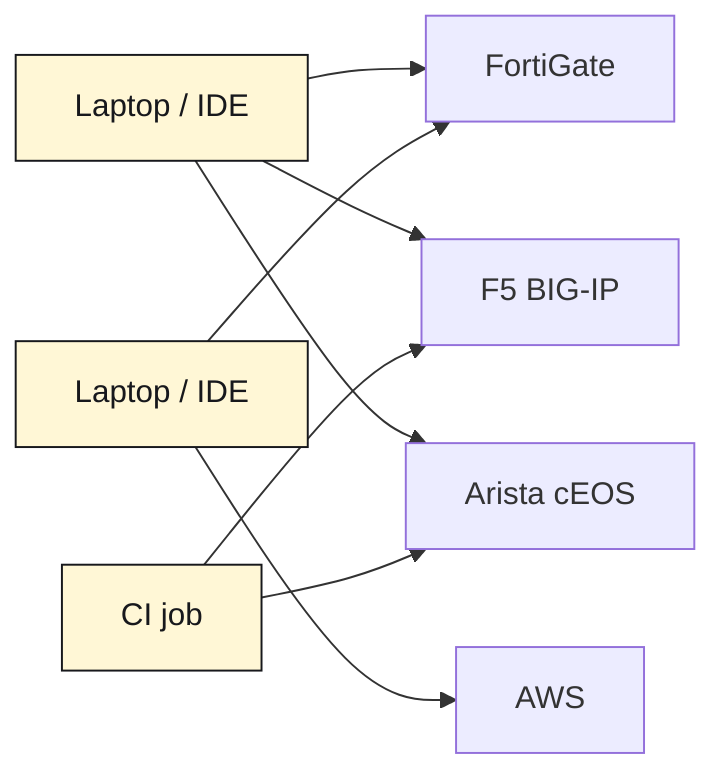
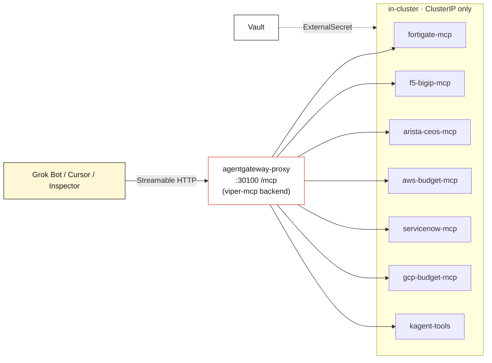

Here is a problem you don't have with one MCP server, and can't avoid with six.

You wire up an MCP server for your firewall so an agent can read policies. Great. Then one for your load balancer. Then your network fabric, your cloud bill, your ticketing system. Each one is useful. But now every developer who wants the firewall tools in their IDE is pasting a URL and a credential into a config file. Multiply that by six systems and a dozen laptops and you've built a **credential sprawl machine**: secrets for production infrastructure scattered across editors, each a place they can leak from, none of them centrally revocable.

The fix isn't fewer tools. It's **one door**. This article walks a real one running on [Viper](https://github.com/sebbycorp/k8s-viper) — a single [agentgateway](https://agentgateway.dev) endpoint that multiplexes **seven** MCP servers into one URL, so clients get every tool through one governed front door and never hold a device password at all.

## The sprawl, drawn

The thing we're replacing looks like this — every client speaking every backend's protocol, holding every backend's secret:

Every one of those arrows is a place a credential lives. The picture we *want* collapses all of that to a single hop into one proxy, with the backends hidden behind it:

One URL for the client. Seven backends it never sees. Every secret in Vault. That's the whole idea — the rest is how it's wired and why it's more secure, not less.

## The catalog behind the door

The single endpoint is `http://172.16.10.135:30100/mcp` — the same agentgateway that already fronts the OpenAI and Spark routes on this lab, just with one more backend attached. Behind it sit seven MCP servers, each a Deployment + ClusterIP in the `kagent` namespace, each speaking Streamable HTTP on `:8084/mcp`:

| Tool prefix | MCP server | Fronts | Tools |
|---|---|---|---:|
| `fortigate_` | `fortigate-mcp` | FortiGate 80F firewall | 22 |
| `f5-bigip_` | `f5-bigip-mcp` | F5 BIG-IP | 6 |
| `arista-ceos_` | `arista-ceos-mcp` | Arista cEOS fabric (eAPI) | 6 |
| `aws-budget_` | `aws-budget-mcp` | AWS us-east-2 billing/capacity | 11 |
| `servicenow_` | `servicenow-mcp` | ServiceNow tickets | 8 |
| `gcp-budget_` | `gcp-budget-mcp` | GCP us-east1 billing/capacity | 8 |
| `kagent-tools_` | `kagent-tools` | in-cluster Kubernetes reads | 124 |

A live `tools/list` through the gateway on 2026-08-18 returned **185 tools** across those seven targets. From the client's side it's one server; from the operator's side it's the entire lab. If those backend names look familiar, they should — several are the very [sandbox agents](/articles/2026-08-18-governed-sandbox-agents-kagent-arista/) covered in earlier posts. The kagent `SandboxAgent`s still talk to their MCP servers directly over ClusterIP; the gateway is an **additional** front door for interactive MCP clients.

## How it's wired: one backend, two behaviors

The multiplex is a single `AgentgatewayBackend` named `viper-mcp`. Here it is live on the cluster — accepted, with all seven targets:

*Live `kubectl` on k3s-viper, 2026-08-18 — the real CR, `Accepted: True`. Seven `static` targets, each `*.kagent.svc.cluster.local:8084/mcp` over `StreamableHTTP`.*

Two fields in that spec do the interesting work:

**`failureMode: FailOpen`.** When a client opens an MCP session, the gateway aggregates the tool lists of all seven backends. If one is down — say the FortiGate MCP pod is restarting — FailOpen means the session still comes up with the *other six*, instead of the whole aggregate failing because one target was unreachable. One flaky backend degrades gracefully rather than taking down every tool.

**`prefixMode: Conditional`.** Seven servers means name collisions are inevitable — more than one backend could plausibly expose a `health` or a `summary`. Conditional prefixing namespaces each tool by its target, so `arista-ceos`'s BGP tool arrives at the client as `arista-ceos_bgp_summary` and AWS's as `aws-budget_cost_month`. "Conditional" because the prefix is applied where it's needed to disambiguate a large, multi-target catalog — which is exactly the situation with 185 tools.

An `HTTPRoute` named `viper-mcp` attaches that backend to the `agentgateway-proxy` Gateway on the path prefix `/mcp`. You can see it living alongside the lab's other routes:

*The `viper-mcp` backend and route sit next to the existing `openai` and desktop routes — one Gateway, many front doors.*

The whole thing is a handful of YAML in git (`platform/agentgateway-ai/backend-viper-mcp.yaml` and `httproute-viper-mcp.yaml`). No new gateway, no new ingress — just one more backend on a proxy that was already there.

## Why one door is *safer* than many

It's tempting to read "central endpoint" as "central risk." It's the opposite, and the reasons are worth being explicit about:

- **The MCP servers never leave the cluster.** Every backend is a ClusterIP Service. The only thing published on the node is the gateway's `:30100`, and it's LAN-only. There is no path from the internet — or even from a random VLAN — to the FortiGate tools.
- **Device passwords and cloud keys stay in Vault.** Each MCP server pulls its own credential from Vault via an ExternalSecret (`secret/platform/fortigate`, `.../f5-bigip`, and so on). The credential lives in the pod that needs it and nowhere else. A client calling through `/mcp` never holds — never *sees* — a device password.
- **One client identity instead of a dozen.** Instead of every laptop authenticating to FortiOS, iControl, and eAPI in its own way, a single agentic client speaks to the gateway. One identity to reason about, one place to revoke.
- **The public surface stays documentation-only.** The lab's public site and GitHub Pages carry docs; the tool plane (`:30100`) and the kagent UI (`:30500`) are never published there.

Contrast that with the sprawl diagram: six protocols implemented in a dozen editors, each holding long-lived secrets. Centralizing the *tool plane* behind one governed proxy shrinks the credential footprint from "everywhere" to "one namespace, backed by Vault."

## Using it: Grok Bot as the governed client

The intended way to actually *use* the multiplex is not to wire it into your editor — it's to ask **Grok Bot**, the k8s-viper agent, in plain language. It already has a jump onto Viper and calls `http://127.0.0.1:30100/mcp` from the host, so you never paste a token and never publish `/mcp`:

> - "What is the BGP summary on spine1?"
> - "List FortiGate policies that mention YouTube."
> - "AWS MTD spend in us-east-2."

One sentence in; the agent picks the right namespaced tool (`arista-ceos_bgp_summary`, `fortigate_*`, `aws-budget_cost_month`), calls it through the gateway, and answers. You're driving seven systems' worth of read-only tooling through a single chat, and the credentials for all of them stayed in Vault the entire time.

If you *do* want raw tools in a client, the same URL works from anything on the LAN — a Cursor `mcpServers` entry pointed at `http://172.16.10.135:30100/mcp`, or MCP Inspector over Streamable HTTP — with the standing rule that it never goes on a public machine. (A quick sanity check: `GET /` on `:30100` returns `404 route not found`. That's expected — the tools live at `/mcp`, not the root.)

## The rules that keep it honest

The doc this is drawn from is blunt about its own guardrails, and they're worth repeating because they're what make "one door" defensible:

- **LAN only.** Do not publish `:30100` or the kagent UI `:30500` on the public site.
- **Vault path names only in git.** Never commit a secret value; never paste one into chat.
- **Don't bump the pins to "fix" a missing tool.** kagent `0.10.0-rc2` and Substrate `0.0.9` are pinned on purpose.
- **FailOpen is a feature, not a mask.** A missing tool usually means a backend pod is down — check the Deployment, don't assume the gateway is broken.

## The takeaway

MCP is going to give every system in your environment an agent-friendly interface. That's the good news and the scaling problem in one sentence: the moment you have several, "how does each client reach each server, and who holds the keys?" becomes the real design question.

Multiplexing answers it by inverting the topology. Instead of *N clients × M servers* each carrying credentials, you get **one front door**, one client identity, and M servers that never leave the cluster with their secrets sealed in Vault. The client experience gets simpler — one URL, every tool — and the security posture gets *tighter*, not looser. On Viper that's 185 tools across seven systems, reachable by asking Grok Bot a question in English, with not a single device password ever leaving the cluster.

One door. Every tool. Keys stay home.

---

*The multiplex config, the full server catalog, and the live captures in this article are documented in [k8s-viper / docs/mcp-servers](https://github.com/sebbycorp/k8s-viper/tree/main/docs/mcp-servers), with the individual MCP servers in [sebbycorp/kagent-agent-substrate-demos](https://github.com/sebbycorp/kagent-agent-substrate-demos).*
