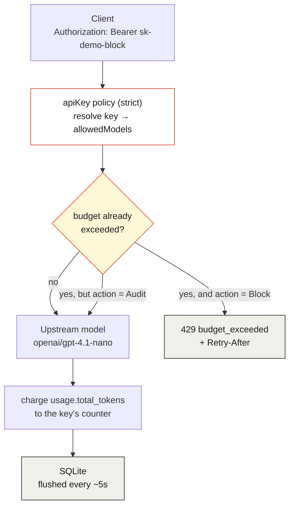

Virtual API keys have always answered two governance questions well: **who is
calling** and **which models are they allowed to reach**. They never answered
the third one — the one finance actually asks:

> How much can this key spend before the gateway stops it?

Until now the honest answer in standalone agentgateway was "approximate it with
token-based rate limiting," which is a request-window mechanism wearing a
budget's clothing. [agentgateway 1.5.0](https://github.com/agentgateway/agentgateway/releases/tag/v1.5.0)
fixed that ([#3143](https://github.com/agentgateway/agentgateway/pull/3143)): a
budget is now a field **on the key itself**, denominated in tokens or dollars,
over a rolling window, with `Audit` or `Block` enforcement.

This is the hands-on walk-through of the demo that exercises it —
[`16-api-key-scoped-token-budgets`](https://github.com/sebbycorp/agentgateway-demos/tree/main/16-api-key-scoped-token-budgets)
— covering the three things you actually have to configure: **the budget**, **the
token costs** (if you want dollars), and **the models** a key can reach. Every
field name and every response body below comes from the committed config and a
real run, not from memory.

## What you'll build

Two virtual keys with the *same* 40-token / 1-hour budget and *different*
enforcement, so you can see both halves of the feature in one run:

| Key | `metadata.name` | `onBudgetExceeded` | What happens |
|-----|-----------------|--------------------|--------------|
| `sk-demo-block` | `demo-block` | `Block` | First completion **200**, next one **429** `budget_exceeded` + `Retry-After` |
| `sk-demo-audit` | `demo-audit` | `Audit` | Calls keep returning **200**; the status API still reports `exceeded: true` |

```sh
git clone https://github.com/sebbycorp/agentgateway-demos
cd agentgateway-demos/16-api-key-scoped-token-budgets
export OPENAI_API_KEY='sk-...'   # optional — see below
./setup.sh
./test.sh
```

`setup.sh` prefers Docker (`cr.agentgateway.dev/agentgateway:v1.5.0`) and falls
back to the official v1.5.0 host binary if the daemon can't start a container
(`AGW_RUNTIME=binary` forces that path). If `OPENAI_API_KEY` is unset it starts
`mock-openai.py`, a stdlib HTTP server that reports **exactly 40 total tokens**
per completion — which is what makes Block trip deterministically on the second
call instead of "whenever real usage happens to cross 40."

Three URLs matter once it's up:

| URL | What it is |
|-----|------------|
| <http://localhost:15000/ui/> | Admin UI — **LLM → Virtual API Keys** has the budget meters |
| <http://localhost:15000/api/budgets/status> | JSON snapshot (`?apiKeyName=demo-block` filters) |
| <http://localhost:4000> | The OpenAI-compatible listener |


*The standalone admin UI at `:15000/ui/`. Two models, one gateway, no MCP — this demo is pure LLM key governance. Note **Virtual API Keys** and **Costs** in the sidebar; you'll use both.*

## How a charge actually happens

Before the config, get the mechanism right, because it explains almost every
surprise later. The check is *before* the request; the **charge is after the
response**, and only if the provider reported usage.



Two consequences worth internalising now:

1. **The call that crosses the limit still succeeds.** You always overshoot by
   at most one request. A 40-token budget can end the window at 40, 80, or
   whatever one more completion costs. Budgets are a spend ceiling with a
   one-request tolerance, not a hard per-request gate.
2. **No reported usage, no charge.** If a provider returns no `usage` block,
   the counter doesn't move. Token budgets need `usage.total_tokens`; dollar
   budgets need a computable `response.cost` (that's the whole point of
   step 4).

## Step 1 — configure the database (not optional)

v1.5.0 refuses to register budgets without one. The source is blunt about it:
*"API key budgets require config.database to be configured."* SQLite is enough.

```yaml
config:
  adminAddr: 0.0.0.0:15000
  database:
    url: sqlite:///data/data.db
```

"Hybrid" is the accurate description of what happens next: counters live **in
memory** and are flushed to the database every ~5 seconds. That's why `test.sh`
sleeps a second before reading `/api/budgets/status`, and why enforcement stays
fast — the check is in-process, not a round trip per request.

One deployment detail that costs an hour if you skip it: `setup.sh` puts that
SQLite file in a **named Docker volume**, not a host bind mount. On Docker
Desktop for macOS, SQLite's WAL locking fails over the bind-mount filesystem
with `disk I/O error` (code 522). A named volume lives on the Linux VM's real
filesystem and works.

## Step 2 — configure the models

Two things are called "models" here and they do different jobs.

**The gateway's model list** is what exists at all. Wildcards are allowed, so
one entry can cover a family:

```yaml
llm:
  gateways:
  - llm
  models:
  - name: openai/gpt-4.1-nano
    provider: openAI
    params:
      model: gpt-4.1-nano
      apiKey: $OPENAI_API_KEY
  - name: openai/*
    provider: openAI
    params:
      model: gpt-4.1-nano
      apiKey: $OPENAI_API_KEY
```

`$OPENAI_API_KEY` is expanded by the gateway from its environment — the
credential is never in the committed file. (The mock path injects a
`params.baseUrl` into a generated `.runtime/config.yaml` so the tracked
`config.yaml` stays a valid live-OpenAI config.)

**`allowedModels` on the key** is what a given caller may reach — a per-key
allowlist, wildcards included:

```yaml
allowedModels:
- openai/*
- gpt-4.1-nano
```

This is the pairing that makes per-key budgets meaningful: `allowedModels`
decides *what* a key can spend on, the budget decides *how much*. A key
restricted to a nano model with a 100k-token budget is a genuinely different
risk profile from the same budget pointed at a frontier model — and the gateway
enforces both without the client's cooperation. In the UI those two patterns
show up as the **2 patterns** chip in the MODELS column.

## Step 3 — configure the budget

Here's the whole thing, both keys, straight from the demo's committed
`config.yaml`:

```yaml
llm:
  policies:
    apiKey:
      mode: strict
      keys:
      # Tiny Tokens budget + Block: the first completion is allowed (charge is
      # post-response), then the next call in the same window is 429.
      - key: sk-demo-block
        metadata:
          name: demo-block
          team: demo
        allowedModels:
        - openai/*
        - gpt-4.1-nano
        budgets:
        - name: tokens
          limit:
            unit: Tokens
            amount: 40
          window:
            rolling: 1h
          onBudgetExceeded: Block
      # Same limit, Audit: calls keep succeeding while the status API
      # still reports used / remaining / exceeded.
      - key: sk-demo-audit
        metadata:
          name: demo-audit
          team: demo
        allowedModels:
        - openai/*
        - gpt-4.1-nano
        budgets:
        - name: tokens
          limit:
            unit: Tokens
            amount: 40
          window:
            rolling: 1h
          onBudgetExceeded: Audit
```

The five fields, and what each one actually controls:

| Field | Values | Notes |
|-------|--------|-------|
| `name` | string | Stable name **within the key**. Shows up in the UI meter and in the status API. `budgets` is a list — a key can carry several. |
| `limit.unit` | `Tokens` \| `USD` | `Tokens` charges from `usage.total_tokens`. `USD` needs priced models — step 4. |
| `limit.amount` | number | Tokens must be whole; USD allows up to 9 fractional digits. |
| `window.rolling` | duration (`1h`, `24h`, `30d`) | **Epoch-aligned** — read the warning below. |
| `onBudgetExceeded` | `Audit` \| `Block` | `Block` → 429; `Audit` → log and let it through. |

`mode: strict` on the `apiKey` policy is what makes any of this enforceable: a
request with no virtual key is rejected outright, so there's no unbudgeted path
through the listener.

### The window is aligned to the Unix epoch, not to your first request

This is the single most surprising thing about the feature, so it's worth being
concrete. `rolling: 1h` does **not** mean "sixty minutes from the first call."
It means consecutive one-hour periods counted from 1970-01-01T00:00:00Z — i.e.
UTC clock hours. `24h` starts at midnight UTC. `30d` is consecutive 30-day
periods from the epoch, which will not line up with anyone's calendar month.

From the real status snapshot below, the window was
`start: 1787860800000, end: 1787864400000` — 20:00:00Z to 21:00:00Z on
2026-08-27, exactly on the hour. Two practical consequences: a key that
exhausts its budget at 20:59 gets a fresh one 60 seconds later, and re-running
`./test.sh` inside the same clock hour will find `sk-demo-block` already over
limit. That's not a bug in the test; it's the window doing what it says.

## Step 4 — configure token costs, so USD budgets can charge

Swap two lines and the budget is denominated in money instead of tokens:

```yaml
budgets:
- name: spend
  limit:
    unit: USD
    amount: 5.00
  window:
    rolling: 24h
  onBudgetExceeded: Block
```

That config is valid the moment you write it — and it will charge **nothing**
until the gateway can compute `response.cost` for the requests going through it.
Cost isn't reported by the provider; it's derived from provider usage **times a
per-model rate you supply**. No rates, no cost, no charge, and a USD budget that
silently never fires. The demo leaves the catalog empty on purpose so you can
see that state:


*`LLM → Costs` with nothing configured. Note the two sentences that tell you everything about how pricing resolves: sources are **merged in order** — database first, file sources override — and inline **custom costs are USD per 1M tokens**.*

You have three ways to fill that page, and they compose:

**1. A catalog file, in config.** This is the reproducible one:

```yaml
config:
  modelCatalog:
  - file: ./cost-openai.json
```

The file is per-provider, per-model rates — **USD per 1M tokens**, as strings:

```json
{
  "providers": {
    "openai": {
      "models": {
        "gpt-4.1": {
          "rates": { "input": "2", "output": "8", "cacheRead": "0.5" }
        },
        "gpt-4.1-mini": {
          "rates": { "input": "0.4", "output": "1.6", "cacheRead": "0.1" }
        }
      }
    }
  }
}
```

`cacheWrite` is a fourth rate where the provider charges for it (Anthropic's
prompt caching, for example). Pricing cache reads separately matters more than
it looks: a cache-heavy agent workload where reads are 10× cheaper than input
will blow through a USD budget at a completely different rate depending on
whether you bothered to model that.

**2. `Refresh base costs`** — the button top-right on that page pulls pricing
from models.dev into the database catalog. Fastest way to get *approximately*
right pricing for a lot of models; it's someone else's list, so treat it as a
starting point rather than as your negotiated rate card.

**3. Custom costs** — inline overrides stored in the gateway configuration, for
the models where your real rate differs (committed volume discounts, a
self-hosted model you want charged at your own cost basis, a model too new to be
in any catalog).

Because sources merge in order — database first, file sources override — the
sane layering is: refresh the base catalog for coverage, then let a committed
file win for the models you actually care about being right.

**My advice: start in `Tokens`, move to `USD` when the catalog is trustworthy.**
A token budget has exactly one dependency (the provider reports usage) and it
either works or it doesn't. A dollar budget has a second one (your rates are
present and correct), and its failure mode is silent — a budget that never
charges looks identical to a team that never spends.

## Step 5 — prove it

Unauthenticated first, because `mode: strict` should make this impossible:

```sh
curl -s -o /tmp/out -w '%{http_code}\n' http://localhost:4000/v1/chat/completions \
  -H 'Content-Type: application/json' \
  -d '{"model":"openai/gpt-4.1-nano","messages":[{"role":"user","content":"hi"}],"max_tokens":8}'
```

Anything but 200. Now the Block key's first call, which must succeed — the
charge hasn't happened yet:

```sh
curl -s http://localhost:4000/v1/chat/completions \
  -H 'Authorization: Bearer sk-demo-block' \
  -H 'Content-Type: application/json' \
  -d '{"model":"openai/gpt-4.1-nano","messages":[{"role":"user","content":"Reply with: OK"}],"max_tokens":8}' | jq .
```

Read the counter:

```sh
curl -s 'http://localhost:15000/api/budgets/status?apiKeyName=demo-block' | jq .
```

Then call again. Once `used >= 40`, the gateway denies it:

```sh
curl -sD - http://localhost:4000/v1/chat/completions \
  -H 'Authorization: Bearer sk-demo-block' \
  -H 'Content-Type: application/json' \
  -d '{"model":"openai/gpt-4.1-nano","messages":[{"role":"user","content":"Reply with: OK"}],"max_tokens":8}'
```

HTTP **429**, a `Retry-After` header carrying the seconds left in the current
epoch window, and an OpenAI-shaped error your SDK's existing rate-limit handling
already understands:

```json
{
  "error": {
    "message": "Budget exceeded",
    "type": "rate_limit_error",
    "code": "budget_exceeded"
  }
}
```

That `type: rate_limit_error` is a deliberate kindness. Clients that already
back off on 429 will back off here, and `code: budget_exceeded` is how you tell
"you're going too fast" apart from "you're out of money" in a log query.

The Audit key, at the same usage, keeps answering 200 — and still reports itself
over budget:

```sh
curl -s http://localhost:4000/v1/chat/completions \
  -H 'Authorization: Bearer sk-demo-audit' \
  -H 'Content-Type: application/json' \
  -d '{"model":"openai/gpt-4.1-nano","messages":[{"role":"user","content":"Reply with: OK"}],"max_tokens":8}' | jq .
curl -s 'http://localhost:15000/api/budgets/status?apiKeyName=demo-audit' | jq .
```

`./test.sh` runs that whole sequence as assertions: no-auth rejected, first
Block call 200, usage charged, `budget_exceeded` with a `Retry-After`, Audit
still 200, both counters non-zero.

## Reading the status API

This is the endpoint to build alerting on, and the real response from the run
above:


Unpacked:

```json
{
  "observedAt": 1787863058404,
  "budgets": [
    {
      "apiKeyName": "demo-audit",
      "name": "tokens",
      "limit": { "unit": "Tokens", "amount": "40" },
      "usage": { "used": "80", "remaining": "0", "exceeded": true },
      "window": { "start": 1787860800000, "end": 1787864400000,
                  "durationMs": 3600000, "expired": false },
      "onBudgetExceeded": "Audit",
      "updatedAt": 1787860942489
    }
  ]
}
```

The two rows tell the story of the whole feature. `demo-audit` sits at **80/40**
— two full completions past its limit, `exceeded: true`, nothing blocked.
`demo-block` sits at exactly **40/40** — it was stopped the moment it crossed.
Same budget, same traffic; the only difference is one enum.

Note also that `remaining` floors at `0` rather than going negative, so
**`used` is the field to alert on** if you care how far past a limit an `Audit`
key has run. And `updatedAt` is the last flush, not the last request — a
few-second lag there is the 5-second flush interval, not a stall.

The UI renders the same data as per-key meters:


*`LLM → Virtual API Keys` after the replay. Both keys show the `tokens` meter at a red 100%. The meter is the same data as `/api/budgets/status` — and note it reads 100% for the Audit key too. **The meter shows consumption, not enforcement**; a maxed-out bar doesn't mean anything was denied.*

The UI is editable, with one caveat: saving `PUT`s `/api/config` and
re-serializes the file, which **drops your comments**. If `config.yaml` is in
git, `git diff config.yaml` is the record of what the UI changed — and probably
where your careful annotations went.

## The five things that will bite you

1. **`metadata.name` is required** on any key with a budget — *"API keys with
   budgets must have a metadata.name."* It's the display name and the
   `apiKeyName` you filter the status API by.
2. **`agentgateway.dev/*` metadata is reserved.** 1.5.0 moved UI-created key IDs
   to `metadata["agentgateway.dev/id"]`
   ([#3139](https://github.com/agentgateway/agentgateway/pull/3139)).
   User-supplied values under that prefix are rejected — don't set them.
3. **Counters are keyed by the SHA-256 of the secret.** Rotate the key string
   and you get a fresh counter, even if `metadata.name` is unchanged. That's a
   convenient reset in a lab and a real bypass in production: whoever can rotate
   a key can clear its budget. Govern key rotation accordingly.
4. **Epoch-aligned windows** (step 3) — the budget resets on UTC boundaries, not
   on a clock that starts with the caller's first request.
5. **Post-response charging** means one request of overshoot, always, and *no*
   charge at all from a provider that reports no usage. Verify usage actually
   lands before you trust a budget to hold.

## Picking amounts and windows

A pattern that has worked for me, and which the two-key demo is a miniature of:

| Tier | Unit | Window | Action | Why |
|------|------|--------|--------|-----|
| New team / unknown workload | `Tokens` | `24h` | `Audit` | Measure first. You cannot size a budget you've never observed. |
| CI, batch, scheduled jobs | `Tokens` | `1h` | `Block` | Predictable per-run cost; a runaway loop is the actual threat, and an hourly window caps the blast radius. |
| Interactive / customer-facing | `USD` | `24h` | `Block` | Dollars are the unit the conversation happens in — once your catalog is trustworthy. |
| Experimental / frontier models | `USD` | `24h` | `Block`, small amount | Pair a tight budget with a narrow `allowedModels`. Two locks, one key. |

Run every new budget in `Audit` for a window or two, read `used` from the status
API, *then* set an amount and flip to `Block`. Shipping `Block` with a guessed
number just moves the outage from your bill to your users.

## The takeaway

The interesting thing about 1.5.0's budgets isn't that a gateway can count
tokens — it's **where the number lives**. On the key, next to
`allowedModels` and the metadata, one object describes a caller's entire
envelope: who they are, which models they may reach, how much they may spend,
over what window, and what happens when they cross it. Nothing about that is
the application's job, and nothing about it depends on the client's cooperation.

Configure three things and you're done: a database so budgets can persist, an
`allowedModels` list so spend is scoped to models you chose, and a `budgets`
entry in `Tokens` while you learn the workload. Add a `modelCatalog` when you're
ready to talk in dollars — and remember that an unpriced USD budget is
indistinguishable from a well-behaved team.

---

*Full config, the run scripts, the mock provider, and the screenshots are in [sebbycorp/agentgateway-demos / 16-api-key-scoped-token-budgets](https://github.com/sebbycorp/agentgateway-demos/tree/main/16-api-key-scoped-token-budgets). The feature landed in [agentgateway#3143](https://github.com/agentgateway/agentgateway/pull/3143) / [v1.5.0](https://github.com/agentgateway/agentgateway/releases/tag/v1.5.0); the standalone config schema is at <https://agentgateway.dev/schema/config>. For the enterprise, CRD-based take on the same problem, see [Hard Spend Limits for LLM Traffic](/articles/2026-07-02-agentgateway-ai-budgets-hard-spend-limits/) and [Budgets You Can See](/articles/2026-07-15-agentgateway-enterprise-budgets-cost-management-ui/).*
